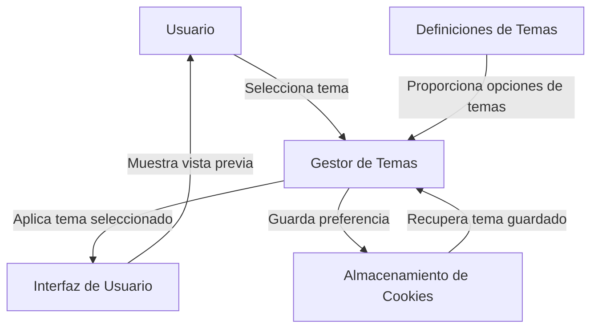

## Module: jquery.themes.js

# Análisis Integral del Módulo jquery.themes.js

## Nombre del Componente/Módulo SQL
**Módulo**: jquery.themes.js - Plugin de jQuery para aplicar temas CSS

## Objetivos Primarios
Este módulo es un plugin de jQuery diseñado para facilitar la aplicación y gestión de temas CSS en sitios web. Permite a los usuarios cambiar dinámicamente entre diferentes temas de interfaz de usuario, principalmente basados en jQuery UI, con capacidades de previsualización y persistencia de preferencias mediante cookies.

## Funciones, Métodos y Consultas Críticas
- **Themes()**: Constructor principal que inicializa el gestor de temas.
- **init()**: Inicializa el tema para la página, cargando el tema predeterminado o el guardado en cookies.
- **_setTheme()**: Función central que cambia el tema activo y actualiza la interfaz.
- **addTheme()**: Permite agregar nuevos temas a la colección disponible.
- **_showPreview()/_hidePreview()**: Gestiona la visualización de previsualizaciones de temas.
- **_attachThemes()**: Conecta la funcionalidad de temas a un elemento DOM.
- **_updateTheme()**: Actualiza la interfaz de selección de temas con las opciones disponibles.

## Variables y Elementos Clave
- **COOKIE_NAME**: Constante que define el nombre de la cookie para almacenar la preferencia de tema.
- **_themes**: Objeto que contiene todas las definiciones de temas disponibles (24 temas predefinidos).
- **_defaults**: Configuración predeterminada del plugin.
- **_settings**: Configuración específica para la visualización de la interfaz de selección de temas.
- **currentTheme**: Variable que almacena el ID del tema actualmente seleccionado.

## Interdependencias y Relaciones
- Depende de jQuery como framework base.
- Interactúa con el DOM para insertar hojas de estilo y elementos de interfaz.
- Utiliza cookies del navegador para persistir las preferencias de temas entre sesiones.
- Está diseñado para trabajar con temas de jQuery UI, aunque puede adaptarse para otros sistemas de temas.

## Operaciones Principales vs. Auxiliares
**Operaciones Principales**:
- Cambio de temas mediante la modificación dinámica de hojas de estilo.
- Generación de la interfaz de selección de temas con iconos y previsualizaciones.

**Operaciones Auxiliares**:
- Gestión de cookies para persistencia de preferencias.
- Manejo de eventos de ratón para mostrar/ocultar previsualizaciones.
- Validaciones y configuración de opciones predeterminadas.

## Secuencia Operativa/Flujo de Ejecución
1. Inicialización del plugin con opciones personalizadas.
2. Verificación de cookies para recuperar el tema previamente seleccionado.
3. Aplicación del tema inicial (predeterminado o guardado).
4. Generación de la interfaz de selección de temas si se solicita.
5. Manejo de eventos de usuario para cambiar temas o mostrar previsualizaciones.
6. Al seleccionar un tema, se actualiza la hoja de estilo, se guarda la preferencia en cookies y se actualiza la interfaz.

## Aspectos de Rendimiento y Optimización
- Utiliza una única hoja de estilo que se modifica dinámicamente en lugar de cargar/descargar múltiples archivos.
- Implementa técnicas de posicionamiento de imágenes (sprites) para iconos y previsualizaciones, reduciendo solicitudes HTTP.
- Podría optimizarse la generación de HTML para la interfaz de selección, que actualmente se realiza mediante concatenación de cadenas.
- La carga inicial de temas podría beneficiarse de técnicas de carga diferida para mejorar el rendimiento.

## Reutilización y Adaptabilidad
- Altamente reutilizable gracias a su diseño como plugin de jQuery.
- Permite personalización mediante opciones configurables.
- Facilita la adición de nuevos temas mediante el método addTheme().
- La estructura modular permite su integración en diferentes proyectos web.
- Las rutas a los archivos de temas son configurables, permitiendo adaptarse a diferentes estructuras de directorios.

## Uso y Contexto
- Se utiliza típicamente en aplicaciones web que requieren personalización visual por parte del usuario.
- Se implementa mediante la sintaxis jQuery: `$('link').themes({themes: ['cupertino', 'smoothness']});`
- Es especialmente útil para aplicaciones basadas en jQuery UI que desean ofrecer múltiples opciones de apariencia.
- Puede integrarse en paneles de control, configuraciones de usuario o barras de herramientas.

## Suposiciones y Limitaciones
- Asume que los temas siguen una estructura consistente de archivos CSS.
- Requiere que jQuery esté cargado antes de su inicialización.
- Está principalmente orientado a temas de jQuery UI, aunque podría adaptarse para otros sistemas.
- Depende de cookies para la persistencia, lo que podría ser problemático si están deshabilitadas.
- La interfaz de selección de temas está predefinida y podría no adaptarse bien a todos los diseños de sitios.
- No incluye mecanismos para cargar temas dinámicamente desde un servidor, todos deben estar predefinidos.
## Flow Diagram [via mermaid]

