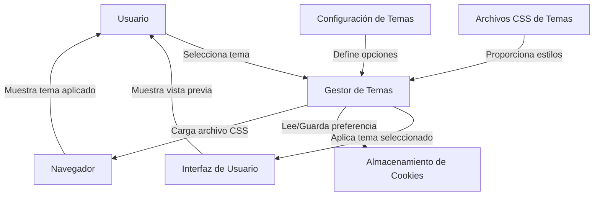

## Module: jquery.themes.min.js

# Análisis Integral del Módulo jquery.themes.min.js

## Nombre del Componente/Módulo
Plugin jQuery Themes (jquery.themes.min.js) - Versión 1.2.0

## Objetivos Primarios
Este módulo es un plugin de jQuery diseñado para aplicar y gestionar temas CSS en aplicaciones web. Su propósito principal es permitir a los usuarios cambiar dinámicamente entre diferentes temas de interfaz de usuario jQuery UI, ofreciendo una experiencia personalizable sin necesidad de recargar la página.

## Funciones, Métodos y Consultas Críticas
- **Themes()**: Constructor principal que inicializa el plugin.
- **setDefaults()**: Establece configuraciones predeterminadas.
- **init()**: Inicializa el plugin con configuraciones específicas.
- **addTheme()**: Añade nuevos temas al conjunto disponible.
- **getThemes()**: Recupera la lista de temas disponibles.
- **_attachThemes()**: Adjunta la funcionalidad de temas a un elemento.
- **_changeThemes()**: Gestiona el cambio de temas.
- **_updateTheme()**: Actualiza la visualización de los temas disponibles.
- **_setTheme()**: Función crítica que aplica el tema seleccionado.
- **_showPreview()**: Muestra una vista previa del tema al pasar el cursor.
- **_hidePreview()**: Oculta la vista previa del tema.

## Variables y Elementos Clave
- **m ('themeID')**: Identificador para cookies de temas.
- **_uuid**: Identificador único basado en timestamp.
- **_linkID**: ID del elemento link para la hoja de estilos del tema.
- **_defaults**: Configuraciones predeterminadas (themeBase, defaultTheme, cookieExpiry, etc.).
- **_settings**: Configuraciones de visualización (iconos, previsualizaciones, tamaños).
- **_themes**: Objeto que contiene todos los temas disponibles con sus propiedades.
- **currentTheme**: Almacena el tema actualmente seleccionado.

## Interdependencias y Relaciones
- Depende de jQuery como biblioteca base.
- Interactúa con el DOM para insertar hojas de estilo y elementos visuales.
- Utiliza cookies del navegador para persistir la selección del tema entre sesiones.
- Se integra con jQuery UI al gestionar sus temas predefinidos.

## Operaciones Principales vs. Auxiliares
**Operaciones Principales:**
- Cambio de temas mediante _setTheme().
- Generación de la interfaz de selección de temas con _updateTheme().

**Operaciones Auxiliares:**
- Gestión de cookies para recordar preferencias.
- Visualización de previsualizaciones al pasar el cursor.
- Validaciones y comprobaciones de estado.

## Secuencia Operacional/Flujo de Ejecución
1. Inicialización del plugin con configuraciones predeterminadas o personalizadas.
2. Comprobación de cookies para recuperar el tema previamente seleccionado.
3. Generación de la interfaz de usuario para selección de temas.
4. Al seleccionar un tema:
   - Se actualiza la hoja de estilos en el DOM.
   - Se marca visualmente el tema seleccionado.
   - Se ejecuta el callback onSelect si está definido.
   - Se guarda la preferencia en una cookie.

## Aspectos de Rendimiento y Optimización
- El código está minificado para reducir el tamaño de descarga.
- Utiliza un único elemento link en el DOM que se actualiza en lugar de crear múltiples elementos.
- Implementa carga dinámica de hojas de estilo para evitar cargar todos los temas simultáneamente.
- Podría optimizarse la generación de HTML para la lista de temas en aplicaciones con muchos temas disponibles.

## Reusabilidad y Adaptabilidad
- Alta reusabilidad gracias a su diseño como plugin jQuery.
- Permite añadir temas personalizados mediante addTheme().
- Configuraciones extensibles a través de setDefaults().
- Adaptable a diferentes proyectos mediante personalización de rutas de archivos y opciones visuales.

## Uso y Contexto
- Se utiliza en aplicaciones web que requieren cambios de tema en tiempo real.
- Especialmente útil para aplicaciones basadas en jQuery UI que desean ofrecer personalización visual.
- Se implementa típicamente como un selector de temas en paneles de configuración o barras de herramientas.
- Ejemplo de uso: `$('#themeSwitcher').themes({themeBase: 'css/themes/'});`

## Suposiciones y Limitaciones
- Asume que las hojas de estilo de los temas siguen una estructura consistente.
- Requiere que las imágenes de iconos y previsualizaciones estén disponibles en las rutas especificadas.
- Limitado a la manipulación de hojas de estilo CSS (no maneja temas basados en variables CSS o sistemas más modernos).
- Depende de cookies para la persistencia, lo que puede ser problemático con políticas de privacidad estrictas.
- No está diseñado para funcionar con frameworks CSS modernos como Bootstrap o Tailwind sin adaptaciones.
## Flow Diagram [via mermaid]

