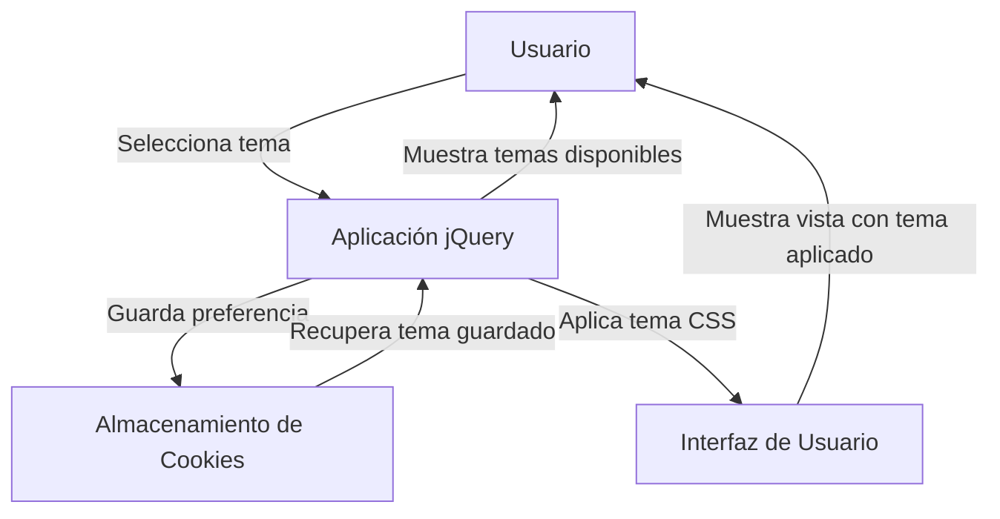

## Module: jquery.themes.pack.js

# Análisis Integral del Módulo jquery.themes.pack.js

## Nombre del Componente/Módulo SQL
El módulo analizado es **jquery.themes.pack.js**, un plugin de jQuery para la aplicación de temas CSS.

## Objetivos Primarios
Este módulo está diseñado para facilitar la aplicación y gestión de temas CSS en aplicaciones web basadas en jQuery. Permite a los usuarios cambiar dinámicamente entre diferentes temas de UI (interfaz de usuario), especialmente orientado a jQuery UI, sin necesidad de recargar la página.

## Funciones, Métodos y Consultas Críticas
- **init**: Inicializa el plugin con configuraciones personalizadas.
- **_setTheme**: Función central que aplica un tema específico cambiando la hoja de estilo.
- **_attachThemes**: Crea la interfaz de selección de temas en el DOM.
- **_updateTheme**: Actualiza la interfaz de temas en elementos existentes.
- **_showPreview**: Muestra una vista previa del tema al pasar el cursor.
- **_hidePreview**: Oculta la vista previa del tema.
- **addTheme**: Permite agregar nuevos temas a la colección disponible.
- **getThemes**: Devuelve la colección de temas configurados.

## Variables y Elementos Clave
- **currentTheme**: Almacena el tema actualmente seleccionado.
- **_defaults**: Configuración predeterminada del plugin.
- **_themes**: Objeto que contiene todos los temas disponibles con sus propiedades.
- **_settings**: Configuración específica para la visualización de iconos y vistas previas.
- **_linkID**: ID del elemento link que se utiliza para cargar la hoja de estilo del tema.
- **markerClassName**: Clase CSS utilizada para marcar elementos que tienen el plugin aplicado.

## Interdependencias y Relaciones
- Depende de jQuery como biblioteca base.
- Interactúa con el DOM para insertar y manipular elementos de interfaz.
- Utiliza cookies del navegador para persistir la selección del tema entre sesiones.
- Se integra con hojas de estilo externas que representan los diferentes temas.

## Operaciones Principales vs. Auxiliares
**Operaciones Principales:**
- Cambio de temas mediante la modificación del atributo href de un elemento link.
- Generación de la interfaz de selección de temas.

**Operaciones Auxiliares:**
- Gestión de cookies para recordar la selección del usuario.
- Visualización de vistas previas al pasar el cursor.
- Validaciones y comprobaciones de estado.

## Secuencia Operativa/Flujo de Ejecución
1. Inicialización del plugin con opciones predeterminadas o personalizadas.
2. Creación de la interfaz de selección de temas en el DOM.
3. Cuando el usuario selecciona un tema:
   - Se actualiza la referencia a la hoja de estilo.
   - Se actualiza la interfaz visual (marcando el tema seleccionado).
   - Se guarda la preferencia en una cookie (si está configurado).
4. Gestión de eventos de ratón para mostrar/ocultar vistas previas.

## Aspectos de Rendimiento y Optimización
- El código está minificado para reducir el tamaño de descarga.
- Utiliza una técnica de evaluación diferida (eval) que podría afectar el rendimiento y la seguridad.
- La carga dinámica de hojas de estilo podría causar parpadeos visuales si no se manejan correctamente.
- No parece implementar precarga de temas, lo que podría mejorar la experiencia del usuario.

## Reutilización y Adaptabilidad
- El plugin es altamente configurable a través de opciones.
- Permite agregar nuevos temas dinámicamente mediante el método addTheme.
- La arquitectura modular facilita su integración en diferentes proyectos.
- El uso de jQuery como base permite compatibilidad con múltiples navegadores.

## Uso y Contexto
- Se utiliza principalmente en aplicaciones web que requieren personalización visual.
- Es especialmente útil para aplicaciones que utilizan jQuery UI y necesitan ofrecer múltiples opciones de temas.
- Se implementa típicamente en paneles de configuración o preferencias de usuario.
- Puede ser utilizado tanto en sitios web completos como en componentes específicos.

## Suposiciones y Limitaciones
- Asume que las hojas de estilo de los temas están estructuradas de manera consistente.
- Requiere que los archivos de temas estén disponibles en las rutas especificadas.
- Depende de jQuery y podría no ser compatible con versiones muy recientes sin adaptación.
- La implementación de cookies para persistencia podría no funcionar en navegadores con restricciones de privacidad.
- El uso de eval() para descomprimir el código podría presentar riesgos de seguridad.
- Está diseñado principalmente para temas de jQuery UI, lo que podría limitar su uso con otros frameworks CSS.
## Flow Diagram [via mermaid]

