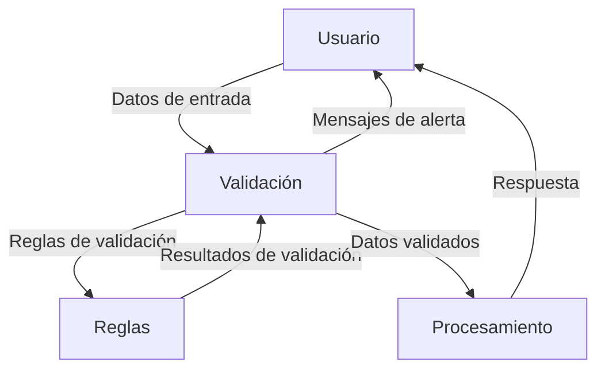

## Module: jquery.validationEngine-es.js

# Análisis Integral del Módulo jquery.validationEngine-es.js

## Nombre del Componente
**Módulo**: jquery.validationEngine-es.js

## Objetivos Primarios
Este módulo es un archivo de idioma español para el plugin jQuery ValidationEngine. Su propósito principal es proporcionar las traducciones y configuraciones de reglas de validación en español para formularios web, permitiendo mostrar mensajes de error localizados cuando se validan campos de formulario.

## Funciones, Métodos y Consultas Críticas
- **$.fn.validationEngineLanguage**: Método que extiende jQuery para inicializar el soporte de idioma.
- **$.validationEngineLanguage.newLang**: Función principal que define todas las reglas de validación disponibles con sus correspondientes mensajes de error en español.
- **$.validationEngineLanguage.allRules**: Objeto que contiene todas las definiciones de reglas de validación, incluyendo expresiones regulares y textos de alerta.

## Variables y Elementos Clave
- **allRules**: Objeto principal que contiene todas las reglas de validación como:
  - required: Validación de campos obligatorios
  - minSize/maxSize: Validación de longitud de texto
  - min/max: Validación de valores numéricos
  - email: Validación de formato de correo electrónico
  - date: Validación de formato de fecha
  - integer/number: Validación de números
  - url: Validación de URLs
  - phone: Validación de números telefónicos
  - creditCard: Validación de tarjetas de crédito

## Interdependencias y Relaciones
- Depende de jQuery como biblioteca base.
- Está diseñado para trabajar con el plugin jQuery ValidationEngine.
- Se integra con el sistema de validación de formularios del plugin principal.

## Operaciones Principales vs. Auxiliares
- **Operaciones Principales**: Definición de reglas de validación con sus expresiones regulares y mensajes de error.
- **Operaciones Auxiliares**: Configuración de funciones personalizadas de validación y soporte para validaciones AJAX.

## Secuencia Operativa/Flujo de Ejecución
1. El módulo se inicializa como un plugin de jQuery.
2. Define el método validationEngineLanguage en el prototipo de jQuery.
3. Crea el objeto validationEngineLanguage en el espacio de nombres de jQuery.
4. Define la función newLang que configura todas las reglas de validación.
5. Ejecuta la función newLang para inicializar las reglas.

## Aspectos de Rendimiento y Optimización
- Las expresiones regulares están optimizadas para validaciones específicas.
- El código está estructurado para cargarse eficientemente como parte del sistema de validación.
- No hay bucles o procesos intensivos que puedan afectar el rendimiento.

## Reusabilidad y Adaptabilidad
- Alta reusabilidad: puede utilizarse en cualquier proyecto que implemente jQuery ValidationEngine.
- Adaptable: las reglas pueden modificarse o ampliarse según las necesidades específicas del proyecto.
- Las reglas personalizadas (como ajaxUserCall) pueden adaptarse para integrarse con servicios backend específicos.

## Uso y Contexto
- Se utiliza en formularios web para proporcionar validación del lado del cliente con mensajes en español.
- Se implementa incluyendo este archivo después de cargar jQuery y el plugin ValidationEngine principal.
- Típicamente se usa en sitios web dirigidos a usuarios hispanohablantes para mejorar la experiencia de usuario.

## Suposiciones y Limitaciones
- **Suposiciones**:
  - Se asume que jQuery y el plugin ValidationEngine ya están cargados.
  - Se espera que los formularios estén correctamente estructurados para la validación.
  
- **Limitaciones**:
  - Está limitado al idioma español (variante estándar).
  - Algunas validaciones como la de fecha están configuradas para el formato DD/MM/AAAA específicamente.
  - Las validaciones AJAX requieren endpoints específicos en el servidor para funcionar correctamente.
  - La validación de correo electrónico, aunque exhaustiva, podría no cubrir todos los casos válidos según los estándares más recientes.
## Flow Diagram [via mermaid]

