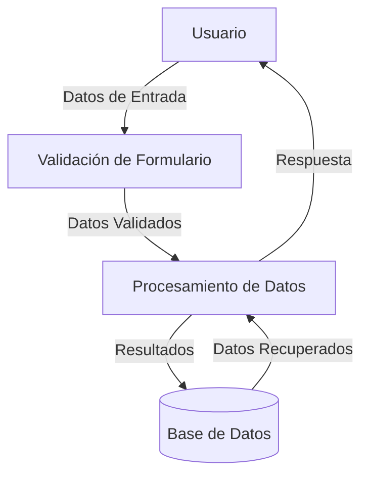

## Module: jquery.validationEngine.js

# Análisis Integral del Módulo jquery.validationEngine.js

## Nombre del Componente/Módulo
jQuery Validation Engine (jquery.validationEngine.js) - Versión 2.6.2

## Objetivos Primarios
Este módulo es un plugin de jQuery diseñado para proporcionar validación de formularios en el lado del cliente. Su propósito principal es permitir la validación de campos de formulario mediante reglas personalizables, incluyendo expresiones regulares y validaciones asíncronas mediante AJAX. El plugin ofrece retroalimentación visual inmediata al usuario sobre errores de validación.

## Funciones, Métodos y Consultas Críticas
- **init**: Inicializa el motor de validación y guarda las opciones del usuario.
- **attach**: Vincula los eventos de validación a los campos del formulario.
- **validate**: Valida un formulario completo o campos específicos.
- **_validateFields**: Valida todos los campos de un formulario.
- **_validateField**: Valida un campo específico según sus reglas.
- **_showPrompt**: Muestra mensajes de error o éxito.
- **_ajax**: Realiza validaciones mediante peticiones AJAX.
- **_required**, **_equals**, **_creditCard**, etc.: Validadores específicos para diferentes tipos de reglas.

## Variables y Elementos Clave
- **options**: Objeto que almacena la configuración del plugin.
- **rules**: Array que contiene las reglas de validación extraídas de los atributos de los campos.
- **promptPosition**: Determina la posición de los mensajes de error.
- **validateAttribute**: Atributo HTML utilizado para definir reglas de validación (por defecto "class").
- **ajaxValidCache**: Caché para resultados de validaciones AJAX.
- **InvalidFields**: Array que almacena los campos que no han pasado la validación.

## Interdependencias y Relaciones
- Depende de jQuery como biblioteca base.
- Requiere archivos de localización externos ($.validationEngineLanguage) para los mensajes de error.
- Interactúa con el DOM para mostrar/ocultar mensajes de validación.
- Se integra con eventos de formulario estándar (submit, blur, click).
- Puede interactuar con servidores mediante AJAX para validaciones del lado del servidor.

## Operaciones Principales vs. Auxiliares
**Operaciones Principales:**
- Validación de campos según reglas definidas.
- Mostrar/ocultar mensajes de error.
- Manejo del envío de formularios.

**Operaciones Auxiliares:**
- Cálculo de posiciones para los mensajes de error.
- Formateo y estilizado de mensajes.
- Manejo de eventos del DOM.
- Funciones de utilidad para manipulación de fechas y strings.

## Secuencia de Ejecución/Flujo Operacional
1. Inicialización del plugin con opciones personalizadas.
2. Vinculación de eventos a los campos del formulario.
3. Al dispararse un evento (blur, submit, etc.), se validan los campos correspondientes.
4. Se aplican las reglas de validación definidas para cada campo.
5. Se muestran mensajes de error si es necesario.
6. En caso de envío del formulario, se validan todos los campos antes de permitir el envío.
7. Opcionalmente, se realiza validación AJAX antes del envío final.

## Aspectos de Rendimiento y Optimización
- Utiliza caché para validaciones AJAX para evitar peticiones repetidas.
- Permite limitar el número de errores mostrados por campo.
- Ofrece opciones para mostrar/ocultar automáticamente los mensajes de error.
- El posicionamiento de los mensajes puede afectar al rendimiento en formularios grandes.
- La validación de campos no visibles es opcional para mejorar el rendimiento.

## Reusabilidad y Adaptabilidad
- Altamente configurable mediante un amplio conjunto de opciones.
- Permite definir reglas de validación personalizadas.
- Soporta múltiples idiomas mediante archivos de localización.
- Se puede aplicar a cualquier formulario HTML.
- Permite personalizar los mensajes de error y su presentación visual.
- Admite integración con otros plugins de jQuery mediante callbacks.

## Uso y Contexto
El plugin se utiliza típicamente en aplicaciones web para validar formularios antes de su envío al servidor. Se implementa añadiendo clases o atributos específicos a los campos HTML que definen las reglas de validación. Es especialmente útil en:
- Formularios de registro y login.
- Formularios de contacto.
- Formularios de entrada de datos complejos.
- Aplicaciones que requieren validación en tiempo real.

## Suposiciones y Limitaciones
**Suposiciones:**
- Se asume que jQuery está cargado en la página.
- Se espera que los archivos de localización estén disponibles.
- Presupone que los campos a validar tienen IDs únicos.

**Limitaciones:**
- Dependencia completa de jQuery.
- La validación del lado del cliente puede ser evitada por usuarios avanzados.
- El posicionamiento de mensajes puede ser problemático en diseños responsivos complejos.
- El rendimiento puede verse afectado en formularios muy grandes.
- La personalización avanzada requiere conocimiento profundo de la estructura del plugin.
- No reemplaza la necesidad de validación del lado del servidor.
## Flow Diagram [via mermaid]

