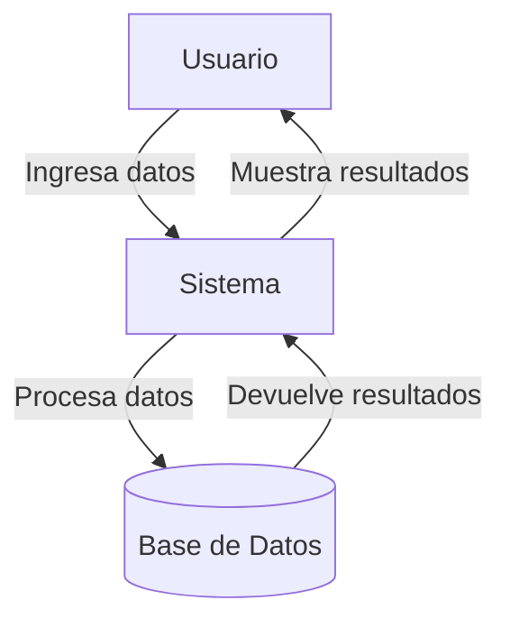

## Module: jquery.wijmo-open.1.5.0.min.js

# Análisis Integral del Módulo jquery.wijmo-open.1.5.0.min.js

## Nombre del Módulo/Componente SQL
**Wijmo Open 1.5.0** - Biblioteca de componentes UI para jQuery

## Objetivos Primarios
Este módulo es una biblioteca de componentes de interfaz de usuario (UI) para jQuery que proporciona widgets avanzados y personalizables. Su objetivo principal es extender las funcionalidades de jQuery UI con componentes más sofisticados para crear interfaces web interactivas y ricas en funcionalidades.

## Funciones, Métodos y Consultas Críticas
La biblioteca incluye múltiples widgets, cada uno con sus propias funciones y métodos:

1. **wijtooltip**: Proporciona tooltips avanzados con posicionamiento personalizable y animaciones.
2. **wijslider**: Implementa un control deslizante con opciones extendidas.
3. **wijsplitter**: Crea paneles divisibles y redimensionables.
4. **wijprogressbar**: Barra de progreso personalizable.
5. **wijdialog**: Diálogos modales avanzados con opciones de minimización y maximización.
6. **wijaccordion**: Componente de acordeón con animaciones personalizables.
7. **wijsuperpanel**: Panel con capacidades de desplazamiento avanzadas.
8. **wijcheckbox** y **wijradio**: Controles de formulario mejorados.
9. **wijlist**: Lista avanzada con selección múltiple y personalización.
10. **wijcalendar**: Calendario con selección de fechas y navegación.
11. **wijexpander**: Componente expandible/contraíble.
12. **wijmenu**: Menú avanzado con submenús y animaciones.
13. **wijtabs**: Sistema de pestañas con carga AJAX y animaciones.

## Variables y Elementos Clave
- **Selectores jQuery**: Utilizados extensivamente para manipular elementos DOM.
- **Opciones de configuración**: Cada widget tiene un conjunto de opciones configurables.
- **Eventos**: Sistema de eventos para interactuar con los widgets.
- **Animaciones**: Efectos visuales para mejorar la experiencia de usuario.
- **Métodos de utilidad**: Funciones auxiliares para manipulación DOM y cálculos.

## Interdependencias y Relaciones
- Depende de **jQuery** como biblioteca base.
- Depende de **jQuery UI** para estilos y funcionalidades básicas.
- Utiliza **Globalize** para internacionalización.
- Los componentes pueden interactuar entre sí (por ejemplo, wijmenu dentro de wijdialog).
- Comparte utilidades comunes entre widgets para manipulación DOM y cálculos.

## Operaciones Principales vs. Auxiliares
**Operaciones principales**:
- Creación y renderizado de widgets UI
- Manejo de eventos de usuario
- Animaciones y transiciones
- Posicionamiento de elementos

**Operaciones auxiliares**:
- Cálculos de dimensiones y posiciones
- Validación de opciones
- Manejo de estados (hover, active, disabled)
- Limpieza de recursos al destruir widgets

## Flujo de Ejecución
1. Inicialización del widget mediante selector jQuery
2. Configuración de opciones y estado inicial
3. Renderizado del widget en el DOM
4. Vinculación de eventos de usuario
5. Respuesta a interacciones (clic, arrastrar, etc.)
6. Actualización del estado visual según interacciones
7. Limpieza y destrucción cuando se elimina el widget

## Aspectos de Rendimiento y Optimización
- Uso de caché para elementos DOM frecuentemente accedidos
- Minimización de reflows y repaints
- Reutilización de elementos DOM cuando es posible
- Delegación de eventos para mejorar rendimiento
- Lazy loading para componentes complejos
- Optimizaciones para diferentes navegadores

## Reusabilidad y Adaptabilidad
- Altamente configurable mediante opciones
- API pública bien definida para cada widget
- Soporte para temas visuales
- Métodos para modificar comportamiento en tiempo de ejecución
- Eventos personalizables para extender funcionalidad

## Uso y Contexto
Se utiliza para crear interfaces web avanzadas en aplicaciones empresariales, dashboards, sistemas de administración y cualquier aplicación web que requiera componentes UI ricos. Los widgets se pueden aplicar a elementos HTML existentes o crear dinámicamente.

## Suposiciones y Limitaciones
- Asume que jQuery y jQuery UI están cargados correctamente
- Requiere navegadores modernos para algunas funcionalidades avanzadas
- Puede tener problemas de rendimiento en dispositivos móviles antiguos
- Algunas funcionalidades avanzadas pueden requerir configuración adicional
- El código minificado dificulta la depuración de problemas específicos

Esta biblioteca proporciona una capa de abstracción sobre jQuery UI para facilitar la creación de interfaces de usuario complejas y profesionales con menos código, pero requiere un buen entendimiento de jQuery y el modelo DOM para su uso óptimo.
## Flow Diagram [via mermaid]

