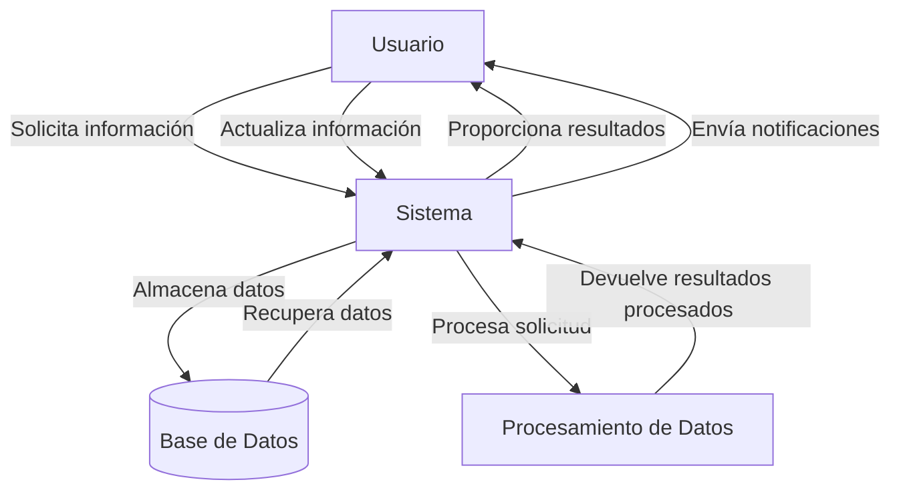

## Module: modernizr-custom.js

# Análisis Completo del Módulo modernizr-custom.js

## Módulo/Componente SQL
**Nombre del Módulo**: modernizr-custom.js

## Objetivos Primarios
Este módulo es una versión personalizada de Modernizr, una biblioteca JavaScript que detecta las características disponibles en el navegador del usuario. Su propósito principal es permitir a los desarrolladores utilizar características modernas de HTML, CSS y JavaScript mientras mantienen la compatibilidad con navegadores más antiguos, proporcionando una forma de detectar qué características están disponibles en el navegador del usuario en tiempo de ejecución.

## Funciones, Métodos y Consultas Críticas
- **testRunner()**: Ejecuta todas las pruebas registradas y actualiza el objeto Modernizr con los resultados.
- **setClasses()**: Añade clases al elemento HTML basadas en las características detectadas.
- **addTest()**: Permite registrar pruebas personalizadas para detectar características específicas.
- **createElement()**: Crea elementos DOM para realizar pruebas.
- **testStyles()**: Inyecta estilos CSS para probar características específicas.
- **testAllProps()**: Prueba propiedades CSS con prefijos de proveedor.
- **prefixed()**: Determina el prefijo de proveedor necesario para una característica específica.

## Variables y Elementos Clave
- **Modernizr**: El objeto principal que contiene todos los resultados de las pruebas.
- **ModernizrProto**: El prototipo del objeto Modernizr.
- **classes**: Array que almacena las clases CSS que se añadirán al elemento HTML.
- **tests**: Array que almacena todas las pruebas a ejecutar.
- **prefixes**: Lista de prefijos de proveedor para probar características con prefijos.
- **docElement**: Referencia al elemento HTML del documento.

## Interdependencias y Relaciones
- Interactúa con el DOM para realizar pruebas de características.
- Se relaciona con el elemento HTML para añadir clases que indican las características soportadas.
- Depende del navegador y sus capacidades para determinar los resultados de las pruebas.
- Proporciona una API que otros scripts pueden utilizar para adaptar su comportamiento según las características disponibles.

## Operaciones Principales vs. Auxiliares
**Operaciones Principales**:
- Detección de características de HTML5, CSS3 y JavaScript.
- Adición de clases al elemento HTML basadas en las características detectadas.
- Exposición de una API para consultar las características disponibles.

**Operaciones Auxiliares**:
- Creación de elementos DOM para pruebas.
- Inyección de estilos CSS para pruebas.
- Manejo de prefijos de proveedor.
- Normalización de resultados entre diferentes navegadores.

## Secuencia Operativa/Flujo de Ejecución
1. Inicialización del objeto Modernizr.
2. Registro de pruebas predefinidas y asíncronas.
3. Ejecución de pruebas síncronas.
4. Programación de pruebas asíncronas para su ejecución posterior.
5. Adición de clases al elemento HTML basadas en los resultados.
6. Exposición del objeto Modernizr como una API global.

## Aspectos de Rendimiento y Optimización
- El código está minificado para reducir el tamaño de descarga.
- Las pruebas se ejecutan solo cuando es necesario.
- Algunas pruebas son asíncronas para no bloquear el hilo principal.
- El módulo utiliza detección de características en lugar de detección de agente de usuario, lo que es más preciso y menos propenso a errores.

## Reusabilidad y Adaptabilidad
- Altamente personalizable mediante la adición de pruebas personalizadas.
- Permite a los desarrolladores adaptar su código según las características disponibles.
- Puede ser configurado para incluir solo las pruebas necesarias para un proyecto específico.
- La API es consistente y bien documentada, facilitando su uso en diferentes proyectos.

## Uso y Contexto
- Se utiliza en el desarrollo web para implementar técnicas de mejora progresiva.
- Permite a los desarrolladores ofrecer experiencias mejoradas a usuarios con navegadores modernos mientras mantienen la funcionalidad básica para navegadores más antiguos.
- Se integra con frameworks y bibliotecas para adaptar su comportamiento según las características disponibles.
- Es especialmente útil en proyectos que requieren compatibilidad con una amplia gama de navegadores.

## Suposiciones y Limitaciones
- Asume que las pruebas de detección de características son confiables, lo que no siempre es el caso debido a implementaciones parciales o incorrectas en algunos navegadores.
- Algunas pruebas pueden dar falsos positivos o negativos en ciertos navegadores.
- El rendimiento puede verse afectado si se incluyen demasiadas pruebas.
- No puede detectar todas las características posibles, y algunas pueden requerir pruebas personalizadas.
- La detección de características no siempre es suficiente para garantizar una experiencia consistente en todos los navegadores.
## Flow Diagram [via mermaid]

