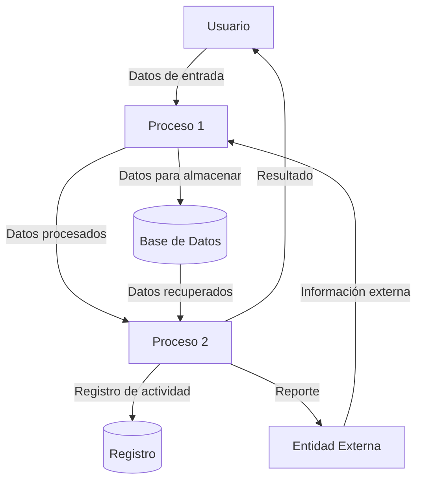

## Module: prettify.js

# Análisis Completo del Módulo prettify.js

## Nombre del Módulo/Componente SQL
**prettify.js** - Biblioteca de JavaScript para resaltado de sintaxis de código.

## Objetivos Primarios
Este módulo está diseñado para formatear y resaltar la sintaxis de fragmentos de código en páginas web. Su propósito principal es mejorar la legibilidad del código fuente mostrado en navegadores web mediante la aplicación de estilos y colores a diferentes elementos sintácticos (palabras clave, cadenas, comentarios, etc.).

## Funciones, Métodos y Consultas Críticas
- **prettyPrintOne**: Función para formatear un solo fragmento de código.
- **prettyPrint**: Función principal que busca elementos con la clase "prettyprint" en el DOM y aplica el formato.
- **L**: Función para compilar expresiones regulares.
- **x (createSimpleLexer)**: Crea analizadores léxicos simples.
- **u (sourceDecorator)**: Decora el código fuente con marcado HTML.
- **M**: Analiza el contenido del nodo para extraer texto y posiciones.
- **E**: Aplica el resaltado de sintaxis al texto analizado.
- **D**: Maneja la numeración de líneas.

## Variables y Elementos Clave
- **PR_SHOULD_USE_CONTINUATION**: Variable global que controla el comportamiento de continuación.
- **A**: Objeto que almacena los manejadores de lenguajes registrados.
- **Constantes de tipo de token**: PR_ATTRIB_NAME, PR_ATTRIB_VALUE, PR_COMMENT, PR_DECLARATION, etc.
- **Definiciones de lenguajes**: Arrays que contienen palabras clave para diferentes lenguajes (F, G, H, I, J, etc.).

## Interdependencias y Relaciones
- El módulo interactúa con el DOM del navegador para encontrar y modificar elementos HTML.
- Depende del objeto `window` y `document` del navegador.
- Utiliza el objeto `Date` para gestionar tiempos de ejecución.
- No tiene dependencias externas de bibliotecas.

## Operaciones Core vs. Auxiliares
**Operaciones Core:**
- Análisis léxico del código fuente mediante expresiones regulares.
- Transformación del texto en HTML con etiquetas de estilo.
- Aplicación de resaltado a elementos DOM.

**Operaciones Auxiliares:**
- Detección de lenguajes de programación.
- Numeración de líneas.
- Gestión de tiempos para evitar bloqueos del navegador.
- Registro de manejadores de lenguajes personalizados.

## Secuencia Operacional/Flujo de Ejecución
1. Inicialización de variables y definición de expresiones regulares para diferentes lenguajes.
2. Registro de manejadores para lenguajes específicos (JavaScript, HTML, CSS, etc.).
3. Cuando se llama a `prettyPrint()`:
   - Busca elementos con clase "prettyprint" en el DOM.
   - Para cada elemento, determina el lenguaje a utilizar.
   - Analiza el contenido del texto.
   - Aplica el resaltado de sintaxis.
   - Opcionalmente añade numeración de líneas.
4. El proceso se ejecuta en fragmentos para evitar bloquear el navegador.

## Aspectos de Rendimiento y Optimización
- Utiliza procesamiento por lotes con `setTimeout` para evitar bloquear la interfaz de usuario.
- Implementa caché de expresiones regulares compiladas para mejorar el rendimiento.
- El análisis léxico puede ser intensivo en CPU para archivos grandes.
- Potenciales cuellos de botella en el procesamiento de expresiones regulares complejas.
- La manipulación extensiva del DOM puede afectar el rendimiento en páginas con mucho código.

## Reusabilidad y Adaptabilidad
- Alta reusabilidad: puede aplicarse a cualquier elemento HTML que contenga código.
- Extensible mediante el registro de nuevos manejadores de lenguajes con `registerLangHandler`.
- Parametrizable a través de clases CSS y atributos en los elementos HTML.
- Permite personalización de la numeración de líneas y estilos de resaltado.

## Uso y Contexto
- Se utiliza en blogs, documentación técnica, y sitios web que muestran fragmentos de código.
- Típicamente se invoca automáticamente al cargar la página o manualmente después de insertar código dinámicamente.
- Se aplica a elementos `<pre>`, `<code>` o `<xmp>` con la clase "prettyprint".
- Puede especificar el lenguaje mediante la clase "lang-xxx" (ej. "lang-js" para JavaScript).

## Suposiciones y Limitaciones
- Asume que el código a formatear está contenido en elementos HTML específicos.
- Requiere que el DOM esté completamente cargado antes de ejecutarse.
- El reconocimiento automático de lenguajes puede no ser preciso en todos los casos.
- No proporciona edición de código, solo visualización formateada.
- El rendimiento puede degradarse con fragmentos de código muy grandes.
- Depende de CSS externo para la visualización final de los estilos aplicados.
## Flow Diagram [via mermaid]

