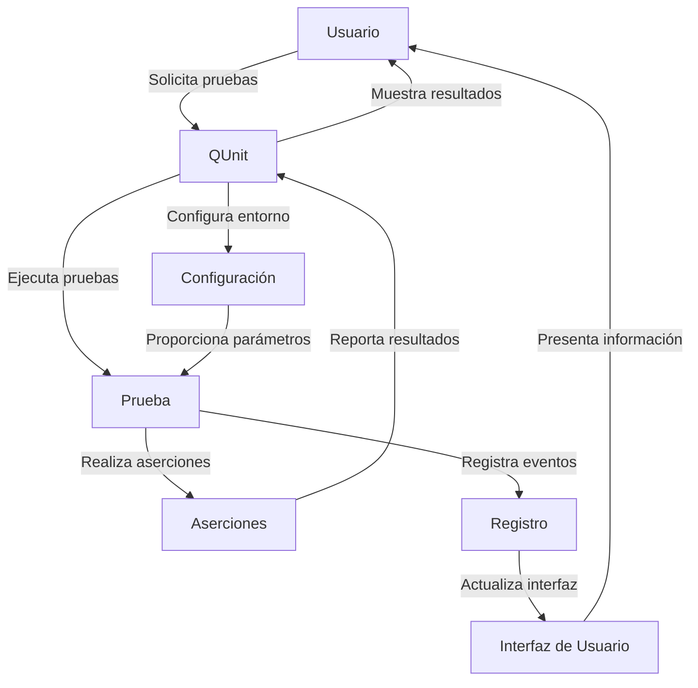

## Module: qunit.js

# Análisis Integral del Módulo QUnit.js

## Nombre del Módulo/Componente SQL
QUnit.js - Un Framework de Pruebas Unitarias para JavaScript (versión 1.11.0)

## Objetivos Primarios
QUnit es un framework de pruebas unitarias para JavaScript que permite a los desarrolladores escribir y ejecutar pruebas automatizadas para validar el comportamiento de su código JavaScript. Su propósito principal es proporcionar una estructura organizada para definir casos de prueba, realizar aserciones sobre el comportamiento esperado del código y reportar los resultados de manera clara y estructurada.

## Funciones, Métodos y Consultas Críticas
- **QUnit.module()**: Define un módulo de pruebas para agrupar casos de prueba relacionados.
- **QUnit.test()**: Define un caso de prueba individual.
- **QUnit.asyncTest()**: Define un caso de prueba asíncrono.
- **QUnit.expect()**: Especifica el número esperado de aserciones en una prueba.
- **QUnit.start()** y **QUnit.stop()**: Controlan la ejecución de pruebas asíncronas.
- **Métodos de aserción**:
  - **assert.ok()**: Verifica que una expresión sea verdadera.
  - **assert.equal()**: Compara dos valores con igualdad no estricta (==).
  - **assert.strictEqual()**: Compara dos valores con igualdad estricta (===).
  - **assert.deepEqual()**: Compara objetos o arrays en profundidad.
  - **assert.throws()**: Verifica que una función lance una excepción.

## Variables y Elementos Clave
- **config**: Objeto central que mantiene el estado interno del framework.
- **assert**: Objeto que contiene todos los métodos de aserción.
- **Test**: Constructor para instancias de prueba.
- **QUnit.urlParams**: Parámetros de URL para configurar la ejecución de pruebas.
- **QUnit.config**: Configuración expuesta públicamente.

## Interdependencias y Relaciones
- Interactúa con el DOM para mostrar resultados de pruebas en el navegador.
- Utiliza el almacenamiento de sesión (sessionStorage) para recordar pruebas fallidas.
- Se integra con el sistema de eventos del navegador para capturar errores globales.
- Puede ser utilizado en entornos CommonJS (como Node.js) a través de exportaciones.

## Operaciones Principales vs. Auxiliares
**Operaciones Principales**:
- Definición y ejecución de pruebas (QUnit.test, Test.prototype.run)
- Sistema de aserciones (assert.ok, assert.equal, etc.)
- Reporte de resultados (runLoggingCallbacks)

**Operaciones Auxiliares**:
- Manipulación del DOM para mostrar resultados
- Gestión de configuración y parámetros
- Utilidades como QUnit.equiv para comparación profunda
- Funciones de ayuda como escapeText, sourceFromStacktrace

## Secuencia Operativa/Flujo de Ejecución
1. **Inicialización**: QUnit.init() configura el entorno de pruebas.
2. **Carga**: QUnit.load() prepara la interfaz de usuario y configura los parámetros.
3. **Definición de pruebas**: Los usuarios definen módulos y pruebas.
4. **Ejecución de pruebas**:
   - Cada prueba se encola (Test.prototype.queue)
   - Se ejecuta la configuración (Test.prototype.setup)
   - Se ejecuta la prueba (Test.prototype.run)
   - Se ejecuta la limpieza (Test.prototype.teardown)
   - Se finalizan los resultados (Test.prototype.finish)
5. **Reporte**: Se muestran los resultados en la interfaz y se notifica a los callbacks registrados.

## Aspectos de Rendimiento y Optimización
- Utiliza una cola de ejecución (config.queue) para gestionar pruebas de manera eficiente.
- Implementa un sistema de semáforo para controlar pruebas asíncronas.
- Reordena las pruebas para ejecutar primero las que fallaron anteriormente.
- Utiliza un sistema de actualización controlada por tiempo (config.updateRate) para evitar bloquear el navegador.
- Implementa detección de contaminación global para identificar variables globales no deseadas.

## Reusabilidad y Adaptabilidad
- Diseño modular que permite extender con nuevos métodos de aserción.
- Sistema de callbacks para integración con otros frameworks o herramientas.
- Configuración flexible a través de parámetros de URL y opciones.
- Compatibilidad con entornos CommonJS para uso en Node.js.
- Capacidad para personalizar la salida y el comportamiento.

## Uso y Contexto
- Se utiliza principalmente en desarrollo web para pruebas unitarias de código JavaScript.
- Puede ejecutarse en navegadores o entornos Node.js.
- Se integra en flujos de trabajo de integración continua.
- Permite tanto pruebas síncronas como asíncronas.
- Proporciona una interfaz visual en el navegador para revisar resultados.

## Suposiciones y Limitaciones
- Asume la disponibilidad de un entorno DOM en la mayoría de los casos (aunque puede funcionar en Node.js).
- Depende de características específicas del navegador para algunas funcionalidades (como la captura de errores).
- La compatibilidad con navegadores antiguos puede ser limitada en algunas características.
- El manejo de pruebas asíncronas requiere uso explícito de start() y stop().
- La detección de fugas de memoria o recursos no está incluida de forma nativa.
- El rendimiento puede degradarse con conjuntos de pruebas muy grandes.
## Flow Diagram [via mermaid]

