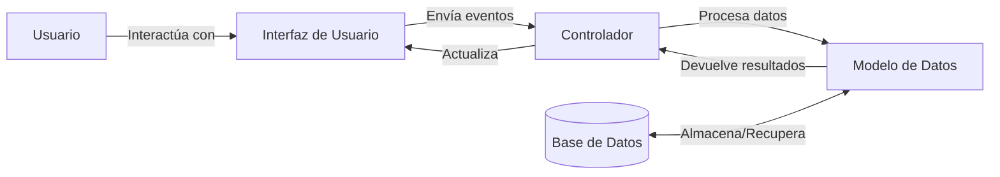
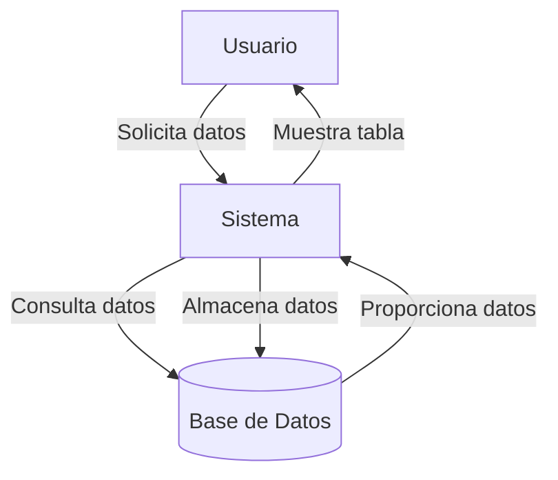

## Module: script.js

# Análisis Integral del Módulo script.js

## Módulo/Componente SQL
**Nombre del Módulo**: script.js

## Objetivos Primarios
El módulo script.js tiene dos objetivos principales:
1. Procesar elementos HTML con la clase "example" para mostrar su código fuente formateado y resaltado.
2. Proporcionar una interfaz de control para el plugin jQuery "bootstrapToggle" a través de una clase Demo.

## Funciones, Métodos y Consultas Críticas
- **Función anónima autoejecutada**: Procesa elementos con clase "example" y aplica resaltado de sintaxis.
- **Clase Demo**: Proporciona métodos para manipular elementos bootstrapToggle:
  - `init`: Inicializa el toggle en un selector específico
  - `destroy`: Elimina la funcionalidad toggle
  - `on`: Activa el toggle
  - `off`: Desactiva el toggle
  - `toggle`: Cambia el estado del toggle
  - `enable`: Habilita el toggle
  - `disable`: Deshabilita el toggle

## Variables y Elementos Clave
- **$**: Referencia a jQuery
- **html**: Contiene el HTML extraído de los elementos con clase "example"
- **count**: Número de espacios/tabulaciones en la primera línea
- **regex**: Expresión regular para formatear el código
- **code**: Código HTML formateado
- **demo**: Instancia de la clase Demo

## Interdependencias y Relaciones
- Dependencia de **jQuery** para manipulación del DOM
- Dependencia de **hljs** (highlight.js) para el resaltado de sintaxis
- Dependencia del plugin **bootstrapToggle** para la funcionalidad de interruptores

## Operaciones Principales vs. Auxiliares
**Operaciones principales**:
- Procesamiento y visualización de ejemplos de código HTML
- Manipulación de elementos bootstrapToggle

**Operaciones auxiliares**:
- Limpieza y formateo del código HTML
- Aplicación del resaltado de sintaxis

## Secuencia Operacional/Flujo de Ejecución
1. La función anónima se ejecuta inmediatamente al cargar el script
2. Se seleccionan todos los elementos con clase "example" (excluyendo los que tienen clase "skip")
3. Para cada elemento:
   - Se extrae y codifica el HTML
   - Se calcula la indentación
   - Se formatea el código eliminando espacios innecesarios
   - Se inserta el código formateado después del elemento original
4. Se aplica resaltado de sintaxis a todos los elementos con clase "highlight"
5. Se define la clase Demo con métodos para controlar bootstrapToggle
6. Se crea una instancia global de Demo llamada "demo"

## Aspectos de Rendimiento y Optimización
- El código procesa todos los elementos "example" de una vez, lo que podría ser ineficiente en páginas con muchos ejemplos
- No hay manejo de errores para casos donde los elementos no tengan el formato esperado
- La creación de una variable global "demo" podría causar conflictos de nombres

## Reusabilidad y Adaptabilidad
- La clase Demo está diseñada como un wrapper reutilizable para bootstrapToggle
- El código de procesamiento de ejemplos está acoplado a la estructura HTML específica
- No hay parámetros configurables para personalizar el comportamiento del resaltado

## Uso y Contexto
Este módulo parece estar diseñado para una página de documentación o demostración que:
1. Muestra ejemplos de código HTML con su representación visual
2. Proporciona controles interactivos usando bootstrapToggle
3. Permite a los usuarios ver el código fuente de los ejemplos con resaltado de sintaxis

## Suposiciones y Limitaciones
**Suposiciones**:
- Los elementos con clase "example" contienen código HTML válido
- jQuery, highlight.js y bootstrapToggle están cargados antes de este script
- La estructura de indentación de los ejemplos es consistente

**Limitaciones**:
- No maneja casos donde la estructura del HTML no coincide con lo esperado
- No es configurable sin modificar el código fuente
- La instancia global "demo" podría causar conflictos en aplicaciones más grandes
- No hay manejo de errores para fallos en el resaltado o en las operaciones de bootstrapToggle
## Flow Diagram [via mermaid]

## Module: script.js

# Análisis Integral del Módulo script.js

## Nombre del Componente
**Módulo JavaScript**: script.js

## Objetivos Primarios
Este módulo tiene como propósito principal implementar y configurar una tabla de datos interactiva utilizando jqGrid, una biblioteca de jQuery. El código está diseñado para mostrar datos tabulares con funcionalidades de ordenamiento y selección múltiple, además de garantizar que la tabla sea responsive (adaptable a diferentes tamaños de pantalla).

## Funciones, Métodos y Consultas Críticas
- **jqGrid**: Método principal que inicializa la tabla de datos con configuraciones específicas.
- **addRowData**: Función que agrega filas de datos a la tabla desde un array local.
- **responsive_jqgrid**: Función personalizada que aplica clases CSS y estilos para hacer que la tabla sea responsive.
- **beforeRequest**: Evento que se ejecuta antes de cada solicitud para asegurar la responsividad de la tabla.

## Variables y Elementos Clave
- **list4**: Selector jQuery que identifica el elemento DOM donde se renderizará la tabla jqGrid.
- **mydata**: Array que contiene los datos de muestra para poblar la tabla, con información de facturas que incluye ID, fecha, cliente, montos, impuestos y notas.
- **colModel**: Configuración de columnas que define el comportamiento y apariencia de cada columna (ancho, alineación, tipo de ordenamiento).
- **colNames**: Array con los nombres de las columnas que se mostrarán en la cabecera de la tabla.

## Interdependencias y Relaciones
- El módulo depende de la biblioteca jQuery y el plugin jqGrid.
- Requiere un elemento HTML con el ID "list4" para renderizar la tabla.
- Utiliza clases CSS como "clear-margin" y "span12", lo que sugiere una integración con un framework CSS (posiblemente Bootstrap).

## Operaciones Principales vs. Auxiliares
**Operaciones Principales**:
- Configuración e inicialización de jqGrid
- Carga de datos en la tabla

**Operaciones Auxiliares**:
- Función responsive_jqgrid para adaptar la tabla a diferentes tamaños de pantalla
- Configuración de opciones visuales como multiselect y caption

## Secuencia Operacional/Flujo de Ejecución
1. El código se ejecuta cuando el DOM está completamente cargado (dentro de `$(function() {...})`).
2. Se inicializa jqGrid con la configuración especificada.
3. Se define el array de datos `mydata`.
4. Se itera sobre el array para agregar cada fila a la tabla.
5. La función responsive_jqgrid se ejecuta antes de cada solicitud para mantener la responsividad.

## Aspectos de Rendimiento y Optimización
- El código carga todos los datos localmente, lo que es eficiente para conjuntos de datos pequeños pero podría ser problemático para grandes volúmenes.
- Hay un posible error en el bucle for: `i<=mydata.length` debería ser `i<mydata.length` para evitar intentar acceder a un elemento indefinido.
- Las múltiples manipulaciones del DOM en la función responsive_jqgrid podrían afectar el rendimiento en navegadores más antiguos.

## Reusabilidad y Adaptabilidad
- La estructura del código permite reutilizarlo fácilmente cambiando el selector y los datos.
- La función responsive_jqgrid podría extraerse como una utilidad independiente para aplicarse a otras instancias de jqGrid.
- El modelo de columnas está hardcodeado, lo que limita la adaptabilidad sin modificar el código fuente.

## Uso y Contexto
- Este módulo se utiliza para presentar datos tabulares en una interfaz web, específicamente información de facturas.
- Es adecuado para paneles administrativos o sistemas de gestión donde se necesita visualizar y manipular datos estructurados.
- La inclusión de funcionalidad responsive sugiere que la aplicación está diseñada para ser utilizada en diferentes dispositivos.

## Suposiciones y Limitaciones
- Supone que las bibliotecas jQuery y jqGrid están correctamente cargadas antes de la ejecución.
- Asume la existencia de un elemento con ID "list4" en el DOM.
- Está limitado a mostrar datos estáticos definidos en el código; no implementa carga dinámica desde una API o base de datos.
- La estructura de datos está fija para el modelo de facturación específico y requeriría modificaciones para adaptarse a otros tipos de datos.
- El código no maneja errores ni situaciones excepcionales.
## Flow Diagram [via mermaid]

