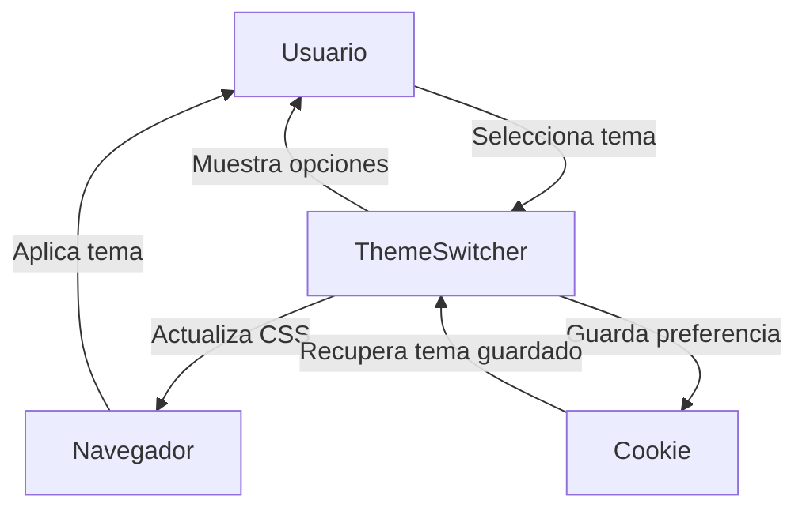

## Module: themeswitchertool.js

# Análisis Integral del Módulo themeswitchertool.js

## Nombre del Componente
**themeswitchertool.js** - Plugin de jQuery para cambiar temas de interfaz de usuario

## Objetivos Primarios
Este módulo es un plugin de jQuery que permite a los usuarios cambiar dinámicamente entre diferentes temas de jQuery UI en una aplicación web. Su propósito principal es proporcionar una interfaz gráfica intuitiva para seleccionar y aplicar distintos temas sin necesidad de recargar la página.

## Funciones, Métodos y Consultas Críticas
- **$.fn.themeswitcher**: Función principal que implementa el plugin
- **updateCSS()**: Función interna que actualiza la hoja de estilo del tema
- **spShow()**: Método para mostrar el panel de selección de temas
- **spHide()**: Método para ocultar el panel de selección de temas
- **jQuery.cookie()**: Función para manejar cookies (almacenamiento de preferencias de tema)

## Variables y Elementos Clave
- **options**: Objeto de configuración con parámetros personalizables
- **button**: Elemento DOM que actúa como disparador del selector de temas
- **switcherpane**: Panel desplegable que contiene la galería de temas disponibles
- **themes**: Objeto que almacena la información de los temas disponibles
- **cssPrefix/cssSuffix**: Rutas para localizar los archivos CSS de los temas
- **imgPrefix/imgSuffix**: Rutas para localizar las imágenes de vista previa de los temas

## Interdependencias y Relaciones
- Depende de la biblioteca jQuery
- Utiliza jQuery UI para los estilos y temas
- Implementa el plugin jQuery.cookie para persistencia de preferencias
- Interactúa con el DOM para insertar y manipular elementos visuales
- Requiere una estructura específica de archivos CSS e imágenes para los temas

## Operaciones Principales vs. Auxiliares
**Operaciones Principales:**
- Generación del selector de temas y su panel desplegable
- Cambio dinámico de hojas de estilo al seleccionar un tema
- Persistencia de la selección del usuario mediante cookies

**Operaciones Auxiliares:**
- Manejo de eventos de ratón (hover, click)
- Aplicación de estilos CSS a los elementos del selector
- Animaciones de apertura/cierre del panel
- Funciones de callback para eventos (onOpen, onClose, onSelect)

## Secuencia Operativa
1. Inicialización del plugin con opciones personalizadas
2. Generación de la lista de temas disponibles
3. Creación del botón selector y panel desplegable
4. Asignación de manejadores de eventos
5. Verificación de tema guardado en cookie (si está habilitado)
6. Al hacer clic en el botón, se muestra/oculta el panel de temas
7. Al seleccionar un tema, se actualiza la hoja de estilo y se guarda la preferencia
8. Se cierra el panel si closeOnSelect está habilitado

## Aspectos de Rendimiento y Optimización
- La carga dinámica de hojas de estilo puede causar parpadeos visuales
- El plugin crea elementos DOM adicionales que podrían optimizarse
- La galería de temas carga todas las imágenes de vista previa, lo que podría afectar el rendimiento inicial
- No implementa carga diferida (lazy loading) para las imágenes de temas
- El manejo de eventos podría optimizarse para reducir la sobrecarga del DOM

## Reusabilidad y Adaptabilidad
- Alta reusabilidad gracias a su naturaleza de plugin jQuery
- Altamente configurable mediante el objeto options
- Permite añadir temas personalizados además de los estándar
- Adaptable a diferentes estructuras de directorios mediante configuración de rutas
- Incluye callbacks personalizables para integración con otras funcionalidades

## Uso y Contexto
- Se utiliza en aplicaciones web que implementan jQuery UI
- Permite a los usuarios personalizar la apariencia de la interfaz
- Típicamente se implementa en paneles de configuración o barras de herramientas
- Útil para aplicaciones que requieren personalización visual por parte del usuario
- Puede utilizarse para adaptar la interfaz a necesidades de accesibilidad

## Suposiciones y Limitaciones
- Asume una estructura específica de archivos CSS para los temas
- Requiere que las imágenes de vista previa sigan una convención de nombres
- Depende de jQuery y potencialmente jQuery UI
- No es responsivo por defecto (ancho y alto fijos)
- La persistencia depende de cookies, lo que puede ser problemático si están deshabilitadas
- No contempla carga asíncrona de recursos de temas
- La interfaz visual está predefinida y tiene opciones limitadas de personalización estructural
## Flow Diagram [via mermaid]

