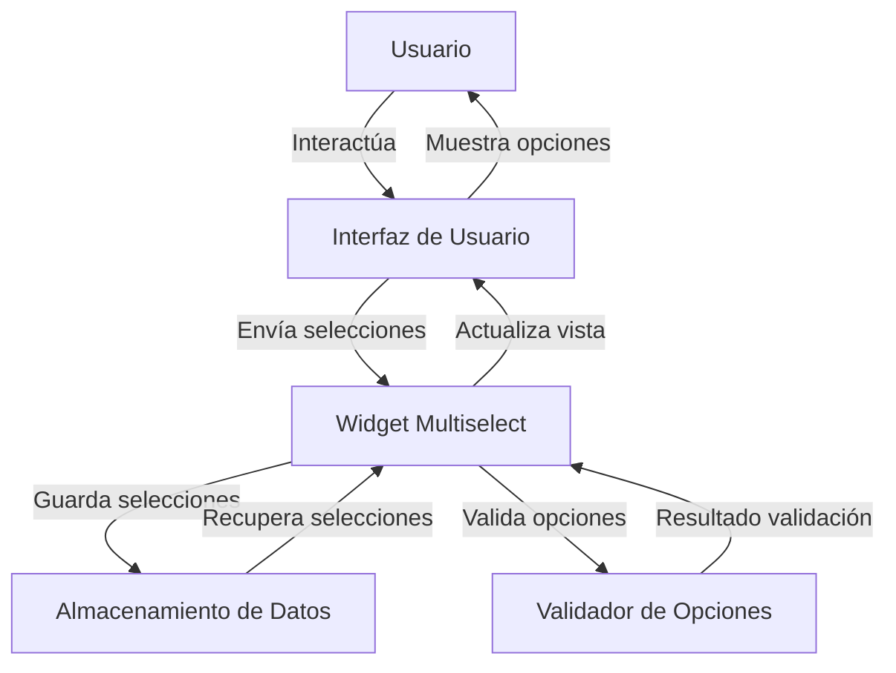

## Module: ui.multiselect.js

# Análisis Integral del Módulo ui.multiselect.js

## Nombre del Módulo/Componente SQL
**jQuery MultiSelect UI Widget** (ui.multiselect.js) - Versión 1.13

## Objetivos Primarios
Este módulo es un widget de jQuery UI que transforma un elemento select HTML estándar en un menú desplegable de selección múltiple interactivo. Su propósito principal es mejorar la experiencia de usuario al seleccionar múltiples opciones de una lista, proporcionando una interfaz más amigable y funcional que el elemento select nativo.

## Funciones, Métodos y Consultas Críticas
- **_create()**: Inicializa el widget, crea la estructura DOM necesaria.
- **refresh()**: Reconstruye los elementos del menú basándose en las opciones del select original.
- **update()**: Actualiza el texto del botón según las selecciones actuales.
- **open()**: Abre el menú desplegable.
- **close()**: Cierra el menú desplegable.
- **checkAll()**: Selecciona todas las opciones disponibles.
- **uncheckAll()**: Deselecciona todas las opciones.
- **_toggleChecked()**: Función interna para cambiar el estado de selección de las opciones.
- **_bindEvents()**: Configura todos los manejadores de eventos necesarios.

## Variables y Elementos Clave
- **this.element**: El elemento select original que se oculta.
- **this.button**: El botón que reemplaza visualmente al select.
- **this.menu**: El contenedor del menú desplegable.
- **this.inputs**: Los elementos input (checkbox/radio) dentro del menú.
- **this.labels**: Las etiquetas asociadas a los inputs.
- **this.options**: Objeto de configuración con múltiples parámetros como height, minWidth, selectedText, etc.

## Interdependencias y Relaciones
- Depende de jQuery 1.4.2+ y jQuery UI 1.8 widget factory.
- Opcionalmente utiliza jQuery UI effects y position utility.
- Interactúa con el elemento select original, manteniendo sincronizados los estados de selección.
- Se integra con el sistema de eventos de jQuery para notificar cambios.

## Operaciones Core vs. Auxiliares
**Operaciones Core:**
- Transformación del select en un widget interactivo.
- Manejo de selecciones múltiples o individuales.
- Sincronización entre el widget y el elemento select original.

**Operaciones Auxiliares:**
- Efectos visuales de apertura/cierre.
- Posicionamiento del menú.
- Manejo de grupos de opciones (optgroups).
- Accesibilidad mediante atributos ARIA.

## Secuencia Operacional/Flujo de Ejecución
1. Inicialización del widget mediante _create() y _init().
2. Construcción de la estructura DOM del widget.
3. Configuración de manejadores de eventos.
4. Interacción del usuario (clic en botón, selección de opciones).
5. Actualización del estado visual y del elemento select original.
6. Disparo de eventos personalizados para notificar cambios.

## Aspectos de Rendimiento y Optimización
- Uso de setTimeout para manejar problemas conocidos con jQuery (#14, #47, #3827).
- Caching de elementos DOM frecuentemente utilizados (this.inputs, this.labels).
- Delegación de eventos para mejorar el rendimiento con muchas opciones.
- Posible optimización en el manejo de listas muy largas, ya que actualmente carga todas las opciones en el DOM.

## Reusabilidad y Adaptabilidad
- Altamente configurable mediante múltiples opciones.
- Soporta tanto selección única como múltiple.
- Adaptable a diferentes estilos mediante clases CSS personalizables.
- Extensible a través del sistema de widgets de jQuery UI.
- Permite personalización de textos para internacionalización.

## Uso y Contexto
- Se utiliza para mejorar formularios web donde se requiere selección múltiple.
- Implementación típica: `$('select').multiselect()`.
- Puede configurarse con opciones adicionales: `$('select').multiselect({height: 200, minWidth: 300})`.
- Útil en interfaces donde el espacio es limitado pero se necesita mostrar múltiples opciones.

## Suposiciones y Limitaciones
- Asume que jQuery y jQuery UI están correctamente cargados.
- Requiere que el elemento original sea un select válido.
- Puede tener problemas de rendimiento con listas extremadamente largas.
- La apariencia visual depende de los estilos de jQuery UI.
- No está optimizado para dispositivos táctiles o móviles.
- Asume que el DOM está completamente cargado antes de la inicialización.
## Flow Diagram [via mermaid]

