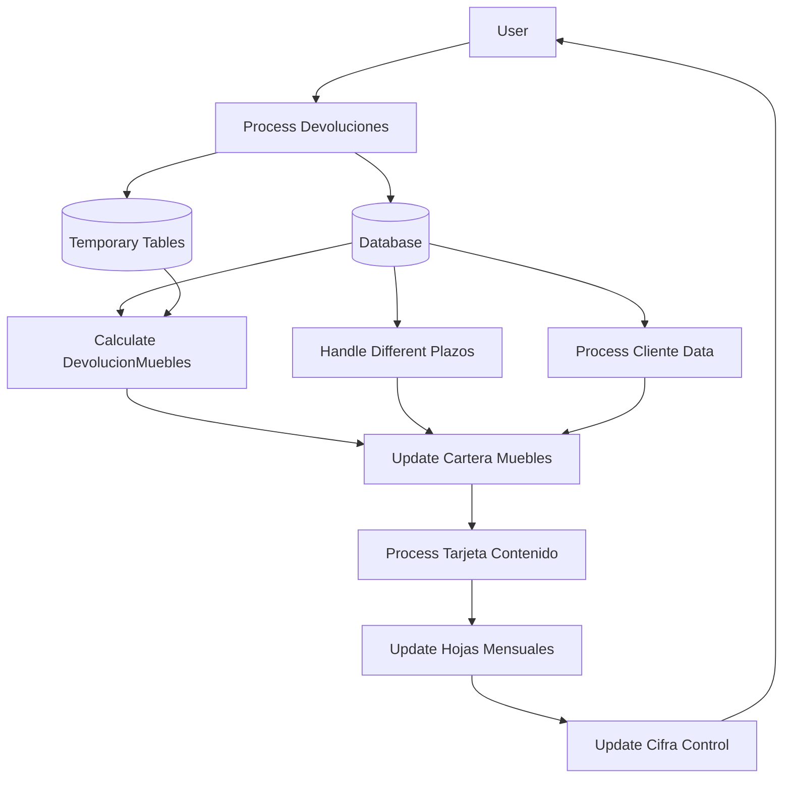
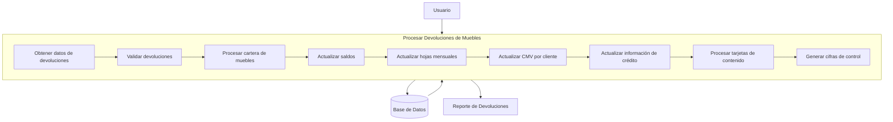
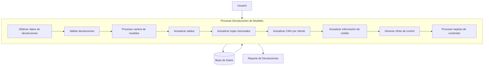

## Module: spcActTransVtasMuebDevoluciones.sql
# Comprehensive Analysis of SQL Stored Procedure

## Module/SQL Component Name
`spcActTransVtasMuebDevoluciones` - A SQL Server stored procedure that processes furniture sales returns/refunds in a retail credit system.

## Primary Objectives
This stored procedure manages the processing of furniture returns ("devoluciones") in a credit sales system. It updates customer accounts, recalculates balances, adjusts credit history, and updates various accounting and reporting tables. The procedure handles both regular returns and special cases like content card returns, with different processing based on payment terms (12, 18, 24, 30, and 36 months).

## Critical Functions, Methods, and Queries

1. **Data Collection and Preparation**:
   - Selects furniture return transactions (`M9` type) from `carAcumuladoTransacciones`
   - Separates transactions based on whether they exist in the furniture credit portfolio (`maeCarteraMuebles`)

2. **Credit Portfolio Updates**:
   - `INSERT` operations to add new returns to the furniture credit portfolio
   - `UPDATE` operations to adjust existing customer balances, payment terms, and status

3. **Monthly Report Updates**:
   - Updates `movHojasMensuales` with return amounts, interest, and counts
   - Processes different payment terms (12, 18, 24, 30, 36 months) separately

4. **Customer Credit History Updates**:
   - Updates `maeCreditoSemestre5` and `creHistoricoCredSem5` with return information
   - Adjusts customer credit status based on return reasons

5. **Sales by Month Portfolio Updates**:
   - Updates `MaeCarteraMueblesMesVenta` and `mae_carteramesventamuebles` with return data
   - Processes content card returns separately from regular returns

## Key Variables and Elements

1. **Tables**:
   - `maeCarteraMuebles`: Main furniture credit portfolio
   - `carAcumuladoTransacciones`: Transaction history
   - `movHojasMensuales`: Monthly accounting reports
   - `maeCreditoSemestre5`: Customer credit status
   - `MaeCarteraMueblesMesVenta`: Sales by month tracking
   - `mae_carteramesventamuebles`: Customer-level sales by month

2. **Parameters**:
   - `@outDevolucionMuebles`: Output parameter for total furniture returns
   - `@outMovtosNoActMuebles`: Output parameter for non-updated transactions

3. **Key Variables**:
   - `@FechaCorte`: Processing cutoff date
   - `@iclv_Hoja`: Monthly report identifier
   - `@Plazo`, `@Cartera`, `@TipoProducto`: Variables for payment terms processing

4. **Critical Columns**:
   - `NumeroCliente`: Customer ID
   - `DevolucionFactura`: Return invoice number
   - `Importe`: Return amount
   - `Interes`: Interest amount
   - `SaldoALaFecha`: Current balance
   - `PlazoMuebles`/`PlazoVenta`: Payment term in months

## Interdependencies and Relationships

1. **Table Relationships**:
   - `maeCarteraMuebles` links to `carAcumuladoTransacciones` via customer and invoice numbers
   - `maeDirectorio` contains customer information referenced by customer ID
   - `his_VentaTarjetaContenido` identifies content card transactions

2. **System Interactions**:
   - Calls `spcActTransGrabaMovtosMueb` to record movements
   - Calls `spcActTransInsertaHojaMensual` to update monthly reports
   - Uses `fun_validarplazo` and `fun_obtienehojamensual` functions to determine payment terms
   - Uses `fncIvaTiendaCiudad` to calculate taxes

## Core vs. Auxiliary Operations

**Core Operations**:
- Updating customer balances in `maeCarteraMuebles`
- Calculating return factors and adjusting payment schedules
- Updating monthly reports with return amounts

**Auxiliary Operations**:
- Handling special cases like content card returns
- Updating customer credit history
- Marking conflict customers
- Calculating and updating sales by month statistics

## Operational Sequence/Flow of Execution

1. **Initialization**:
   - Get processing date and initialize variables
   - Drop temporary tables if they exist

2. **Data Collection**:
   - Select furniture returns from transaction history
   - Separate transactions based on existence in credit portfolio

3. **Portfolio Processing**:
   - For new returns: Insert into credit portfolio
   - For existing returns: Update balances and payment terms

4. **Monthly Report Processing**:
   - Process returns by payment term (12, 18, 24, 30, 36 months)
   - Update monthly reports with return amounts and counts

5. **Credit History Updates**:
   - Update customer credit status
   - Process special cases (conflict customers, paid accounts)

6. **Content Card Processing**:
   - Process content card returns separately
   - Update monthly reports with active and inactive card returns

7. **Sales by Month Updates**:
   - Update sales by month statistics at customer and store levels

## Performance Aspects and Optimization

1. **Temporary Tables**:
   - Extensive use of temporary tables to stage data and reduce repeated calculations
   - Separate processing paths for different payment terms to optimize performance

2. **Potential Bottlenecks**:
   - Multiple updates to the same tables could cause contention
   - Complex calculations for return factors and balance adjustments
   - Large transaction volumes could impact performance

3. **Optimization Opportunities**:
   - Consider indexing temporary tables for large datasets
   - Evaluate whether some updates could be batched
   - Review complex calculations for simplification

## Reusability and Adaptability

1. **Modularity**:
   - Uses helper procedures for common tasks (recording movements, updating monthly reports)
   - Separates processing by payment term and return type

2. **Parameterization**:
   - Uses dynamic SQL for some operations to adapt to different payment terms
   - Leverages functions to determine payment terms and report identifiers

3. **Adaptability Challenges**:
   - Highly specific to the existing database schema
   - Contains business logic embedded in SQL that would need to be updated if business rules change

## Usage and Context

This procedure is part of a larger credit sales system, specifically handling furniture returns. It appears to be executed as part of a regular transaction processing cycle, likely daily or at the end of a business day. The procedure is called by `vbpActTransacciones.exe` (mentioned in comments), suggesting it's part of a batch processing system.

The procedure handles various business scenarios:
- Regular furniture returns
- Partial returns with recalculation of payment terms
- Returns due to collection issues (marked with special codes)
- Content card returns (both active and inactive)

## Assumptions and Limitations

1. **Assumptions**:
   - Assumes specific database structure with tables like `maeCarteraMuebles`, `carAcumuladoTransacciones`
   - Assumes business rules for calculating return factors and adjusting payment schedules
   - Assumes specific coding for transaction types (M9 for furniture returns)

2. **Limitations**:
   - Complex business logic embedded in SQL makes maintenance challenging
   - Limited error handling - no explicit transaction management or rollback mechanisms
   - Heavily dependent on temporary tables which could cause memory pressure with large datasets
   - Multiple updates to the same tables could cause locking issues in high-volume environments

3. **Dependencies**:
   - Relies on external functions like `fun_validarplazo`, `fun_obtienehojamensual`, and `fncIvaTiendaCiudad`
   - Depends on helper procedures like `spcActTransGrabaMovtosMueb` and `spcActTransInsertaHojaMensual`
   - Requires specific configuration in tables like `ctl_admincarteras` for payment terms
## Flow Diagram [via mermaid]

## Module: spcActTransVtasMuebDevoluciones.sql
# Análisis Integral del Módulo SQL: spcActTransVtasMuebDevoluciones

## Nombre del Componente SQL
**Procedimiento Almacenado**: `spcActTransVtasMuebDevoluciones`

## Objetivos Principales
Este procedimiento almacenado gestiona el procesamiento de devoluciones de ventas de muebles en un sistema de crédito comercial. Su propósito principal es actualizar la cartera de muebles, registrar las devoluciones en las hojas mensuales correspondientes, y mantener actualizadas las cifras de control relacionadas con estas operaciones.

## Funciones y Consultas Críticas
- **Procesamiento de devoluciones**: Identifica y procesa las transacciones de devolución de muebles (tipo 'M9').
- **Actualización de cartera**: Actualiza los saldos en `maeCarteraMuebles` para reflejar las devoluciones.
- **Registro en hojas mensuales**: Actualiza las hojas mensuales con los importes de devoluciones según diferentes plazos (12, 18, 24, 30 y 36 meses).
- **Gestión de tarjetas de contenido**: Procesa por separado las devoluciones relacionadas con tarjetas de contenido, distinguiendo entre activas e inactivas.
- **Actualización de cifras de control**: Mantiene actualizados los contadores y totales para reportes financieros.

## Variables y Elementos Clave
- **Tablas principales**:
  - `maeCarteraMuebles`: Almacena la cartera de créditos de muebles.
  - `carAcumuladoTransacciones`: Contiene las transacciones a procesar.
  - `movHojasMensuales`: Registra los movimientos mensuales por tienda.
  - `maeCreditoSemestre5`: Mantiene información crediticia de los clientes.
  - `mae_carteramesventamuebles`: Almacena la cartera por mes de venta a nivel cliente.
  
- **Parámetros de salida**:
  - `@outDevolucionMuebles`: Total de devoluciones procesadas.
  - `@outMovtosNoActMuebles`: Total de movimientos no actualizados.

- **Variables críticas**:
  - `@FechaCorte`: Fecha de procesamiento.
  - `@iclv_Hoja`: Identificador de la hoja mensual.
  - `@Plazo`, `@Cartera`, `@TipoProducto`: Variables para gestionar diferentes plazos de crédito.

## Interdependencias y Relaciones
- Interactúa con múltiples tablas del sistema de crédito y cartera.
- Utiliza funciones como `fun_validarplazo` y `fun_obtienehojamensual` para determinar plazos y hojas mensuales.
- Ejecuta procedimientos auxiliares como `spcActTransGrabaMovtosMueb` y `spcActTransInsertaHojaMensual`.
- Mantiene relaciones entre clientes, facturas y transacciones a través de claves foráneas.

## Operaciones Core vs. Auxiliares
- **Operaciones core**:
  - Procesamiento de devoluciones y actualización de saldos en la cartera.
  - Actualización de hojas mensuales según diferentes plazos.
  - Cálculo y registro de importes de devolución.
  
- **Operaciones auxiliares**:
  - Validación de datos y limpieza de tablas temporales.
  - Actualización de información crediticia de clientes.
  - Gestión de clientes en conflicto.
  - Procesamiento específico para tarjetas de contenido.

## Secuencia de Ejecución
1. Inicialización de variables y limpieza de tablas temporales.
2. Selección de transacciones de devolución de muebles.
3. Separación de transacciones según existencia en cartera.
4. Actualización de saldos y estados en la cartera de muebles.
5. Procesamiento por plazos (12, 18, 24, 30 y 36 meses).
6. Actualización de hojas mensuales correspondientes.
7. Actualización de cartera por mes de venta a nivel cliente.
8. Procesamiento específico para tarjetas de contenido.
9. Actualización de cifras de control y estadísticas.

## Aspectos de Rendimiento y Optimización
- Uso intensivo de tablas temporales para procesar grandes volúmenes de datos.
- Múltiples operaciones de agregación que podrían optimizarse.
- Posibles cuellos de botella en las actualizaciones masivas de tablas como `maeCarteraMuebles` y `movHojasMensuales`.
- Oportunidad de optimización en las múltiples consultas anidadas y subconsultas.

## Reusabilidad y Adaptabilidad
- El procedimiento está altamente especializado para el procesamiento de devoluciones de muebles.
- La parametrización de plazos permite adaptarse a diferentes políticas de crédito.
- El código está estructurado por secciones según el tipo de procesamiento, facilitando modificaciones futuras.
- La separación del procesamiento por plazos permite agregar nuevos plazos sin modificar la lógica principal.

## Uso y Contexto
- Se utiliza en el proceso de cierre diario o periódico del sistema de crédito.
- Forma parte del flujo de actualización de transacciones de la empresa.
- Es invocado por un proceso batch que gestiona todas las actualizaciones del sistema.
- Interactúa con otros procedimientos del módulo de actualización de transacciones.

## Suposiciones y Limitaciones
- Asume la existencia de estructuras específicas en las tablas de cartera y transacciones.
- Requiere que las transacciones estén correctamente clasificadas con tipo 'M' y subtipo '9'.
- Depende de funciones externas para determinar plazos y hojas mensuales.
- El procesamiento está optimizado para la estructura actual de la base de datos y podría requerir ajustes si esta cambia.
- Maneja casos específicos como clientes Fonacot y tarjetas de contenido que podrían requerir lógica adicional en el futuro.
## Flow Diagram [via mermaid]

## Module: spcActTransVtasMuebDevoluciones.sql
# Análisis Integral del Módulo SQL: spcActTransVtasMuebDevoluciones

## Nombre del Componente SQL
**Procedimiento Almacenado**: `spcActTransVtasMuebDevoluciones`

## Objetivos Principales
Este procedimiento almacenado gestiona el procesamiento de devoluciones de ventas de muebles en un sistema de crédito comercial. Su propósito principal es actualizar la cartera de muebles, registrar las devoluciones en las hojas mensuales correspondientes, actualizar saldos de clientes y mantener la integridad de la información financiera relacionada con las devoluciones de productos.

## Funciones, Métodos y Consultas Críticas
- **Procesamiento de devoluciones**: Identifica y procesa transacciones de devolución de muebles (tipo 'M9').
- **Actualización de cartera**: Actualiza los saldos en `maeCarteraMuebles` para reflejar las devoluciones.
- **Gestión de hojas mensuales**: Actualiza las hojas mensuales (`movHojasMensuales`) con los importes de devolución.
- **Procesamiento de tarjetas de contenido**: Maneja separadamente las devoluciones de tarjetas de contenido activas e inactivas.
- **Actualización de crédito**: Modifica los registros en `maeCreditoSemestre5` y `creHistoricoCredSem5`.
- **Cálculo de factores de devolución**: Determina los factores para ajustar importes de venta, intereses y enganches.

## Variables y Elementos Clave
- **Tablas principales**:
  - `maeCarteraMuebles`: Registro principal de la cartera de muebles
  - `movHojasMensuales`: Registro de movimientos mensuales
  - `maeCreditoSemestre5`: Información crediticia de clientes
  - `mae_carteramesventamuebles`: Cartera por mes de venta
  - `carAcumuladoTransacciones`: Transacciones acumuladas
  - `his_VentaTarjetaContenido`: Historial de ventas con tarjeta de contenido

- **Columnas críticas**:
  - `NumeroCliente`, `NumeroFactura`: Identificadores de cliente y factura
  - `SaldoALaFecha`, `ImporteVenta`, `InteresSobreCompra`: Valores monetarios
  - `PlazoVenta`, `PlazoMuebles`: Plazos de crédito
  - `FechaMovimiento`, `FechaVenta`: Fechas relevantes
  - `TipoMovimiento`, `ClaveMovimiento`: Identificadores de tipo de transacción

- **Parámetros**:
  - `@outDevolucionMuebles`: Salida con el total de devoluciones
  - `@outMovtosNoActMuebles`: Salida con movimientos no actualizados

## Interdependencias y Relaciones
- Interactúa con múltiples tablas del sistema de crédito y ventas.
- Utiliza funciones como `fun_validarplazo` y `fun_obtienehojamensual` para determinar plazos y hojas mensuales.
- Depende de `spcActTransGrabaMovtosMueb` para registrar movimientos.
- Depende de `spcActTransInsertaHojaMensual` para insertar registros en hojas mensuales.
- Utiliza `proc_ActMueblesInsertaCMVcliente` para actualizar la cartera por mes de venta.

## Operaciones Core vs. Auxiliares
**Operaciones Core**:
- Procesamiento de devoluciones de muebles y actualización de saldos en cartera
- Actualización de hojas mensuales con importes de devolución
- Cálculo y aplicación de factores de devolución

**Operaciones Auxiliares**:
- Limpieza de tablas temporales
- Validación de existencia de registros
- Actualización de cifras de control
- Manejo de clientes en conflicto
- Procesamiento separado de tarjetas de contenido

## Secuencia Operativa
1. Inicialización de variables y limpieza de tablas temporales
2. Selección de transacciones de devolución de muebles
3. Separación de devoluciones existentes y no existentes en cartera
4. Procesamiento de devoluciones no existentes (alta en cartera)
5. Actualización de saldos para devoluciones existentes
6. Procesamiento por plazos (12, 18, 24, 30, 36 meses)
7. Actualización de hojas mensuales por cada plazo
8. Actualización de cartera por mes de venta
9. Actualización de información crediticia
10. Procesamiento separado de tarjetas de contenido
11. Actualización de cifras de control

## Aspectos de Rendimiento y Optimización
- Uso intensivo de tablas temporales para procesar grandes volúmenes de datos
- Múltiples operaciones de agregación (SUM, COUNT) que podrían optimizarse
- Numerosas actualizaciones individuales que podrían consolidarse
- Consultas anidadas que podrían beneficiarse de índices adecuados
- Operaciones repetitivas para diferentes plazos que podrían parametrizarse mejor

## Reusabilidad y Adaptabilidad
- El procedimiento está altamente especializado para el sistema específico
- Contiene lógica de negocio compleja que dificulta su reutilización
- La parametrización de plazos permite cierta adaptabilidad a nuevos plazos
- El código está estructurado por secciones, lo que facilita modificaciones puntuales
- Las múltiples modificaciones históricas indican adaptabilidad a cambios de requisitos

## Uso y Contexto
Este procedimiento se utiliza en el proceso de cierre diario o periódico del sistema de crédito para procesar las devoluciones de ventas de muebles. Es invocado por el ejecutable `vbpActTransacciones.exe` como parte de un proceso batch de actualización de transacciones. El contexto es un sistema de ventas a crédito con múltiples modalidades de pago y plazos.

## Suposiciones y Limitaciones
- Asume la existencia de estructuras de datos específicas (tablas, campos, relaciones)
- Requiere que las transacciones de devolución estén correctamente codificadas (tipo 'M9')
- Depende de funciones externas para cálculos de plazos y hojas mensuales
- Maneja casos especiales como clientes Fonacot (3029980)
- Tiene lógica específica para tarjetas de contenido activas e inactivas
- Limitado a los plazos definidos (12, 18, 24, 30, 36 meses)
- Asume reglas de negocio específicas para el cálculo de factores de devolución
## Flow Diagram [via mermaid]

