# Introduction :

# System Overview: createdoc.sh

This shell script serves as a documentation generation utility designed to automate the creation of standardized documentation files for software projects. The system processes input files and generates corresponding documentation in a consistent format, likely following organizational or project-specific templates.

The primary purpose of createdoc.sh is to streamline the documentation workflow, ensuring that all project components are properly documented with minimal manual effort. It handles the extraction of relevant information from source files and transforms it into structured documentation, maintaining consistency across the project's documentation ecosystem.

The system likely supports various input formats and produces documentation that adheres to predefined standards, facilitating better knowledge transfer and project maintainability.

# Full System Overview


# Module Overview
## Module: createdoc.sh

# Documentación Técnica: createdoc.sh

## 1. **Nombre del módulo o componente SQL:**
createdoc.sh

## 2. **Objetivos principales:**
Este script de Bash automatiza la generación de documentación técnica para archivos de código fuente. Su propósito es procesar archivos con extensiones específicas (.sh, .py, .php, .js) dentro de un directorio y crear documentación estructurada para cada uno utilizando la herramienta Bito.

## 3. **Funciones, métodos o consultas críticas:**
- Comando `find` para localizar archivos de código fuente
- Comando `bito` para generar documentación a partir del contenido de los archivos
- Comandos de manipulación de directorios (`mkdir -p`)
- Procesamiento de rutas de archivos mediante manipulación de cadenas en Bash

## 4. **Variables y elementos clave:**
- `BITO_CMD`: Ruta al ejecutable de Bito
- `BITO_VERSION`: Versión de Bito instalada
- `BITO_CMD_VEP`: Parámetro adicional para versiones de Bito superiores a 3.7
- `folder`: Directorio de entrada que contiene los archivos a documentar
- `doc_folder`: Directorio de salida donde se generará la documentación
- `file2write`: Ruta de destino para cada archivo de documentación

## 5. **Interdependencias y relaciones:**
- Depende de la herramienta Bito para la generación de documentación
- Requiere un archivo de prompt (`./prompts/structured_doc.txt`) para la generación de documentación
- Mantiene la estructura de directorios del código fuente en la documentación generada

## 6. **Operaciones centrales vs. auxiliares:**
- **Centrales**: Búsqueda de archivos con `find`, generación de documentación con `bito`
- **Auxiliares**: Verificación de argumentos, comprobación de existencia de directorios, creación de directorios de salida, determinación de la versión de Bito

## 7. **Secuencia operativa o flujo de ejecución:**
1. Verificación de la versión de Bito y configuración de parámetros
2. Validación del argumento de entrada (nombre de carpeta)
3. Comprobación de la existencia de la carpeta de entrada
4. Creación de la carpeta de documentación
5. Búsqueda recursiva de archivos con extensiones específicas
6. Para cada archivo encontrado:
   - Determinación de la ruta relativa
   - Creación de directorios necesarios en la carpeta de documentación
   - Generación de documentación con Bito
   - Almacenamiento de la documentación en archivos .md

## 8. **Aspectos de rendimiento y optimización:**
- Procesa los archivos uno por uno, lo que puede ser lento para grandes cantidades de archivos
- No implementa procesamiento paralelo
- La eficiencia depende principalmente del rendimiento de la herramienta Bito

## 9. **Reusabilidad y adaptabilidad:**
- Altamente reutilizable para diferentes proyectos
- Las extensiones de archivo están codificadas directamente, pero podrían parametrizarse
- El formato de salida (.md) está fijo pero podría modificarse fácilmente

## 10. **Uso y contexto:**
- Se utiliza como herramienta de línea de comandos para generar documentación de proyectos
- Se invoca pasando el nombre de la carpeta que contiene el código fuente: `./createdoc.sh folder_name`
- La documentación generada se almacena en una carpeta con el prefijo "doc_"

## 11. **Supuestos y limitaciones:**
- Supone que Bito está instalado y disponible en el PATH
- Solo procesa archivos con extensiones .sh, .py, .php y .js
- Requiere que exista un archivo de prompt en ./prompts/structured_doc.txt
- No maneja errores de ejecución de Bito
- No proporciona opciones para personalizar el formato o estilo de la documentación generada
## Flow Diagram [via mermaid]

## Module: createdoc.sh

# Documentación Técnica: createdoc.sh

## 1. **Nombre del módulo o componente SQL:**
createdoc.sh

## 2. **Objetivos principales:**
Este script bash automatiza la generación de documentación técnica para proyectos de software. Su propósito es analizar archivos de código fuente en un directorio especificado, crear documentación detallada para cada módulo, y generar diagramas de flujo utilizando Mermaid. Finalmente, consolida toda la documentación en un documento de alto nivel con una visión general del sistema.

## 3. **Funciones, métodos o consultas críticas:**
- `bito_response_ok()`: Valida las respuestas de la herramienta Bito.
- `create_module_documentation()`: Genera documentación para un módulo específico.
- `call_bito_with_retry()`: Llama a la API de Bito con mecanismo de reintentos.
- `create_mermaid_diagram()`: Genera diagramas de flujo en formato Mermaid.
- `fix_and_validate_mermaid()`: Corrige y valida la sintaxis de los diagramas Mermaid.
- `generate_mdd_overview()`: Crea una visión general del sistema basada en diagramas individuales.
- `parallel_create_module_documentation()`: Procesa múltiples archivos en paralelo.

## 4. **Variables y elementos clave:**
- `BITO_CMD`: Ruta al comando Bito.
- `BITO_VERSION`: Versión de Bito instalada.
- `prompt_folder`: Directorio con archivos de prompt para NLP.
- `lang_csv`: Archivo CSV con extensiones de lenguajes de programación.
- `skip_list_csv`: Lista de archivos y directorios a excluir.
- `MAX_JOBS`: Número máximo de procesos paralelos (5).
- `total_input_token_count` y `total_output_token_count`: Contadores de tokens para seguimiento de uso.

## 5. **Interdependencias y relaciones:**
- Depende de la herramienta CLI de Bito para análisis de código y generación de documentación.
- Requiere Mermaid CLI (`mmdc`) para validar y generar diagramas.
- Utiliza archivos de prompt específicos para diferentes tareas de documentación.
- Interactúa con el sistema de archivos para leer código fuente y escribir documentación.

## 6. **Operaciones centrales vs. auxiliares:**
**Centrales:**
- Generación de documentación de alto nivel para cada módulo.
- Creación de diagramas de flujo Mermaid.
- Consolidación de documentación en un archivo general.

**Auxiliares:**
- Validación de herramientas y archivos requeridos.
- Seguimiento de uso de tokens.
- Manejo de errores y reintentos.
- Filtrado de archivos según lista de exclusión.

## 7. **Secuencia operativa o flujo de ejecución:**
1. Verifica herramientas y archivos necesarios.
2. Crea directorio de documentación si no existe.
3. Identifica archivos a documentar según extensiones y exclusiones.
4. Procesa cada archivo en paralelo, generando documentación y diagramas.
5. Consolida la documentación individual en un archivo general.
6. Genera una introducción y resumen del sistema.
7. Crea un diagrama de visión general del sistema.
8. Registra estadísticas de uso de tokens y tiempo.

## 8. **Aspectos de rendimiento y optimización:**
- Implementa procesamiento paralelo para mejorar el rendimiento con `MAX_JOBS=5`.
- Utiliza bloqueos de archivo para evitar condiciones de carrera en actualizaciones de progreso.
- Implementa mecanismo de reintentos para llamadas a la API de Bito.
- Optimiza la generación de diagramas con validación y corrección automática.
- Registra tiempos de ejecución para análisis de rendimiento.

## 9. **Reusabilidad y adaptabilidad:**
- Altamente parametrizable mediante archivos de configuración externos.
- Modular con funciones bien definidas para tareas específicas.
- Adaptable a diferentes lenguajes de programación mediante el archivo CSV de extensiones.
- Personalizable mediante archivos de prompt para diferentes estilos de documentación.
- Configurable para excluir directorios o archivos específicos.

## 10. **Uso y contexto:**
Se utiliza como herramienta de línea de comandos para generar documentación automática de proyectos de software:
```
./createdoc.sh <directorio_del_proyecto>
```
La documentación generada se guarda en un directorio `doc_<nombre_del_directorio>` e incluye:
- Documentación individual por archivo
- Diagramas de flujo Mermaid
- Un documento consolidado de alto nivel
- Registros de progreso y uso de recursos

## 11. **Supuestos y limitaciones:**
- Requiere Bito CLI versión 3.7 o superior.
- Necesita Mermaid CLI instalado para la generación de diagramas.
- Utiliza una clave API específica de Bito (hardcodeada en el script).
- Limitado a los lenguajes de programación definidos en el archivo CSV.
- La calidad de la documentación depende de la calidad de las respuestas de la API de Bito.
- El procesamiento paralelo está limitado a 5 trabajos simultáneos.
- No maneja bien archivos muy grandes debido a posibles limitaciones de tokens.
## Flow Diagram [via mermaid]

