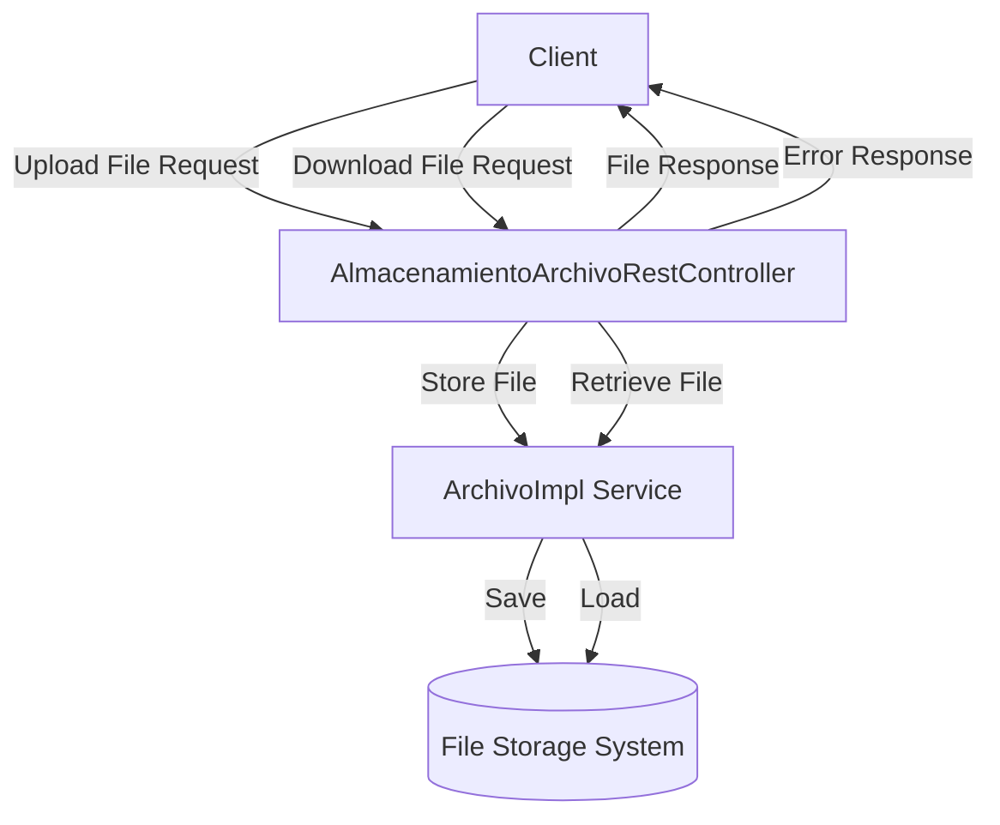

## Module: AlmacenamientoArchivoRestController.java

# Documentación Técnica: AlmacenamientoArchivoRestController

## 1. **Nombre del módulo o componente SQL:**
AlmacenamientoArchivoRestController.java

## 2. **Objetivos principales:**
Este controlador REST gestiona operaciones de almacenamiento y descarga de archivos en un sistema e-commerce de Coppel. Su propósito principal es proporcionar endpoints para cargar archivos al servidor y descargarlos posteriormente, implementando validaciones de seguridad y manejo de errores.

## 3. **Funciones, métodos o consultas críticas:**
- `cargarArchivo(@RequestParam("file") MultipartFile file)`: Endpoint POST que recibe un archivo, valida su tipo y tamaño, y lo almacena en el sistema.
- `descargarArchivo(@PathVariable String nombreArchivo, HttpServletRequest request)`: Endpoint GET que permite la descarga de un archivo previamente almacenado.

## 4. **Variables y elementos clave (columnas, tablas, parámetros):**
- `MAX_FILE_SIZE`: Constante que define el tamaño máximo permitido para archivos (10MB).
- `allowedContentTypes`: Lista de tipos MIME permitidos para carga (JPEG, PNG, PDF, CSV).
- `archivoImpl`: Servicio que implementa la lógica de almacenamiento y recuperación de archivos.
- `logger`: Objeto para registro de eventos y errores.

## 5. **Interdependencias y relaciones:**
- Depende de `ArchivoImpl` para la implementación de la lógica de almacenamiento.
- Utiliza DTOs como `FileDto` y `UploadFileResponse` para transferencia de datos.
- Maneja excepciones personalizadas como `FileException`.
- Interactúa con el sistema de archivos para almacenamiento y recuperación.

## 6. **Operaciones centrales vs. auxiliares:**
- **Centrales**: 
  - Almacenamiento de archivos mediante el endpoint `/almacenar`
  - Descarga de archivos mediante el endpoint `/descargar/{nombreArchivo}`
- **Auxiliares**:
  - Validación de tipos MIME permitidos
  - Validación de tamaño máximo de archivo
  - Registro de eventos (logging)
  - Manejo de errores y excepciones

## 7. **Secuencia operativa o flujo de ejecución:**
- **Para carga de archivos**:
  1. Recepción del archivo multipart
  2. Validación del tipo de contenido
  3. Validación del tamaño del archivo
  4. Delegación del almacenamiento a ArchivoImpl
  5. Retorno de respuesta con información del archivo o error
- **Para descarga de archivos**:
  1. Recepción del nombre de archivo
  2. Obtención del recurso mediante ArchivoImpl
  3. Determinación del tipo MIME
  4. Configuración de cabeceras HTTP para descarga
  5. Retorno del recurso como respuesta

## 8. **Aspectos de rendimiento y optimización:**
- Limita el tamaño de archivos a 10MB para prevenir sobrecarga del servidor
- Restringe los tipos de archivos aceptados, mejorando la seguridad
- Utiliza Spring Resource para manejo eficiente de archivos
- El logging está implementado para facilitar el diagnóstico de problemas

## 9. **Reusabilidad y adaptabilidad:**
- El controlador está diseñado siguiendo principios REST, facilitando su integración con diferentes clientes
- La inyección de dependencias permite reemplazar la implementación de almacenamiento
- Los parámetros como tipos de archivos permitidos y tamaño máximo podrían extraerse a un archivo de configuración para mayor adaptabilidad

## 10. **Uso y contexto:**
- Este controlador forma parte de un sistema de administración de e-commerce de Coppel
- Se utiliza para gestionar archivos relacionados con productos, imágenes, documentos o reportes
- Expone endpoints REST bajo la ruta base `/api/v1`
- Depende de servicios externos para el almacenamiento físico de los archivos

## 11. **Supuestos y limitaciones:**
- Supone que el servicio ArchivoImpl maneja correctamente el almacenamiento físico de archivos
- Limita los tipos de archivos a imágenes (JPEG, PNG), PDF y CSV
- Restringe el tamaño máximo de archivo a 10MB
- No implementa autenticación ni autorización a nivel de controlador
- No maneja versionado de archivos ni detección de duplicados
- Asume que el sistema de archivos subyacente tiene espacio suficiente para almacenamiento
## Flow Diagram [via mermaid]

