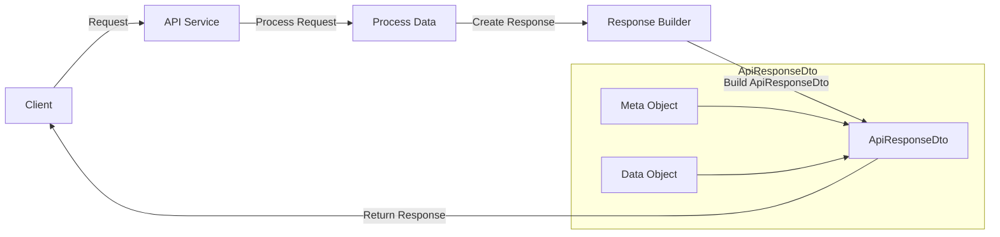

## Module: ApiResponseDto.java

# Documentación Técnica: ApiResponseDto.java

## 1. **Nombre del módulo o componente SQL:**
ApiResponseDto.java

## 2. **Objetivos principales:**
Este componente define una clase de transferencia de datos (DTO) que estandariza la estructura de respuesta para los servicios API del sistema e-commerce de Coppel. Su propósito es encapsular tanto los metadatos de la respuesta como los datos de respuesta reales en un formato consistente.

## 3. **Funciones, métodos o consultas críticas:**
No contiene métodos específicos más allá de los getters y setters generados automáticamente por Lombok para los atributos `meta` y `data`.

## 4. **Variables y elementos clave (columnas, tablas, parámetros):**
- `meta`: Objeto de tipo Meta que contiene metadatos sobre la respuesta (posiblemente información como códigos de estado, mensajes, etc.)
- `data`: Objeto genérico que contiene los datos de respuesta reales del servicio

## 5. **Interdependencias y relaciones:**
- Depende de la clase `Meta` del paquete `com.coppel.omnicanal.ecommercempadministrador.util`
- Utiliza anotaciones de la biblioteca Lombok para la generación automática de código
- Forma parte del paquete `com.coppel.omnicanal.ecommercempadministrador.dto`

## 6. **Operaciones centrales vs. auxiliares:**
- **Central:** Proporcionar una estructura estandarizada para las respuestas API
- **Auxiliar:** No contiene operaciones auxiliares explícitas

## 7. **Secuencia operativa o flujo de ejecución:**
Al ser un DTO, no tiene un flujo de ejecución propio. Es instanciado y poblado por los controladores o servicios antes de ser serializado como respuesta HTTP.

## 8. **Aspectos de rendimiento y optimización:**
Al ser una clase simple de transferencia de datos, no presenta problemas significativos de rendimiento. El uso de Lombok reduce el código boilerplate, lo que mejora la mantenibilidad sin afectar el rendimiento.

## 9. **Reusabilidad y adaptabilidad:**
- Alta reusabilidad: Puede ser utilizado por cualquier endpoint de la API para estandarizar respuestas
- Adaptable: El campo `data` es de tipo Object, lo que permite contener cualquier tipo de respuesta específica

## 10. **Uso y contexto:**
Este DTO se utiliza en los controladores REST del sistema para envolver las respuestas antes de ser serializadas a JSON. Proporciona una estructura consistente para todas las respuestas API, facilitando el manejo de errores y el procesamiento de respuestas en el cliente.

## 11. **Supuestos y limitaciones:**
- **Supuestos:** Se asume que la clase Meta contiene la información necesaria sobre el estado de la respuesta
- **Limitaciones:** Al usar un Object genérico para data, se pierde la tipificación estricta, lo que podría dificultar la documentación automática de la API
## Flow Diagram [via mermaid]

