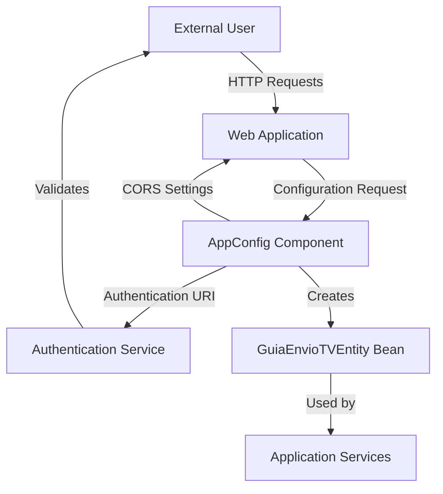

## Module: AppConfig.java

# Documentación Técnica: AppConfig.java

## 1. **Nombre del módulo o componente SQL:**
AppConfig.java

## 2. **Objetivos principales:**
Este componente proporciona la configuración centralizada para la aplicación de administración de e-commerce de Coppel. Su propósito principal es gestionar parámetros de configuración relacionados con autenticación, CORS (Cross-Origin Resource Sharing) y la creación de beans específicos para la aplicación.

## 3. **Funciones, métodos o consultas críticas:**
- `guiaEnvioTVEntity()`: Método anotado con @Bean que crea y proporciona una instancia de GuiaEnvioTVEntity para su uso en la aplicación.

## 4. **Variables y elementos clave (columnas, tablas, parámetros):**
- `authUri`: URL para la autenticación
- `ignoreSession`: Bandera para ignorar la sesión
- `allowedOrigins`: Orígenes permitidos para CORS (por defecto "*")
- `allowedMethods`: Métodos HTTP permitidos para CORS
- `allowedHeaders`: Cabeceras permitidas para CORS

## 5. **Interdependencias y relaciones:**
- Depende de la entidad `GuiaEnvioTVEntity` del paquete `com.coppel.omnicanal.ecommercempadministrador.entities.tiendavirtual`
- Utiliza anotaciones de Lombok para reducir código boilerplate
- Se integra con el sistema de configuración de Spring Boot mediante `@ConfigurationProperties`

## 6. **Operaciones centrales vs. auxiliares:**
- **Central**: Proporcionar configuración para CORS y autenticación
- **Auxiliar**: Creación del bean GuiaEnvioTVEntity

## 7. **Secuencia operativa o flujo de ejecución:**
1. Spring Boot carga la clase durante el inicio de la aplicación
2. Las propiedades con prefijo "configuraciones" del archivo de propiedades se inyectan en los campos correspondientes
3. El método `guiaEnvioTVEntity()` se ejecuta para crear el bean correspondiente
4. La configuración queda disponible para ser utilizada por otros componentes de la aplicación

## 8. **Aspectos de rendimiento y optimización:**
- La clase es ligera y solo contiene configuración, sin lógica de procesamiento intensivo
- El uso de Lombok reduce el código boilerplate, mejorando la mantenibilidad

## 9. **Reusabilidad y adaptabilidad:**
- Alta reusabilidad gracias a la parametrización mediante propiedades externas
- Los valores por defecto proporcionados permiten un funcionamiento básico sin configuración adicional
- La configuración puede adaptarse fácilmente a diferentes entornos modificando el archivo de propiedades

## 10. **Uso y contexto:**
- Este componente es utilizado por el framework Spring para configurar aspectos de seguridad y comunicación de la aplicación
- Es cargado automáticamente durante el inicio de la aplicación
- Proporciona configuración para el manejo de CORS, crucial para aplicaciones web modernas

## 11. **Supuestos y limitaciones:**
- Supone que existe un archivo de propiedades con el prefijo "configuraciones"
- La configuración CORS por defecto es permisiva (permite todos los orígenes con "*"), lo que podría no ser adecuado para entornos de producción desde el punto de vista de seguridad
- No incluye validación de los valores de configuración proporcionados
## Flow Diagram [via mermaid]

