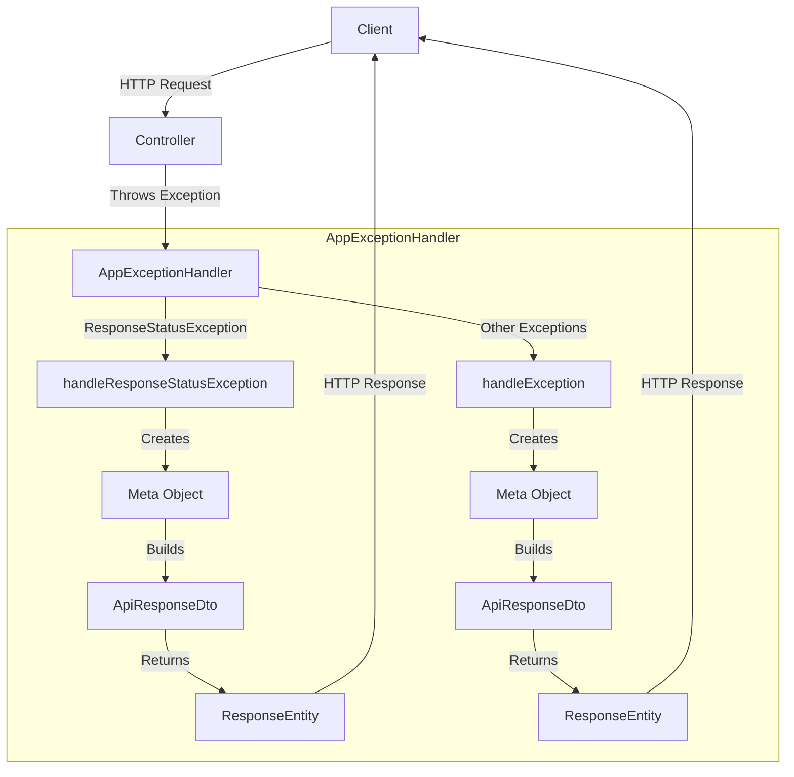

## Module: AppExceptionHandler.java

# Documentación Técnica: AppExceptionHandler.java

## 1. **Nombre del módulo o componente SQL:**
AppExceptionHandler.java

## 2. **Objetivos principales:**
Este componente es un manejador global de excepciones para una aplicación Spring Boot. Su propósito principal es interceptar y procesar las excepciones no controladas que ocurren durante la ejecución de la aplicación, transformándolas en respuestas HTTP estructuradas y consistentes para el cliente. Esto permite centralizar el manejo de errores y proporcionar información útil sobre los problemas ocurridos sin exponer detalles sensibles de implementación.

## 3. **Funciones, métodos o consultas críticas:**
- `handleResponseStatusException(ResponseStatusException ex)`: Maneja específicamente las excepciones de tipo ResponseStatusException, devolviendo un ResponseEntity con información estructurada del error.
- `handleException(RuntimeException runtimeException, WebRequest webRequest)`: Método genérico que captura cualquier excepción no manejada específicamente, convirtiéndola en una respuesta HTTP 500 (Internal Server Error) estructurada.

## 4. **Variables y elementos clave (columnas, tablas, parámetros):**
- `Meta`: Clase utilizada para estructurar los metadatos de la respuesta de error.
- `ApiResponseDto`: Clase que encapsula la respuesta completa, incluyendo metadatos y datos (nulos en caso de error).
- `AppMessages`: Clase de constantes que contiene mensajes predefinidos como "CLIENT_ERROR" y "ERROR".
- `HttpHeaders` y `MediaType`: Utilizados para configurar los encabezados de la respuesta HTTP.

## 5. **Interdependencias y relaciones:**
El componente depende de:
- Clases del framework Spring: `ResponseEntityExceptionHandler`, `ControllerAdvice`, `ExceptionHandler`, etc.
- DTOs y utilidades propias de la aplicación: `ApiResponseDto`, `Meta`, `AppMessages`.
- Interactúa con el sistema de manejo de excepciones de Spring para interceptar errores antes de que lleguen al cliente.

## 6. **Operaciones centrales vs. auxiliares:**
- **Operaciones centrales**: La captura y transformación de excepciones en respuestas HTTP estructuradas.
- **Operaciones auxiliares**: La configuración de encabezados HTTP, la creación de objetos Meta y ApiResponseDto, y el registro de timestamps.

## 7. **Secuencia operativa o flujo de ejecución:**
1. Se produce una excepción en algún controlador de la aplicación.
2. Spring detecta la excepción y la dirige al manejador apropiado en AppExceptionHandler.
3. Se crea un objeto Meta con información sobre el error.
4. Se encapsula el Meta en un ApiResponseDto.
5. Se configura un ResponseEntity con los encabezados HTTP apropiados.
6. Se devuelve la respuesta estructurada al cliente.

## 8. **Aspectos de rendimiento y optimización:**
- El código es ligero y no realiza operaciones costosas.
- No hay bucles ni consultas a bases de datos que puedan afectar el rendimiento.
- La creación de objetos es mínima y eficiente.

## 9. **Reusabilidad y adaptabilidad:**
- El componente es altamente reutilizable ya que está diseñado para manejar excepciones de toda la aplicación.
- Puede extenderse fácilmente para manejar tipos específicos de excepciones agregando nuevos métodos con la anotación @ExceptionHandler.
- La estructura de respuesta está estandarizada, lo que facilita su procesamiento por parte de los clientes.

## 10. **Uso y contexto:**
- Se utiliza automáticamente en toda la aplicación gracias a la anotación @ControllerAdvice.
- No requiere invocación explícita; Spring lo utiliza cuando se producen excepciones no manejadas.
- Es parte del sistema de manejo de errores de la aplicación, proporcionando una capa de abstracción entre los errores internos y las respuestas al cliente.

## 11. **Supuestos y limitaciones:**
- Supone que todas las respuestas de error deben seguir el formato definido por ApiResponseDto y Meta.
- Está limitado a manejar excepciones que ocurren dentro del contexto de Spring MVC.
- No maneja excepciones específicas de negocio, solo proporciona un mecanismo general para transformar excepciones en respuestas HTTP.
- Asume que los clientes esperan respuestas en formato JSON (MediaType.APPLICATION_JSON_VALUE).
## Flow Diagram [via mermaid]

