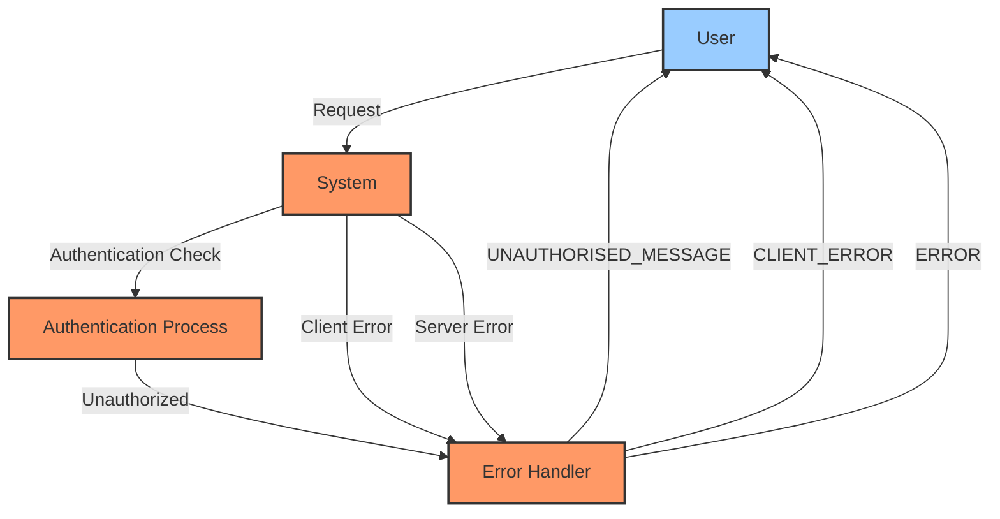

## Module: AppMessages.java

# Documentación Técnica: AppMessages.java

## 1. **Nombre del módulo o componente SQL:**
AppMessages.java

## 2. **Objetivos principales:**
Este componente define constantes de mensajes de error utilizadas en la aplicación. Su propósito es centralizar los mensajes de error estándar para mantener consistencia en toda la aplicación de administración de e-commerce.

## 3. **Funciones, métodos o consultas críticas:**
No contiene métodos o consultas, solo define constantes estáticas para mensajes de error:
- `CLIENT_ERROR`: Identifica errores del lado del cliente
- `ERROR`: Identifica errores del servidor
- `UNAUTHORISED_MESSAGE`: Mensaje específico para accesos no autorizados

## 4. **Variables y elementos clave:**
- `CLIENT_ERROR`: Constante para errores de cliente
- `ERROR`: Constante para errores de servidor
- `UNAUTHORISED_MESSAGE`: Mensaje detallado para errores de autorización

## 5. **Interdependencias y relaciones:**
Este componente pertenece al paquete `com.coppel.omnicanal.ecommercempadministrador.util`, lo que sugiere que es utilizado como una utilidad dentro del sistema de administración de e-commerce omnicanal de Coppel.

## 6. **Operaciones centrales vs. auxiliares:**
Este es un componente auxiliar que proporciona constantes para la gestión de errores en la aplicación. No contiene operaciones de procesamiento.

## 7. **Secuencia operativa o flujo de ejecución:**
No aplica, ya que es una clase de constantes sin flujo de ejecución.

## 8. **Aspectos de rendimiento y optimización:**
Al ser una clase de constantes, tiene un impacto mínimo en el rendimiento. El constructor privado evita la instanciación innecesaria de la clase.

## 9. **Reusabilidad y adaptabilidad:**
Alta reusabilidad. Las constantes pueden ser importadas y utilizadas en cualquier parte de la aplicación que necesite mostrar mensajes de error estandarizados. Para añadir nuevos mensajes, solo se requiere agregar nuevas constantes a esta clase.

## 10. **Uso y contexto:**
Este módulo se utiliza en toda la aplicación para mantener consistencia en los mensajes de error. Probablemente es referenciado en controladores, servicios y manejadores de excepciones para proporcionar respuestas estandarizadas al cliente.

## 11. **Supuestos y limitaciones:**
- Supone que los mensajes de error son estáticos y no requieren localización o internacionalización dinámica.
- Limitado a mensajes en español según el contenido de `UNAUTHORISED_MESSAGE`.
- No proporciona mecanismos para parametrizar los mensajes (por ejemplo, incluir detalles específicos del error).
## Flow Diagram [via mermaid]

