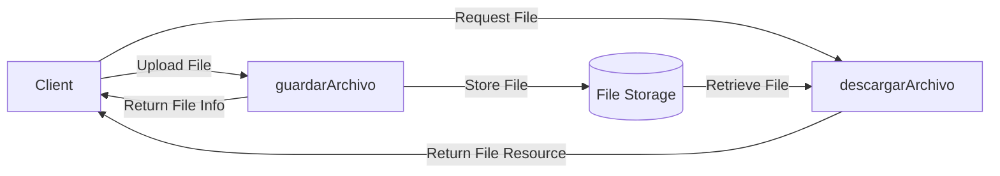

## Module: Archivo.java

# Documentación Técnica: Archivo.java

## 1. **Nombre del módulo o componente SQL:**
Archivo.java - Interfaz de servicio para manejo de archivos

## 2. **Objetivos principales:**
Define una interfaz para la gestión de operaciones básicas con archivos en el sistema, específicamente para guardar y descargar archivos. Forma parte del módulo de administración de un sistema de comercio electrónico omnicanal de Coppel.

## 3. **Funciones, métodos o consultas críticas:**
- `guardarArchivo(MultipartFile file)`: Método para almacenar un archivo subido por el usuario.
- `descargarArchivo(String fileName)`: Método para recuperar un archivo almacenado mediante su nombre.

## 4. **Variables y elementos clave (columnas, tablas, parámetros):**
- `MultipartFile file`: Parámetro que representa el archivo a guardar, proveniente de una solicitud HTTP multipart.
- `String fileName`: Parámetro que identifica el nombre del archivo a descargar.
- `FileDto`: Objeto de transferencia de datos que encapsula la información del archivo guardado.
- `Resource`: Tipo de retorno que representa el recurso de archivo descargado.

## 5. **Interdependencias y relaciones:**
- Depende del paquete `com.coppel.omnicanal.ecommercempadministrador.dto` para el uso de `FileDto`.
- Utiliza clases de Spring Framework: `org.springframework.core.io.Resource` y `org.springframework.web.multipart.MultipartFile`.
- Debe ser implementada por una clase concreta que defina la lógica real de almacenamiento y recuperación de archivos.

## 6. **Operaciones centrales vs. auxiliares:**
- **Operaciones centrales**: Las dos operaciones definidas (guardar y descargar) constituyen la funcionalidad principal.
- **Operaciones auxiliares**: No se definen operaciones auxiliares en esta interfaz.

## 7. **Secuencia operativa o flujo de ejecución:**
Al ser una interfaz, no define un flujo de ejecución específico. La implementación determinará el flujo real, que típicamente seguiría:
1. Recepción de la solicitud (guardar o descargar)
2. Validación del archivo o nombre
3. Ejecución de la operación solicitada
4. Retorno del resultado (FileDto o Resource)

## 8. **Aspectos de rendimiento y optimización:**
La interfaz no especifica consideraciones de rendimiento. La implementación debería considerar:
- Manejo eficiente de archivos grandes
- Posible uso de almacenamiento en caché
- Gestión adecuada de recursos para evitar fugas de memoria
- Posible limitación de tamaño de archivos

## 9. **Reusabilidad y adaptabilidad:**
- Alta reusabilidad: La interfaz es genérica y puede implementarse para diferentes tipos de almacenamiento (sistema de archivos local, almacenamiento en la nube, base de datos).
- Adaptabilidad: Puede extenderse para incluir operaciones adicionales como eliminación o actualización de archivos.

## 10. **Uso y contexto:**
- Se utiliza en el contexto de un administrador de comercio electrónico omnicanal.
- Probablemente es consumida por controladores REST que exponen endpoints para subir y descargar archivos.
- La implementación concreta podría interactuar con sistemas de almacenamiento como S3, Azure Blob Storage, sistema de archivos local, etc.

## 11. **Supuestos y limitaciones:**
- **Supuestos**: 
  - Los archivos tienen nombres únicos o se manejan colisiones de nombres.
  - Existe un mecanismo de almacenamiento subyacente accesible.
  - Los permisos de acceso se gestionan en otra capa de la aplicación.
- **Limitaciones**:
  - No incluye métodos para eliminar o actualizar archivos.
  - No especifica manejo de errores ni validaciones.
  - No define mecanismos para controlar tipos de archivos permitidos o tamaños máximos.
## Flow Diagram [via mermaid]

