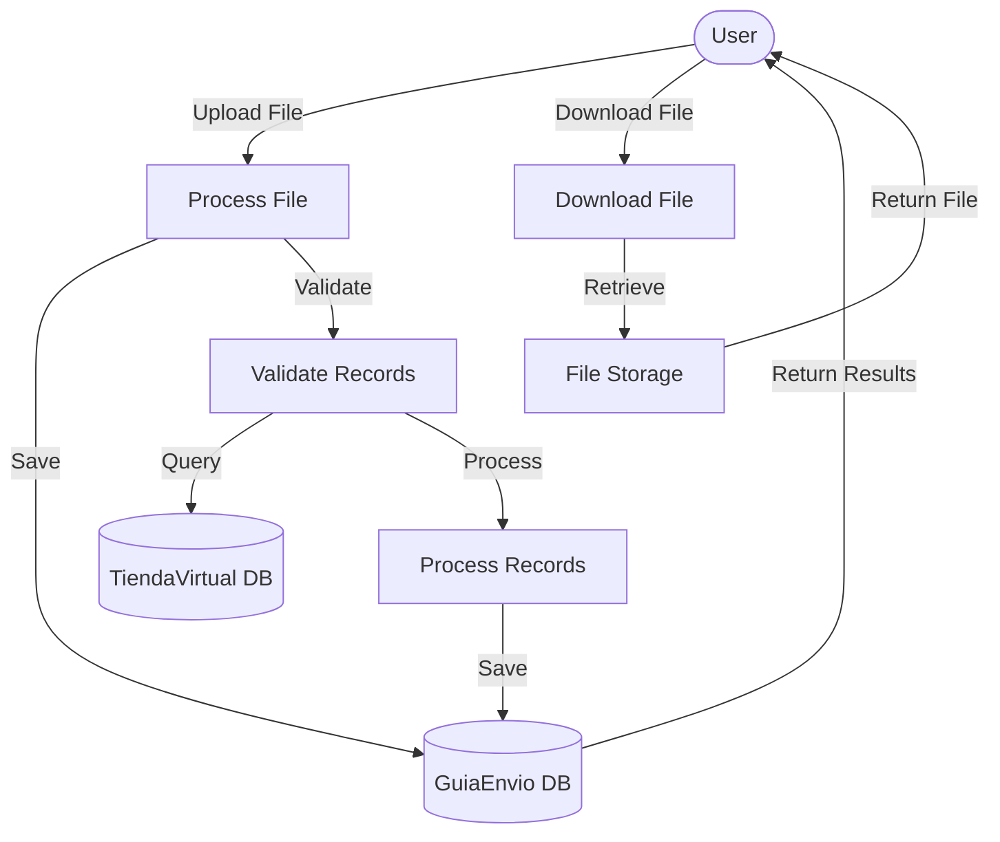

## Module: ArchivoImpl.java

# Documentación Técnica: ArchivoImpl.java

## 1. **Nombre del módulo o componente SQL:**
ArchivoImpl.java

## 2. **Objetivos principales:**
Este componente implementa la interfaz `Archivo` y se encarga del procesamiento de archivos CSV/TXT que contienen información de guías de envío. Su propósito principal es permitir la carga, validación y almacenamiento de datos de guías de envío en el sistema de comercio electrónico de Coppel, así como la descarga de archivos.

## 3. **Funciones, métodos o consultas críticas:**
- `guardarArchivo`: Procesa un archivo MultipartFile y valida su contenido.
- `descargarArchivo`: Recupera un archivo del sistema de archivos.
- `procesarArchivo`: Maneja la lectura del archivo CSV.
- `validarRegistro`: Valida cada registro del archivo.
- `getNumGuiaOriginal`: Extrae y valida el número de guía.
- `getNumMonto`: Extrae y valida el monto de la guía.
- `guardarGuia`: Persiste la información de la guía en la base de datos.
- `consultarDatosGuia`: Consulta información adicional de la guía.

## 4. **Variables y elementos clave (columnas, tablas, parámetros):**
- `MAX_RECORDS`: Constante que limita el número máximo de registros a procesar (3000).
- `guiaEnvioRepository`: Repositorio para operaciones con guías en CoppelPay.
- `guiaEnvioTVRepository`: Repositorio para operaciones con guías en TiendaVirtual.
- `FileDto`: DTO para manejar la información del archivo y sus registros.
- `GuiaDto`: DTO para la información de cada guía.
- `GuiaTVDto`: DTO para la información de guía en TiendaVirtual.

## 5. **Interdependencias y relaciones:**
- Depende de repositorios `GuiaEnvioRepository` y `GuiaEnvioTVRepository` para operaciones de base de datos.
- Utiliza `ModelMapper` para mapear entre entidades y DTOs.
- Interactúa con dos bases de datos diferentes: "coppelPay" y "tiendaVirtual".
- Utiliza la librería OpenCSV para el procesamiento de archivos CSV.
- Depende de la clase utilitaria `Sanitizie` para sanitizar mensajes de log.

## 6. **Operaciones centrales vs. auxiliares:**
**Operaciones centrales:**
- Procesamiento y validación de archivos CSV/TXT.
- Almacenamiento de guías en la base de datos.
- Consulta de información adicional de guías.

**Operaciones auxiliares:**
- Validación de errores.
- Sanitización de mensajes de log.
- Manejo de excepciones.
- Creación de directorios seguros para archivos.

## 7. **Secuencia operativa o flujo de ejecución:**
1. Recepción del archivo MultipartFile.
2. Validación del formato del archivo (CSV o TXT).
3. Procesamiento del archivo línea por línea.
4. Validación de cada registro (número de guía y monto).
5. Consulta de datos adicionales de la guía.
6. Almacenamiento de la guía en la base de datos.
7. Retorno de resultados o errores.

## 8. **Aspectos de rendimiento y optimización:**
- Limita el procesamiento a un máximo de 3000 registros para evitar sobrecarga.
- Utiliza transacciones para operaciones de base de datos.
- Implementa manejo de excepciones para evitar fallos en el procesamiento.
- Podría optimizarse el procesamiento en lote de las guías en lugar de procesarlas una por una.

## 9. **Reusabilidad y adaptabilidad:**
- El código está estructurado siguiendo el patrón de diseño de servicios e inyección de dependencias.
- La separación de responsabilidades permite reutilizar componentes como la validación y el procesamiento.
- La implementación de una interfaz `Archivo` facilita la sustitución de la implementación.
- El uso de DTOs permite adaptar la estructura de datos según sea necesario.

## 10. **Uso y contexto:**
- Este módulo forma parte del sistema de administración de comercio electrónico de Coppel.
- Se utiliza para cargar y procesar archivos de guías de envío.
- Interactúa con dos sistemas de base de datos diferentes: CoppelPay y TiendaVirtual.
- Es utilizado probablemente por una interfaz web que permite la carga de archivos.

## 11. **Supuestos y limitaciones:**
- Supone que los archivos CSV/TXT tienen un formato específico con campos en posiciones determinadas.
- Limita el procesamiento a 3000 registros por archivo.
- Requiere permisos POSIX para la creación de directorios seguros (limitado a sistemas Unix/Linux).
- No maneja procesamiento concurrente de archivos.
- Asume que el número de guía y el monto son campos obligatorios.
- No permite montos iguales a cero.
- Requiere que la guía exista previamente en el sistema de TiendaVirtual.
## Flow Diagram [via mermaid]

