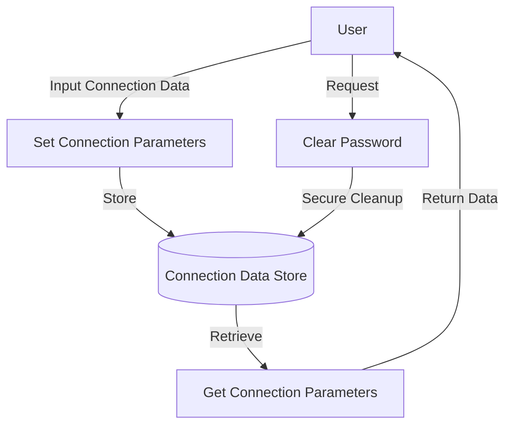

## Module: Conexion.java

# Documentación Técnica: Conexion.java

## 1. **Nombre del módulo o componente SQL:**
Conexion.java

## 2. **Objetivos principales:**
Este módulo define una clase para gestionar los parámetros de conexión a una base de datos. Su propósito es encapsular y proporcionar acceso controlado a la información de conexión necesaria para establecer comunicación con un servidor de base de datos dentro del sistema de administración de comercio electrónico de Coppel.

## 3. **Funciones, métodos o consultas críticas:**
- Métodos getter y setter para cada atributo de conexión (servidor, bd, puerto, usuario, etc.)
- `setPassw0rd(char[])`: Método especializado para establecer la contraseña de forma segura
- `getPassword()`: Devuelve una copia de la contraseña almacenada
- `clearPassw0rd()`: Limpia la contraseña de la memoria por seguridad

## 4. **Variables y elementos clave:**
- `servidor`: Dirección del servidor de base de datos
- `bd`: Nombre de la base de datos
- `puerto`: Puerto de conexión
- `usuario`: Nombre de usuario para la autenticación
- `passw0rd`: Contraseña almacenada como array de caracteres (por seguridad)
- `app`: Nombre de la aplicación que utiliza la conexión
- `funcion`: Propósito o función específica de la conexión

## 5. **Interdependencias y relaciones:**
El módulo pertenece al paquete `com.coppel.omnicanal.ecommercempadministrador.util`, lo que sugiere que es una clase utilitaria dentro del sistema de administración de comercio electrónico de Coppel. No muestra dependencias explícitas con otros componentes del sistema.

## 6. **Operaciones centrales vs. auxiliares:**
- **Centrales**: Almacenamiento y recuperación segura de credenciales de conexión
- **Auxiliares**: Limpieza de memoria para datos sensibles (contraseña)

## 7. **Secuencia operativa o flujo de ejecución:**
1. Instanciación del objeto Conexion
2. Configuración de parámetros mediante métodos setter
3. Recuperación de parámetros mediante métodos getter cuando sea necesario
4. Limpieza de contraseña cuando ya no se necesite mediante clearPassw0rd()

## 8. **Aspectos de rendimiento y optimización:**
- La implementación de manejo de contraseñas utiliza arrays de caracteres en lugar de String para mejorar la seguridad, ya que los String son inmutables y pueden permanecer en memoria
- Se implementa la limpieza explícita de la contraseña para evitar que permanezca en memoria más tiempo del necesario

## 9. **Reusabilidad y adaptabilidad:**
La clase es altamente reutilizable y adaptable, ya que:
- Encapsula todos los parámetros de conexión de forma independiente
- No contiene lógica específica de negocio
- Puede ser utilizada para diferentes tipos de conexiones a bases de datos
- Los parámetros son configurables mediante setters

## 10. **Uso y contexto:**
Este módulo se utiliza como contenedor de información de conexión a base de datos dentro del sistema de administración de comercio electrónico. Probablemente es utilizado por otras clases que necesitan establecer conexiones a la base de datos para realizar operaciones CRUD u otras consultas.

## 11. **Supuestos y limitaciones:**
- **Supuestos**: Se asume que la aplicación maneja correctamente la información sensible y que los métodos de esta clase serán invocados apropiadamente.
- **Limitaciones**: 
  - No implementa la conexión real a la base de datos, solo almacena los parámetros
  - No incluye validación de los datos ingresados
  - No proporciona cifrado adicional para la contraseña más allá del manejo como array de caracteres
  - No implementa mecanismos de pooling de conexiones o reconexión automática
## Flow Diagram [via mermaid]

