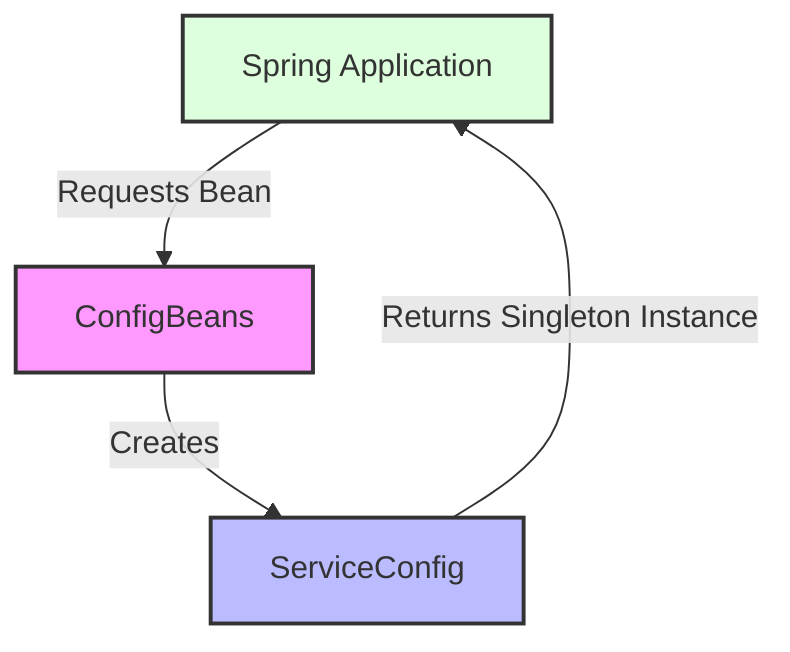

## Module: ConfigBeans.java

# Documentación Técnica: ConfigBeans.java

## 1. **Nombre del módulo o componente SQL:**
ConfigBeans.java

## 2. **Objetivos principales:**
Este módulo define la configuración de beans para la aplicación Spring. Su propósito principal es establecer y gestionar la creación de beans de configuración que serán utilizados en toda la aplicación de e-commerce de Coppel. Específicamente, se encarga de definir un bean de configuración de servicios como singleton.

## 3. **Funciones, métodos o consultas críticas:**
- `getServiceConfig()`: Método anotado como @Bean que crea y devuelve una instancia de ServiceConfig como singleton.

## 4. **Variables y elementos clave (columnas, tablas, parámetros):**
- No hay variables de instancia definidas en esta clase.
- El elemento clave es el bean ServiceConfig que se configura como singleton.

## 5. **Interdependencias y relaciones:**
- Depende de la clase `ServiceConfig` que debe estar definida en el mismo paquete o en uno accesible.
- Se integra con el sistema de gestión de beans de Spring Framework.
- Forma parte del paquete `com.coppel.omnicanal.ecommercempadministrador.config`.

## 6. **Operaciones centrales vs. auxiliares:**
- Operación central: Definición y configuración del bean ServiceConfig como singleton.
- No contiene operaciones auxiliares visibles en el código proporcionado.

## 7. **Secuencia operativa o flujo de ejecución:**
1. Durante el inicio de la aplicación Spring, el contenedor de IoC detecta la clase anotada con @Configuration.
2. El método getServiceConfig() es invocado para crear el bean ServiceConfig.
3. El bean creado se almacena en el contexto de aplicación de Spring como singleton.

## 8. **Aspectos de rendimiento y optimización:**
- El uso del ámbito SCOPE_SINGLETON garantiza que solo se cree una instancia del bean ServiceConfig, optimizando el uso de memoria.
- Al ser una clase de configuración simple, no presenta problemas de rendimiento significativos.

## 9. **Reusabilidad y adaptabilidad:**
- La clase está diseñada siguiendo el patrón de configuración de Spring, lo que la hace adaptable a diferentes entornos.
- Se puede extender fácilmente para incluir más beans de configuración según sea necesario.
- La configuración es modular y sigue las mejores prácticas de Spring.

## 10. **Uso y contexto:**
- Este módulo se utiliza durante la inicialización de la aplicación Spring para configurar los beans necesarios.
- Es parte del sistema de configuración de la aplicación de e-commerce de Coppel, específicamente del módulo administrador.
- Proporciona acceso centralizado a la configuración de servicios a través del bean ServiceConfig.

## 11. **Supuestos y limitaciones:**
- Supone que la clase ServiceConfig existe y puede ser instanciada sin parámetros.
- Asume que el entorno de ejecución es una aplicación Spring.
- No proporciona configuración parametrizable externamente (como a través de archivos de propiedades).
- Limitado a la configuración de un solo bean en su implementación actual.
## Flow Diagram [via mermaid]

