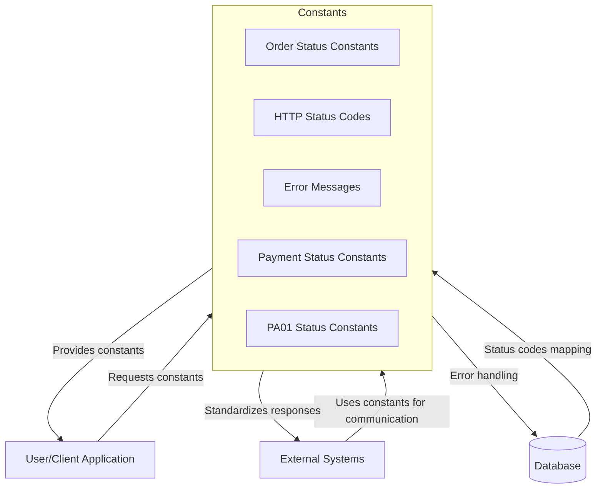

## Module: Constantes.java

# Documentación Técnica: Constantes.java

## 1. **Nombre del módulo o componente SQL:**
Constantes.java

## 2. **Objetivos principales:**
Este módulo define un conjunto de constantes utilizadas en el sistema de comercio electrónico (ecommerce) de Coppel. Su propósito es centralizar valores constantes que se utilizan en diferentes partes de la aplicación, facilitando su mantenimiento y evitando la duplicación de valores literales en el código.

## 3. **Funciones, métodos o consultas críticas:**
El archivo no contiene métodos funcionales, solo declaraciones de constantes. Incluye un constructor privado que lanza una excepción para prevenir la instanciación de la clase.

## 4. **Variables y elementos clave (columnas, tablas, parámetros):**
Las constantes clave incluyen:
- Estados de líneas de pedido: `ORDER_LINE_WAITING_DEBIT_PAYMENT`, `ORDER_LINE_REFUSED`, `ORDER_LINE_CANCELED`
- Códigos HTTP: `HTTP_200`, `HTTP_204`, `HTTP_ERROR_400`, `HTTP_ERROR_401`, `HTTP_ERROR_404`, `HTTP_ERROR_405`, `HTTP_ERROR_500`
- Mensajes de error: `ERROR_WS_ECOMMERCEETVSERVICE`, `ERROR_WS_PA01_CONFIRMACION`, `ERROR_WS_PA01_RECHAZO`, `ERROR_NOTIFICAR_REMBOLSO`
- Estados de pago: `ESTATUS_PAGO_PENDIENTE_CONFIRMAR`, `ESTATUS_PAGO_CONFIRMADO`, `ESTATUS_PAGO_NO_RECIBIDO`
- Respuestas de confirmación: `CONFIRMAR_PA01_OK`, `CONFIRMAR_PA01_REFUSED`

## 5. **Interdependencias y relaciones:**
Este módulo no tiene dependencias directas con otros componentes, pero es utilizado por múltiples clases del sistema que necesitan hacer referencia a estos valores constantes.

## 6. **Operaciones centrales vs. auxiliares:**
No aplica para este módulo, ya que solo contiene definiciones de constantes y no implementa operaciones.

## 7. **Secuencia operativa o flujo de ejecución:**
No aplica para este módulo, ya que no contiene lógica de ejecución secuencial.

## 8. **Aspectos de rendimiento y optimización:**
Las constantes están definidas como `static final`, lo que optimiza el rendimiento al ser cargadas una sola vez en memoria durante la inicialización de la clase.

## 9. **Reusabilidad y adaptabilidad:**
Este módulo es altamente reusable, ya que centraliza valores constantes que pueden ser utilizados en cualquier parte del sistema. Para adaptarlo, solo se necesita agregar, modificar o eliminar constantes según sea necesario.

## 10. **Uso y contexto:**
Este módulo se utiliza en todo el sistema de administración de ecommerce para referenciar estados, códigos de respuesta HTTP, mensajes de error y estados de pago. Forma parte del paquete `com.coppel.omnicanal.ecommercempadministrador.util`.

## 11. **Supuestos y limitaciones:**
- Se asume que los valores de las constantes son estables y no cambian durante la ejecución del programa.
- La clase está diseñada para no ser instanciada (constructor privado con excepción).
- Las constantes están relacionadas principalmente con estados de pedidos, códigos HTTP y mensajes de error específicos del sistema PA01 y servicios web relacionados.
- No hay mecanismo para extender o modificar estas constantes en tiempo de ejecución.
## Flow Diagram [via mermaid]

