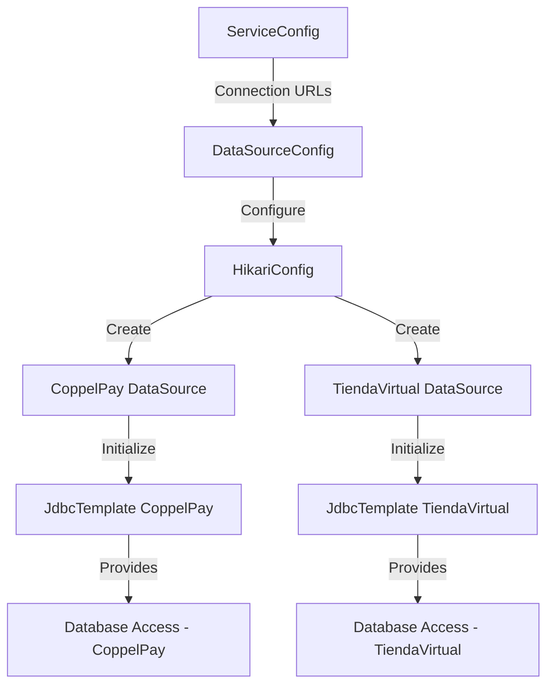

## Module: DataSourceConfig.java

# Documentación Técnica: DataSourceConfig.java

## 1. **Nombre del módulo o componente SQL:**
DataSourceConfig.java

## 2. **Objetivos principales:**
Este módulo configura las fuentes de datos (DataSources) para la aplicación Spring Boot, estableciendo conexiones a diferentes bases de datos utilizadas por el sistema de e-commerce. Su propósito principal es centralizar y gestionar las configuraciones de conexión a bases de datos, facilitando el acceso a múltiples orígenes de datos desde la aplicación.

## 3. **Funciones, métodos o consultas críticas:**
- `solicitudConfig(String url)`: Método auxiliar que configura un objeto HikariConfig con la URL de conexión proporcionada.
- `dataSourceCoppelPay()`: Crea y configura el DataSource para la base de datos CoppelPay.
- `jdbcTemplateCoppelPay(DataSource ds)`: Crea un JdbcTemplate para interactuar con la base de datos CoppelPay.
- `dataSourceTV()`: Crea y configura el DataSource para la base de datos TiendaVirtual.
- `jdbcTemplateTV(DataSource ds)`: Crea un JdbcTemplate para interactuar con la base de datos TiendaVirtual.

## 4. **Variables y elementos clave (columnas, tablas, parámetros):**
- `serviceConfig`: Objeto inyectado que contiene las URLs de conexión a las bases de datos.
- `HikariConfig`: Configuración para el pool de conexiones HikariCP.
- `HikariDataSource`: Implementación de DataSource que utiliza el pool de conexiones HikariCP.
- URLs de conexión: Obtenidas mediante `serviceConfig.getConCoppelPay()` y `serviceConfig.getConTiendaVirtual()`.

## 5. **Interdependencias y relaciones:**
- Depende de la clase `ServiceConfig` para obtener las URLs de conexión.
- Utiliza la biblioteca HikariCP para la gestión del pool de conexiones.
- Se integra con el framework Spring a través de anotaciones como `@Configuration`, `@Bean`, `@Primary` y `@Qualifier`.
- Los JdbcTemplate creados dependen de los DataSource correspondientes.

## 6. **Operaciones centrales vs. auxiliares:**
- **Centrales**: La creación y configuración de los DataSource y JdbcTemplate para CoppelPay y TiendaVirtual.
- **Auxiliares**: El método `solicitudConfig()` que encapsula la configuración común de HikariConfig.

## 7. **Secuencia operativa o flujo de ejecución:**
1. Spring inicializa el contenedor de aplicación y detecta la clase `DataSourceConfig`.
2. Se inyecta el objeto `ServiceConfig`.
3. Se crean los DataSource para CoppelPay (marcado como primario) y TiendaVirtual.
4. Se crean los JdbcTemplate correspondientes para cada DataSource.
5. Estos beans quedan disponibles para ser inyectados en otros componentes de la aplicación.

## 8. **Aspectos de rendimiento y optimización:**
- Utiliza HikariCP, un pool de conexiones de alto rendimiento que optimiza la gestión de conexiones a la base de datos.
- La configuración actual es mínima y podría beneficiarse de ajustes adicionales como tamaño del pool, tiempos de espera, etc.
- No se establecen límites explícitos para el número de conexiones, lo que podría ser un problema en entornos de alta carga.

## 9. **Reusabilidad y adaptabilidad:**
- El diseño es modular, permitiendo agregar fácilmente nuevas fuentes de datos siguiendo el mismo patrón.
- El método `solicitudConfig()` promueve la reutilización de código para configuraciones similares.
- La parametrización a través de `ServiceConfig` permite cambiar las URLs de conexión sin modificar el código.

## 10. **Uso y contexto:**
- Este módulo se utiliza durante la inicialización de la aplicación Spring Boot para configurar el acceso a bases de datos.
- Los JdbcTemplate configurados son utilizados por otros componentes de la aplicación para ejecutar operaciones SQL.
- Forma parte de un sistema de e-commerce (indicado por el paquete `com.coppel.omnicanal.ecommercempadministrador`).

## 11. **Supuestos y limitaciones:**
- Supone que las URLs de conexión están correctamente configuradas en `ServiceConfig`.
- No incluye configuración de credenciales de base de datos en el código, asumiendo que están incluidas en las URLs o gestionadas externamente.
- Está comentada la anotación `@Profile("dev")`, lo que sugiere que esta configuración podría estar destinada a un entorno de desarrollo.
- No incluye manejo de errores específico para fallos de conexión a la base de datos.
- La configuración de HikariCP es mínima, sin ajustes específicos para optimización.
## Flow Diagram [via mermaid]

