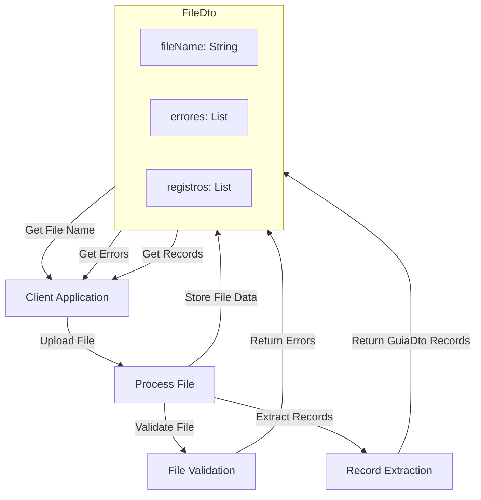

## Module: FileDto.java

# Documentación Técnica: FileDto.java

## 1. **Nombre del módulo o componente SQL:**
FileDto.java

## 2. **Objetivos principales:**
Este componente es una clase de transferencia de datos (DTO) diseñada para encapsular información relacionada con archivos en el sistema de administración de e-commerce. Su propósito principal es transportar datos de archivos entre diferentes capas de la aplicación, específicamente para manejar información de archivos que contienen guías, junto con sus posibles errores y registros asociados.

## 3. **Funciones, métodos o consultas críticas:**
- `getFileName()`: Método para obtener el nombre del archivo.
- `setFileName()`: Método para establecer el nombre del archivo.
- `getErrores()`: Método para obtener la lista de errores.
- `setErrores()`: Método para establecer la lista de errores.
- `getRegistros()`: Método para obtener la lista de registros de guías.
- `setRegistros()`: Método para establecer la lista de registros de guías.

## 4. **Variables y elementos clave (columnas, tablas, parámetros):**
- `fileName`: Almacena el nombre del archivo procesado.
- `errores`: Lista de cadenas que contiene los errores encontrados durante el procesamiento del archivo.
- `registros`: Lista de objetos GuiaDto que contiene los registros de guías extraídos del archivo.

## 5. **Interdependencias y relaciones:**
- Depende de la clase `GuiaDto` para almacenar los registros de guías.
- Forma parte del paquete `com.coppel.omnicanal.ecommercempadministrador.dto`, lo que sugiere que interactúa con otros componentes del sistema de administración de e-commerce.

## 6. **Operaciones centrales vs. auxiliares:**
- **Operaciones centrales**: Almacenamiento y recuperación de datos de archivos, errores y registros de guías.
- **Operaciones auxiliares**: Métodos getter y setter para acceder y modificar los atributos de la clase.

## 7. **Secuencia operativa o flujo de ejecución:**
Al ser un DTO, no tiene un flujo de ejecución propio. Es utilizado por otros componentes para:
1. Crear una instancia de FileDto
2. Establecer los datos necesarios (nombre de archivo, errores, registros)
3. Transferir estos datos entre capas de la aplicación

## 8. **Aspectos de rendimiento y optimización:**
- La clase es simple y ligera, sin operaciones complejas que afecten el rendimiento.
- El uso de listas para errores y registros permite manejar cantidades variables de datos.
- No hay consideraciones especiales de rendimiento más allá de la gestión eficiente de memoria para las listas.

## 9. **Reusabilidad y adaptabilidad:**
- Alta reusabilidad como contenedor genérico de información de archivos.
- Podría adaptarse fácilmente para manejar otros tipos de registros además de GuiaDto.
- Su diseño simple facilita su extensión para incluir atributos adicionales si fuera necesario.

## 10. **Uso y contexto:**
- Utilizado probablemente en procesos de carga, validación y procesamiento de archivos que contienen información de guías.
- Sirve como intermediario entre la capa de presentación y la lógica de negocio para transferir información sobre archivos procesados.
- Posiblemente usado en APIs REST o servicios web para devolver resultados de operaciones con archivos.

## 11. **Supuestos y limitaciones:**
- Supone la existencia de una clase GuiaDto para manejar los registros individuales.
- No implementa validaciones propias, asumiendo que estas se realizan en otras capas de la aplicación.
- No maneja directamente operaciones de archivo (lectura/escritura), solo almacena información relacionada.
- No incluye métodos para procesar o filtrar los datos que contiene, limitándose a ser un contenedor pasivo de información.
## Flow Diagram [via mermaid]

