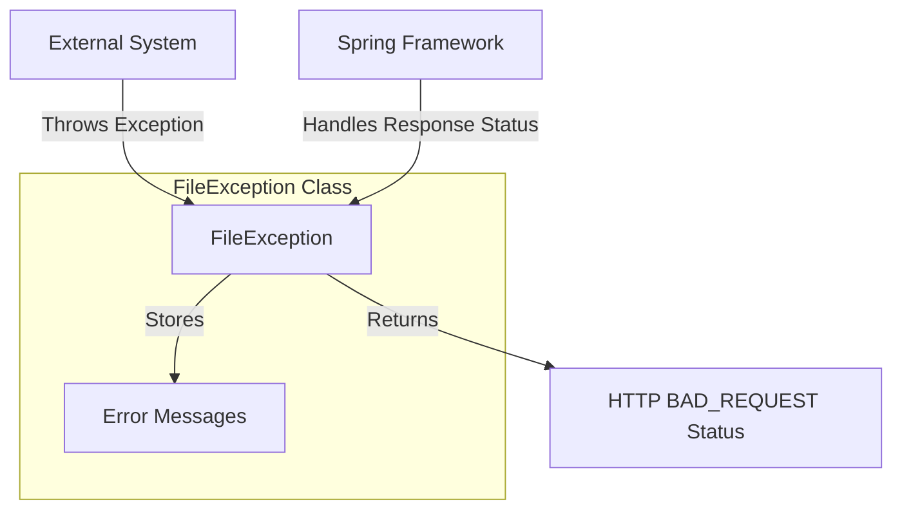

## Module: FileException.java

# Documentación Técnica: FileException.java

## 1. **Nombre del módulo o componente SQL:**
FileException.java

## 2. **Objetivos principales:**
Este componente define una clase de excepción personalizada llamada `FileException` que se utiliza para manejar errores relacionados con operaciones de archivos en el sistema de administración de e-commerce. Su propósito es proporcionar un mecanismo estructurado para reportar y gestionar errores específicos de manipulación de archivos, permitiendo incluir mensajes detallados y una lista de errores asociados.

## 3. **Funciones, métodos o consultas críticas:**
- Constructor `FileException(String message)`: Crea una excepción con un mensaje de error.
- Constructor `FileException(String message, Throwable cause)`: Crea una excepción con mensaje y causa subyacente.
- Constructor `FileException(String message, List<String> errors)`: Crea una excepción con mensaje y lista de errores.
- Método `getErrors()`: Devuelve la lista de errores asociados a la excepción.

## 4. **Variables y elementos clave (columnas, tablas, parámetros):**
- `serialVersionUID`: Identificador de versión para serialización.
- `errors`: Lista de cadenas que almacena múltiples mensajes de error relacionados con la excepción.

## 5. **Interdependencias y relaciones:**
- Extiende `RuntimeException` de Java.
- Utiliza la anotación `@ResponseStatus` de Spring Framework para asociar esta excepción con el código de estado HTTP 400 (BAD_REQUEST).
- Pertenece al paquete `com.coppel.omnicanal.ecommercempadministrador.execeptions`.
- Depende de las clases `ArrayList` y `List` de Java para gestionar la colección de errores.

## 6. **Operaciones centrales vs. auxiliares:**
- **Centrales**: Almacenamiento y gestión de errores relacionados con archivos.
- **Auxiliares**: Método getter para acceder a la lista de errores.

## 7. **Secuencia operativa o flujo de ejecución:**
1. Se instancia la excepción con uno de los constructores disponibles.
2. Se propaga la excepción en el código cuando ocurre un error relacionado con archivos.
3. Spring Framework captura la excepción y la traduce automáticamente a una respuesta HTTP 400.
4. El cliente puede acceder a los mensajes de error detallados mediante el método `getErrors()`.

## 8. **Aspectos de rendimiento y optimización:**
- La clase utiliza `ArrayList` para almacenar errores, lo que proporciona acceso rápido por índice.
- Al ser una excepción, su uso debe limitarse a situaciones excepcionales y no como mecanismo de control de flujo regular.

## 9. **Reusabilidad y adaptabilidad:**
- Alta reusabilidad dentro del sistema para cualquier operación relacionada con archivos.
- Puede adaptarse fácilmente para manejar diferentes tipos de errores de archivo mediante la lista de errores personalizable.
- Los constructores sobrecargados permiten diferentes niveles de detalle en el reporte de errores.

## 10. **Uso y contexto:**
- Se utiliza en el módulo de administración de e-commerce para manejar errores en operaciones como carga, descarga, procesamiento o validación de archivos.
- Es capturada por controladores REST de Spring para devolver respuestas HTTP apropiadas al cliente.

## 11. **Supuestos y limitaciones:**
- Supone que los errores relacionados con archivos deben resultar en una respuesta HTTP 400 (BAD_REQUEST).
- No proporciona mecanismos para categorizar o priorizar los errores dentro de la lista.
- No incluye información sobre el archivo específico que causó el error, lo que podría requerir incluir esa información en los mensajes de error.
## Flow Diagram [via mermaid]

