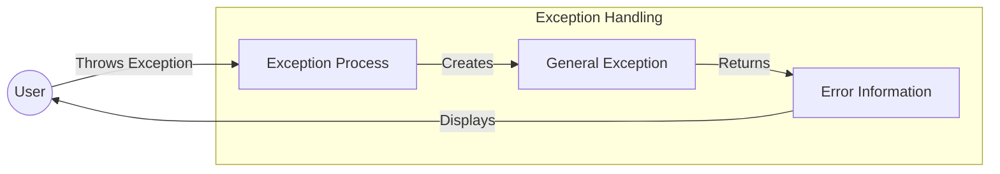

## Module: General.java

# Documentación Técnica: General.java

## 1. **Nombre del módulo o componente SQL:**
General.java

## 2. **Objetivos principales:**
Este módulo define una clase de excepción personalizada llamada "General" que extiende la clase Exception de Java. Su propósito es proporcionar un mecanismo estandarizado para el manejo de excepciones en el sistema de administración de e-commerce, permitiendo incluir información adicional como códigos de error y origen del error.

## 3. **Funciones, métodos o consultas críticas:**
- Constructor `General(String message, String code, String errorOrigen)`: Inicializa la excepción con mensaje, código y origen del error.
- `getMessage()`: Método sobrescrito que devuelve el mensaje de error.
- `getCode()`: Método que devuelve el código de error.
- `getErrorOrigen()`: Método que devuelve el origen del error.
- `toString()`: Método sobrescrito que devuelve una representación en cadena de la excepción.

## 4. **Variables y elementos clave (columnas, tablas, parámetros):**
- `serialVersionUID`: Identificador de versión para serialización.
- `message`: Almacena el mensaje descriptivo del error.
- `code`: Almacena el código identificador del error.
- `errorOrigen`: Almacena información sobre el origen o fuente del error.

## 5. **Interdependencias y relaciones:**
- Extiende la clase `Exception` de Java.
- Pertenece al paquete `com.coppel.omnicanal.ecommercempadministrador.execeptions`.
- Es utilizada por otros componentes del sistema de administración de e-commerce para manejar errores específicos de la aplicación.

## 6. **Operaciones centrales vs. auxiliares:**
- **Centrales**: Constructor y métodos getter para acceder a la información del error.
- **Auxiliares**: Método `toString()` para facilitar el registro y visualización de la excepción.

## 7. **Secuencia operativa o flujo de ejecución:**
1. Se instancia la excepción con los parámetros requeridos (mensaje, código, origen).
2. La excepción es lanzada en el punto donde se detecta el error.
3. El sistema captura la excepción y puede acceder a sus propiedades específicas.
4. Se puede utilizar el método `toString()` para obtener una representación completa del error.

## 8. **Aspectos de rendimiento y optimización:**
- La clase es ligera y eficiente, sin operaciones costosas.
- Al ser una clase de excepción, su uso debe limitarse a situaciones excepcionales y no para control de flujo normal del programa.

## 9. **Reusabilidad y adaptabilidad:**
- Alta reusabilidad: puede ser utilizada en cualquier parte del sistema para representar errores específicos del dominio.
- Adaptable mediante la parametrización del mensaje, código y origen del error.
- Podría extenderse para incluir información adicional si fuera necesario.

## 10. **Uso y contexto:**
- Se utiliza en el sistema de administración de e-commerce omnicanal de Coppel.
- Sirve como base para el manejo estructurado de excepciones específicas de la aplicación.
- Permite categorizar y rastrear errores mediante códigos y orígenes estandarizados.

## 11. **Supuestos y limitaciones:**
- Supone que los errores pueden ser categorizados mediante un código y un origen.
- No implementa mecanismos para clasificar jerárquicamente los errores más allá de estos atributos.
- No incluye funcionalidad para sugerir acciones correctivas o recuperación automática.
- Depende de que el código cliente proporcione valores significativos para mensaje, código y origen.
## Flow Diagram [via mermaid]

