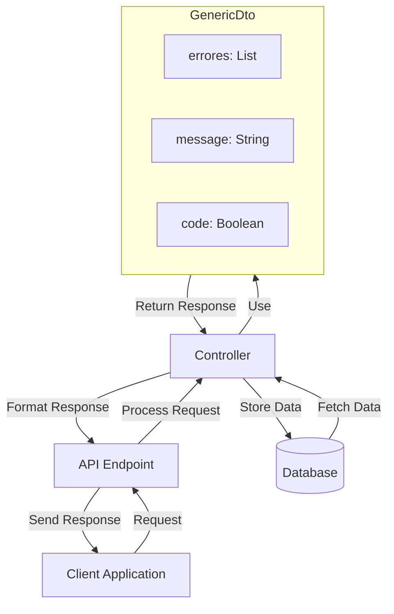

## Module: GenericDto.java

# Documentación Técnica: GenericDto.java

## 1. **Nombre del módulo o componente SQL:**
GenericDto.java

## 2. **Objetivos principales:**
Este componente define una clase de transferencia de datos (DTO) genérica utilizada para transportar información entre capas de la aplicación, especialmente para manejar respuestas que incluyen mensajes, códigos de estado y posibles errores. Sirve como estructura estándar para comunicación entre el backend y frontend o entre diferentes capas del sistema.

## 3. **Funciones, métodos o consultas críticas:**
No contiene métodos específicos más allá de los generados automáticamente por Lombok (getters, setters, constructor, toString). Es una clase de estructura de datos pura.

## 4. **Variables y elementos clave (columnas, tablas, parámetros):**
- `errores`: Lista de cadenas que contiene mensajes de error.
- `message`: Cadena que almacena un mensaje informativo o de estado.
- `code`: Valor booleano que probablemente indica el éxito (true) o fracaso (false) de una operación.

## 5. **Interdependencias y relaciones:**
- Depende de la biblioteca Lombok para la generación automática de código.
- Forma parte del paquete `com.coppel.omnicanal.ecommercempadministrador.dto`.
- Es utilizada por otros componentes del sistema que necesitan transportar datos con información de estado y errores.

## 6. **Operaciones centrales vs. auxiliares:**
- Operación central: Almacenar y transportar datos de respuesta.
- No contiene operaciones auxiliares ya que es una estructura de datos pura.

## 7. **Secuencia operativa o flujo de ejecución:**
No aplica una secuencia operativa específica al ser una clase DTO. Su ciclo de vida típico sería:
1. Instanciación
2. Población de datos
3. Transferencia entre capas
4. Lectura de datos por el receptor

## 8. **Aspectos de rendimiento y optimización:**
- Es una clase ligera sin lógica compleja.
- El uso de Lombok reduce el código boilerplate, mejorando la mantenibilidad.
- La estructura genérica permite su reutilización en múltiples contextos.

## 9. **Reusabilidad y adaptabilidad:**
- Alta reusabilidad por su naturaleza genérica.
- Puede ser utilizada en cualquier parte del sistema que requiera transportar mensajes y estados.
- Podría extenderse para incluir campos adicionales según necesidades específicas.

## 10. **Uso y contexto:**
- Se utiliza como contenedor de respuestas en operaciones del sistema.
- Probablemente empleada en respuestas de API REST o en comunicación entre capas de servicio.
- Forma parte del ecosistema de DTOs del sistema e-commerce de Coppel.

## 11. **Supuestos y limitaciones:**
- Supone que un valor booleano es suficiente para representar el estado de una operación.
- No incluye información detallada como códigos de error numéricos o timestamps.
- Limitada a transportar información básica de estado y mensajes de error.
- No implementa validaciones propias ni lógica de negocio.
## Flow Diagram [via mermaid]

