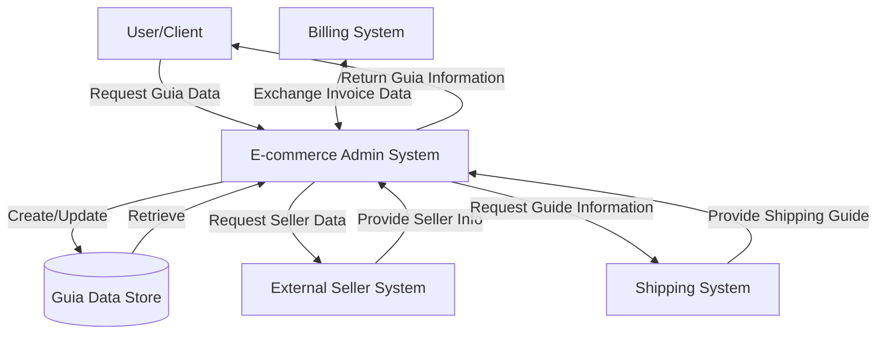

## Module: GuiaDto.java

# Documentación Técnica: GuiaDto.java

## 1. **Nombre del módulo o componente SQL:**
GuiaDto.java

## 2. **Objetivos principales:**
Este componente define una clase de transferencia de datos (DTO) llamada GuiaDto que sirve para encapsular información relacionada con guías de envío o facturas en el sistema de comercio electrónico. Su propósito es facilitar la transferencia de datos entre las capas de la aplicación sin exponer los detalles de implementación de las entidades del dominio.

## 3. **Funciones, métodos o consultas críticas:**
No contiene métodos de negocio específicos, ya que es una clase DTO. Los métodos disponibles son los generados automáticamente por Lombok:
- Constructores (por defecto y con todos los argumentos)
- Getters y setters para cada atributo
- Método toString() para representación en cadena de texto

## 4. **Variables y elementos clave (columnas, tablas, parámetros):**
- `numNotaFactura`: Entero que representa el número de nota o factura
- `numGuiaOriginal`: Cadena que almacena el número de guía original
- `idSeller`: Entero que identifica al vendedor
- `importeGuia`: Valor decimal (Double) que representa el importe asociado a la guía
- `tipoGuia`: Entero que clasifica el tipo de guía

## 5. **Interdependencias y relaciones:**
- Extiende la clase `GenericDto`, heredando sus propiedades y comportamientos
- Pertenece al paquete `com.coppel.omnicanal.ecommercempadministrador.dto`
- Utiliza anotaciones de la biblioteca Lombok para generación automática de código

## 6. **Operaciones centrales vs. auxiliares:**
Al ser un DTO puro, no contiene operaciones de procesamiento:
- **Centrales**: Almacenamiento y transferencia de datos relacionados con guías
- **Auxiliares**: Métodos generados por Lombok (getters, setters, toString, constructores)

## 7. **Secuencia operativa o flujo de ejecución:**
No aplica un flujo de ejecución específico al ser una estructura de datos pasiva. Su ciclo típico sería:
1. Instanciación del objeto
2. Asignación de valores a sus propiedades
3. Transferencia entre capas de la aplicación
4. Lectura de sus propiedades en el destino

## 8. **Aspectos de rendimiento y optimización:**
- Clase liviana sin lógica de negocio, lo que favorece el rendimiento
- El uso de Lombok reduce el código boilerplate, mejorando la mantenibilidad
- No hay operaciones costosas ni almacenamiento de colecciones grandes

## 9. **Reusabilidad y adaptabilidad:**
- Alta reusabilidad como contenedor de datos para operaciones relacionadas con guías
- Puede ser extendido o modificado fácilmente agregando nuevos campos
- Su diseño simple facilita su adaptación a diferentes contextos dentro del sistema

## 10. **Uso y contexto:**
- Utilizado probablemente en servicios REST como objeto de transferencia
- Sirve como intermediario entre la capa de presentación y la capa de servicio/persistencia
- Forma parte del módulo de administración de comercio electrónico omnicanal de Coppel

## 11. **Supuestos y limitaciones:**
- Supone que los tipos de datos definidos son suficientes para representar la información de guías
- No incluye validaciones de datos, asumiendo que estas se realizan en otra capa
- Limitado a la estructura definida; cualquier cambio en el modelo de datos requeriría modificar esta clase
- No proporciona serialización personalizada, confiando en los mecanismos estándar de Java/frameworks
## Flow Diagram [via mermaid]

