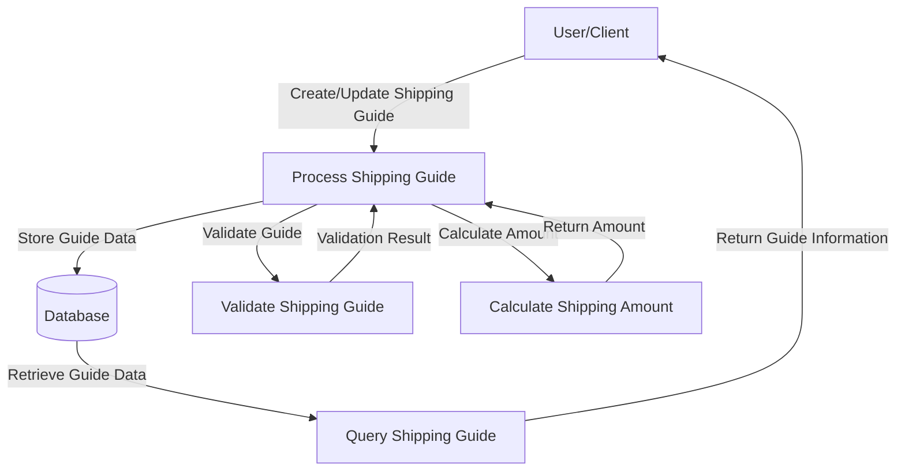

## Module: GuiaEnvioEntity.java

# Documentación Técnica: GuiaEnvioEntity.java

## 1. **Nombre del módulo o componente SQL:**
GuiaEnvioEntity.java - Entidad JPA para mapeo objeto-relacional

## 2. **Objetivos principales:**
Este componente define una entidad JPA que mapea una tabla de base de datos relacionada con guías de envío en el sistema de comercio electrónico de Coppel. Su propósito es representar y gestionar la información de guías de envío asociadas a notas de factura, permitiendo la persistencia y manipulación de estos datos dentro del sistema.

## 3. **Funciones, métodos o consultas críticas:**
No contiene métodos de negocio específicos, ya que es una clase de entidad JPA pura. Las operaciones principales serían las generadas automáticamente por JPA:
- Operaciones CRUD (Create, Read, Update, Delete) implícitas
- Getters y setters para acceder y modificar los atributos de la entidad

## 4. **Variables y elementos clave (columnas, tablas, parámetros):**
- `numNotaFactura` (Integer): Clave primaria que identifica la nota o factura asociada
- `idSeller` (Short): Identificador del vendedor
- `numGuiaOriginal` (String): Número de guía de envío original
- `importeGuia` (BigDecimal): Importe o costo asociado a la guía de envío
- `tipoGuia` (Short): Tipo de guía de envío

## 5. **Interdependencias y relaciones:**
No se definen explícitamente relaciones con otras entidades mediante anotaciones JPA como @OneToMany, @ManyToOne, etc. Sin embargo, por el nombre y estructura, se puede inferir que:
- Existe una relación con alguna entidad de facturas o notas de venta
- Posiblemente se relaciona con una entidad de vendedores (sellers)

## 6. **Operaciones centrales vs. auxiliares:**
Al ser una entidad JPA pura:
- Operaciones centrales: Persistencia y recuperación de datos de guías de envío
- Operaciones auxiliares: Getters/setters generados por Lombok para acceso a atributos

## 7. **Secuencia operativa o flujo de ejecución:**
No aplica directamente al ser una entidad JPA. El flujo típico sería:
1. Instanciación de la entidad
2. Asignación de valores mediante setters
3. Persistencia mediante EntityManager o repositorios Spring Data
4. Recuperación posterior para consultas o modificaciones

## 8. **Aspectos de rendimiento y optimización:**
- No se observan índices adicionales más allá de la clave primaria
- El uso de tipos primitivos como Short puede optimizar el espacio de almacenamiento
- BigDecimal es apropiado para valores monetarios, garantizando precisión en cálculos financieros

## 9. **Reusabilidad y adaptabilidad:**
- Alta reusabilidad dentro del contexto de guías de envío
- El uso de Lombok reduce el código boilerplate, facilitando el mantenimiento
- La entidad es simple y enfocada, lo que facilita su adaptación a cambios en los requisitos

## 10. **Uso y contexto:**
- Se utiliza en el módulo de administración de e-commerce de Coppel
- Forma parte del paquete "coppelpay", sugiriendo su uso en el contexto de pagos o facturación
- Probablemente es utilizada por servicios y repositorios para gestionar la información de guías de envío

## 11. **Supuestos y limitaciones:**
- Supone la existencia de una tabla en la base de datos con estructura correspondiente a los campos definidos
- No incluye validaciones de negocio a nivel de entidad
- No maneja relaciones complejas con otras entidades
- Limitada a la representación de datos, sin lógica de negocio incorporada
## Flow Diagram [via mermaid]

