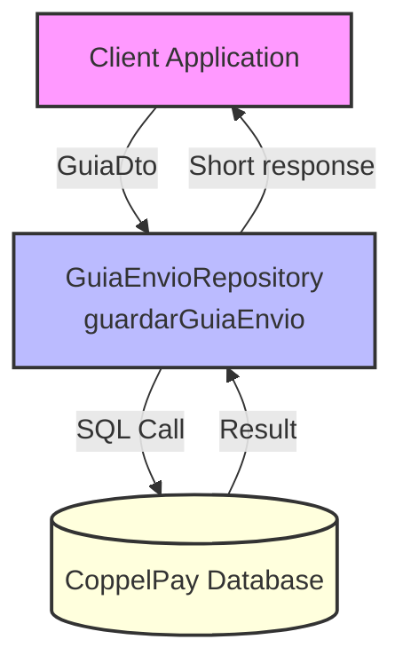

## Module: GuiaEnvioRepository.java

# Documentación Técnica: GuiaEnvioRepository.java

## 1. **Nombre del módulo o componente SQL:**
GuiaEnvioRepository.java

## 2. **Objetivos principales:**
Este componente es un repositorio de Spring que se encarga de gestionar la persistencia de guías de envío en la base de datos de CoppelPay. Su propósito principal es proporcionar una interfaz para guardar información de guías de envío relacionadas con notas de factura y vendedores.

## 3. **Funciones, métodos o consultas críticas:**
- `guardarGuiaEnvio(GuiaDto guiaDto)`: Método principal que ejecuta un procedimiento almacenado llamado `fun_guardarguiaenvio` para persistir la información de una guía de envío en la base de datos.

## 4. **Variables y elementos clave (columnas, tablas, parámetros):**
- `jdbcTemplateCoppelPay`: Instancia de JdbcTemplate calificada para conectarse a la base de datos de CoppelPay.
- Parámetros del procedimiento almacenado:
  - `numNotaFactura`: Número de nota o factura asociada a la guía.
  - `idSeller`: Identificador del vendedor.
  - `numGuiaOriginal`: Número de guía original.
  - `importeGuia`: Importe o valor monetario de la guía.
  - `tipoGuia`: Tipo de guía de envío.

## 5. **Interdependencias y relaciones:**
- Depende del DTO `GuiaDto` para recibir los datos necesarios para la operación.
- Utiliza un procedimiento almacenado `fun_guardarguiaenvio` en la base de datos de CoppelPay.
- Se integra con el sistema de Spring a través de las anotaciones `@Repository` y `@Autowired`.

## 6. **Operaciones centrales vs. auxiliares:**
- **Central**: La ejecución del procedimiento almacenado para guardar la guía de envío.
- **Auxiliares**: Manejo de conexiones, preparación de parámetros, gestión de excepciones y logging de errores.

## 7. **Secuencia operativa o flujo de ejecución:**
1. Se obtiene una conexión a la base de datos de CoppelPay.
2. Se prepara la llamada al procedimiento almacenado.
3. Se configuran los parámetros con los datos de la guía.
4. Se ejecuta el procedimiento almacenado.
5. Se procesa el resultado obtenido.
6. Se cierra la conexión y se devuelve el código de respuesta.

## 8. **Aspectos de rendimiento y optimización:**
- Utiliza try-with-resources para garantizar el cierre adecuado de recursos (Connection, CallableStatement, ResultSet).
- No mantiene conexiones abiertas más tiempo del necesario.
- Podría beneficiarse de un mecanismo de reintentos para operaciones fallidas.

## 9. **Reusabilidad y adaptabilidad:**
- El componente está diseñado específicamente para guardar guías de envío, con poca flexibilidad para otras operaciones.
- Podría extenderse para incluir más operaciones relacionadas con guías (consulta, actualización, eliminación).
- La dependencia directa del procedimiento almacenado limita su adaptabilidad a otros contextos.

## 10. **Uso y contexto:**
- Se utiliza dentro de un sistema de comercio electrónico (ecommercempadministrador) para gestionar guías de envío.
- Es parte del módulo de CoppelPay, probablemente relacionado con pagos y envíos.
- Depende de la configuración de Spring para la inyección del JdbcTemplate.

## 11. **Supuestos y limitaciones:**
- Supone que el procedimiento almacenado `fun_guardarguiaenvio` existe y está correctamente implementado en la base de datos.
- Asume que los datos proporcionados en el GuiaDto son válidos y completos.
- Limitado a operaciones de inserción, sin capacidad para consultar o modificar guías existentes.
- No implementa validaciones de negocio antes de la persistencia, confiando en que estas se realizan en capas superiores o en el procedimiento almacenado.
## Flow Diagram [via mermaid]

