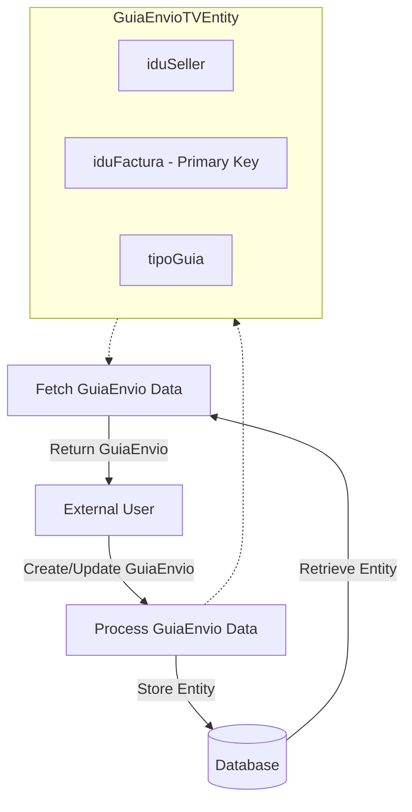

## Module: GuiaEnvioTVEntity.java

# Documentación Técnica: GuiaEnvioTVEntity.java

## 1. **Nombre del módulo o componente SQL:**
GuiaEnvioTVEntity.java

## 2. **Objetivos principales:**
Este componente define una entidad JPA (Java Persistence API) que representa una tabla de base de datos relacionada con guías de envío en un contexto de tienda virtual. Su propósito es mapear los datos de guías de envío entre la aplicación Java y la base de datos, facilitando las operaciones CRUD (Crear, Leer, Actualizar, Eliminar) sobre estos registros.

## 3. **Funciones, métodos o consultas críticas:**
No contiene métodos de consulta explícitos, ya que es una clase de entidad pura. Las operaciones de base de datos se realizarán a través de repositorios JPA que utilicen esta entidad. La clase está anotada con `@Entity` para indicar que es una entidad JPA mapeada a una tabla de base de datos.

## 4. **Variables y elementos clave (columnas, tablas, parámetros):**
- `iduSeller`: Identificador del vendedor (columna "idu_seller")
- `iduFactura`: Identificador de la factura (columna "idu_factura"), marcado como clave primaria con `@Id`
- `tipoGuia`: Tipo de guía de envío (columna "tipo_guia") representado como un Short

## 5. **Interdependencias y relaciones:**
No se definen explícitamente relaciones con otras entidades mediante anotaciones como `@OneToMany`, `@ManyToOne`, etc. Sin embargo, por el nombre de los campos, se puede inferir que esta entidad podría tener relaciones con entidades de vendedores y facturas.

## 6. **Operaciones centrales vs. auxiliares:**
- **Centrales**: Mapeo objeto-relacional de la tabla de guías de envío
- **Auxiliares**: Getters y setters generados por Lombok para acceder a los atributos de la entidad

## 7. **Secuencia operativa o flujo de ejecución:**
Al ser una clase de entidad, no tiene un flujo de ejecución propio. Su ciclo de vida está gestionado por el contenedor JPA, que la utiliza para realizar operaciones de persistencia cuando es invocada por los repositorios o servicios correspondientes.

## 8. **Aspectos de rendimiento y optimización:**
- La entidad es ligera, con solo tres campos, lo que favorece un rendimiento eficiente.
- No se observan índices adicionales más allá de la clave primaria.
- No hay configuraciones específicas de caché o estrategias de carga perezosa (lazy loading).

## 9. **Reusabilidad y adaptabilidad:**
La entidad está diseñada específicamente para el modelo de datos de guías de envío en tienda virtual. Su reusabilidad está limitada a este contexto, aunque podría extenderse o modificarse para adaptarse a cambios en los requisitos del sistema.

## 10. **Uso y contexto:**
Esta entidad forma parte del módulo de administración de e-commerce, específicamente en el contexto de tienda virtual, como se evidencia por el paquete `com.coppel.omnicanal.ecommercempadministrador.entities.tiendavirtual`. Se utiliza para operaciones relacionadas con guías de envío, probablemente en procesos de logística y seguimiento de pedidos.

## 11. **Supuestos y limitaciones:**
- **Supuestos**: Se asume que la tabla correspondiente en la base de datos tiene exactamente las columnas mapeadas.
- **Limitaciones**: 
  - La entidad no incluye validaciones de datos.
  - No hay manejo de versiones para control de concurrencia.
  - El tipo de dato Short para tipoGuia limita la cantidad de tipos de guías posibles.
  - No se implementan interfaces adicionales para comportamientos específicos.
## Flow Diagram [via mermaid]

