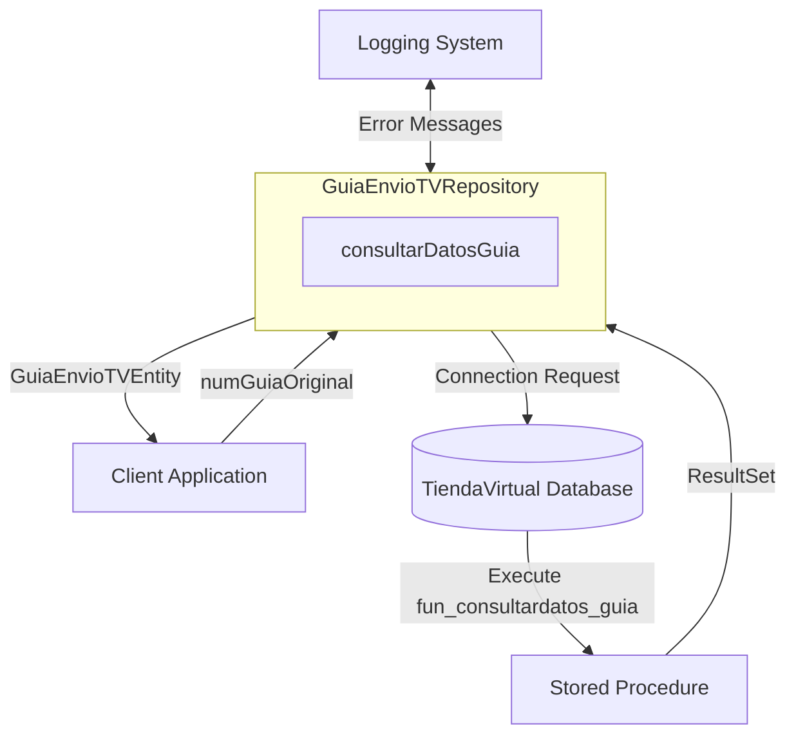

## Module: GuiaEnvioTVRepository.java

# Documentación Técnica: GuiaEnvioTVRepository.java

## 1. **Nombre del módulo o componente SQL:**
GuiaEnvioTVRepository.java

## 2. **Objetivos principales:**
Este componente es un repositorio de Spring que proporciona acceso a datos relacionados con guías de envío en el sistema de Tienda Virtual. Su propósito principal es consultar información de guías de envío mediante la ejecución de procedimientos almacenados en la base de datos.

## 3. **Funciones, métodos o consultas críticas:**
- `consultarDatosGuia(String numGuiaOriginal)`: Método principal que ejecuta el procedimiento almacenado `fun_consultardatos_guia` para obtener información detallada de una guía de envío específica.

## 4. **Variables y elementos clave (columnas, tablas, parámetros):**
- `jdbcTemplateTiendaVirtual`: Objeto JdbcTemplate para interactuar con la base de datos de Tienda Virtual.
- `guiaEnvioTVEntity`: Entidad que almacena los datos de la guía de envío.
- Columnas recuperadas: `idu_factura`, `idu_seller`, `tipo_guia`.
- Parámetro principal: `numGuiaOriginal` (número de guía a consultar).

## 5. **Interdependencias y relaciones:**
- Depende de la entidad `GuiaEnvioTVEntity` para almacenar los resultados.
- Utiliza un `JdbcTemplate` específico para la base de datos de Tienda Virtual, calificado como "jdbcTiendaVirtual".
- Interactúa con el procedimiento almacenado `fun_consultardatos_guia` en la base de datos.

## 6. **Operaciones centrales vs. auxiliares:**
- **Central**: Ejecución del procedimiento almacenado y mapeo de resultados a la entidad.
- **Auxiliares**: Manejo de conexiones, gestión de excepciones y registro de errores mediante Log4j2.

## 7. **Secuencia operativa o flujo de ejecución:**
1. Obtiene una conexión a la base de datos de Tienda Virtual.
2. Prepara la llamada al procedimiento almacenado `fun_consultardatos_guia`.
3. Establece el parámetro `numGuiaOriginal`.
4. Ejecuta el procedimiento almacenado.
5. Procesa el conjunto de resultados y mapea los datos a la entidad `guiaEnvioTVEntity`.
6. Maneja excepciones si ocurren y registra errores.
7. Devuelve la entidad con los datos recuperados.

## 8. **Aspectos de rendimiento y optimización:**
- Utiliza try-with-resources para garantizar el cierre adecuado de recursos (Connection, CallableStatement, ResultSet).
- No realiza operaciones de procesamiento intensivo en memoria.
- La eficiencia depende principalmente del rendimiento del procedimiento almacenado `fun_consultardatos_guia`.

## 9. **Reusabilidad y adaptabilidad:**
- El repositorio está diseñado específicamente para consultar guías de envío en la Tienda Virtual.
- La funcionalidad es específica y no está diseñada para ser reutilizada en otros contextos.
- Para adaptarlo a otros tipos de consultas, se requeriría crear métodos adicionales o modificar el existente.

## 10. **Uso y contexto:**
- Este repositorio forma parte del módulo de administración de e-commerce de Coppel.
- Es utilizado probablemente por servicios que necesitan información sobre guías de envío en la Tienda Virtual.
- Está anotado con `@Repository` para ser gestionado por el contenedor de Spring.

## 11. **Supuestos y limitaciones:**
- Supone que el procedimiento almacenado `fun_consultardatos_guia` existe en la base de datos.
- Asume que la guía consultada puede existir o no (maneja el caso donde no hay resultados).
- Limitado a consultar solo tres campos específicos de la guía de envío.
- No proporciona funcionalidad para crear, actualizar o eliminar guías de envío.
- Depende de una configuración específica de Spring para la inyección del JdbcTemplate.
## Flow Diagram [via mermaid]

