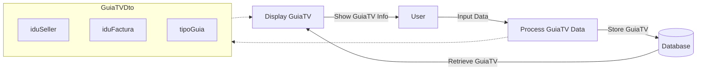

## Module: GuiaTVDto.java

# Documentación Técnica: GuiaTVDto.java

## 1. Nombre del módulo o componente SQL
GuiaTVDto.java

## 2. Objetivos principales
Este componente define una clase de transferencia de datos (DTO) llamada GuiaTVDto que sirve para transportar información relacionada con guías de TV entre diferentes capas de la aplicación. Su propósito es encapsular datos específicos de guías de TV para facilitar su transferencia entre el cliente y el servidor en un sistema de comercio electrónico.

## 3. Funciones, métodos o consultas críticas
No contiene métodos o consultas específicas, ya que es una clase DTO pura que solo almacena datos. Los métodos getter y setter son generados automáticamente por Lombok para cada atributo.

## 4. Variables y elementos clave (columnas, tablas, parámetros)
- `iduSeller`: String que representa el identificador del vendedor
- `iduFactura`: String que representa el identificador de la factura
- `tipoGuia`: Short que representa el tipo de guía

## 5. Interdependencias y relaciones
- Depende del paquete Lombok para la generación automática de getters, setters y método toString
- Pertenece al paquete `com.coppel.omnicanal.ecommercempadministrador.dto`, lo que indica que forma parte de un módulo de administración de comercio electrónico

## 6. Operaciones centrales vs. auxiliares
- Operaciones centrales: Almacenamiento de datos de guías de TV
- Operaciones auxiliares: Métodos getter y setter generados por Lombok, método toString para representación en texto

## 7. Secuencia operativa o flujo de ejecución
Al ser un DTO, no tiene un flujo de ejecución propio. Su ciclo de vida típico sería:
1. Instanciación
2. Establecimiento de valores mediante setters
3. Transferencia entre capas de la aplicación
4. Lectura de valores mediante getters

## 8. Aspectos de rendimiento y optimización
- Clase liviana con pocos atributos, lo que favorece un bajo consumo de memoria
- Uso de Lombok reduce el código boilerplate, mejorando la mantenibilidad
- No presenta problemas de rendimiento al ser una estructura de datos simple

## 9. Reusabilidad y adaptabilidad
- Alta reusabilidad dentro del sistema para operaciones relacionadas con guías de TV
- Puede ser extendido fácilmente agregando más atributos si se requieren más datos
- Su diseño simple facilita su adaptación a diferentes contextos dentro de la aplicación

## 10. Uso y contexto
- Se utiliza para transferir información de guías de TV entre la capa de presentación y la capa de servicio/persistencia
- Probablemente forma parte de un flujo de trabajo relacionado con la gestión de guías de TV en un sistema de administración de comercio electrónico
- Es utilizado en operaciones CRUD (Crear, Leer, Actualizar, Eliminar) relacionadas con guías de TV

## 11. Supuestos y limitaciones
- Supone que los identificadores de vendedor y factura son representados como String
- Asume que el tipo de guía puede ser representado como un Short, lo que limita la cantidad de tipos posibles
- No incluye validaciones de datos, asumiendo que estas se realizan en otra capa de la aplicación
- No proporciona comportamiento adicional más allá del almacenamiento de datos
## Flow Diagram [via mermaid]

