# Introduction :

# System Overview: Document Management and Shipping Guide Application

This system is a comprehensive document management and shipping guide application built on Spring Boot architecture. It provides functionality for file storage, retrieval, and management while handling shipping guides for both standard and TV-related deliveries.

## Core Components

- **File Management**: Handles document storage, retrieval, and validation through the `Archivo` interface and `ArchivoImpl` implementation, with REST endpoints exposed via `AlmacenamientoArchivoRestController`.

- **Shipping Guide Processing**: Manages shipping information through `GuiaEnvioEntity` and `GuiaEnvioTVEntity` models with corresponding repositories and DTOs (`GuiaDto`, `GuiaTVDto`).

- **Security Layer**: Implements authentication and authorization via `SecurityConfiguration` and `SessionFilter`, ensuring secure access to system resources.

- **Configuration Management**: Provides extensive configuration through `AppConfig`, `DataSourceConfig`, `ServiceConfig`, and other configuration classes to handle database connections, services, and web settings.

- **Exception Handling**: Centralizes error management through `AppExceptionHandler` and custom exceptions like `FileException`.

- **API Documentation**: Implements OpenAPI specifications via `OpenApiConfig` for comprehensive API documentation.

- **Frontend Integration**: Includes JavaScript functionality (`main.js`) that interacts with the backend services.

## Purpose

The system serves as an enterprise-grade solution for managing shipping documentation and guides, providing secure file storage and retrieval capabilities while maintaining data integrity through proper validation and sanitization. It supports both standard shipping operations and specialized TV-related shipping processes, with a robust API layer for integration with other systems.

# Full System Overview

# Module Overview
## Module: AlmacenamientoArchivoRestController.java

# Documentación Técnica: AlmacenamientoArchivoRestController

## 1. **Nombre del módulo o componente SQL:**
AlmacenamientoArchivoRestController.java

## 2. **Objetivos principales:**
Este controlador REST gestiona operaciones de almacenamiento y descarga de archivos en un sistema e-commerce de Coppel. Su propósito principal es proporcionar endpoints para cargar archivos al servidor y descargarlos posteriormente, implementando validaciones de seguridad y manejo de errores.

## 3. **Funciones, métodos o consultas críticas:**
- `cargarArchivo(@RequestParam("file") MultipartFile file)`: Endpoint POST que recibe un archivo, valida su tipo y tamaño, y lo almacena en el sistema.
- `descargarArchivo(@PathVariable String nombreArchivo, HttpServletRequest request)`: Endpoint GET que permite la descarga de un archivo previamente almacenado.

## 4. **Variables y elementos clave (columnas, tablas, parámetros):**
- `MAX_FILE_SIZE`: Constante que define el tamaño máximo permitido para archivos (10MB).
- `allowedContentTypes`: Lista de tipos MIME permitidos para carga (JPEG, PNG, PDF, CSV).
- `archivoImpl`: Servicio que implementa la lógica de almacenamiento y recuperación de archivos.
- `logger`: Objeto para registro de eventos y errores.

## 5. **Interdependencias y relaciones:**
- Depende de `ArchivoImpl` para la implementación de la lógica de almacenamiento.
- Utiliza DTOs como `FileDto` y `UploadFileResponse` para transferencia de datos.
- Maneja excepciones personalizadas como `FileException`.
- Interactúa con el sistema de archivos para almacenamiento y recuperación.

## 6. **Operaciones centrales vs. auxiliares:**
- **Centrales**: 
  - Almacenamiento de archivos mediante el endpoint `/almacenar`
  - Descarga de archivos mediante el endpoint `/descargar/{nombreArchivo}`
- **Auxiliares**:
  - Validación de tipos MIME permitidos
  - Validación de tamaño máximo de archivo
  - Registro de eventos (logging)
  - Manejo de errores y excepciones

## 7. **Secuencia operativa o flujo de ejecución:**
- **Para carga de archivos**:
  1. Recepción del archivo multipart
  2. Validación del tipo de contenido
  3. Validación del tamaño del archivo
  4. Delegación del almacenamiento a ArchivoImpl
  5. Retorno de respuesta con información del archivo o error
- **Para descarga de archivos**:
  1. Recepción del nombre de archivo
  2. Obtención del recurso mediante ArchivoImpl
  3. Determinación del tipo MIME
  4. Configuración de cabeceras HTTP para descarga
  5. Retorno del recurso como respuesta

## 8. **Aspectos de rendimiento y optimización:**
- Limita el tamaño de archivos a 10MB para prevenir sobrecarga del servidor
- Restringe los tipos de archivos aceptados, mejorando la seguridad
- Utiliza Spring Resource para manejo eficiente de archivos
- El logging está implementado para facilitar el diagnóstico de problemas

## 9. **Reusabilidad y adaptabilidad:**
- El controlador está diseñado siguiendo principios REST, facilitando su integración con diferentes clientes
- La inyección de dependencias permite reemplazar la implementación de almacenamiento
- Los parámetros como tipos de archivos permitidos y tamaño máximo podrían extraerse a un archivo de configuración para mayor adaptabilidad

## 10. **Uso y contexto:**
- Este controlador forma parte de un sistema de administración de e-commerce de Coppel
- Se utiliza para gestionar archivos relacionados con productos, imágenes, documentos o reportes
- Expone endpoints REST bajo la ruta base `/api/v1`
- Depende de servicios externos para el almacenamiento físico de los archivos

## 11. **Supuestos y limitaciones:**
- Supone que el servicio ArchivoImpl maneja correctamente el almacenamiento físico de archivos
- Limita los tipos de archivos a imágenes (JPEG, PNG), PDF y CSV
- Restringe el tamaño máximo de archivo a 10MB
- No implementa autenticación ni autorización a nivel de controlador
- No maneja versionado de archivos ni detección de duplicados
- Asume que el sistema de archivos subyacente tiene espacio suficiente para almacenamiento
## Flow Diagram [via mermaid]
## Module: ApiResponseDto.java

# Documentación Técnica: ApiResponseDto.java

## 1. **Nombre del módulo o componente SQL:**
ApiResponseDto.java

## 2. **Objetivos principales:**
Este componente define una clase de transferencia de datos (DTO) que estandariza la estructura de respuesta para los servicios API del sistema e-commerce de Coppel. Su propósito es encapsular tanto los metadatos de la respuesta como los datos de respuesta reales en un formato consistente.

## 3. **Funciones, métodos o consultas críticas:**
No contiene métodos específicos más allá de los getters y setters generados automáticamente por Lombok para los atributos `meta` y `data`.

## 4. **Variables y elementos clave (columnas, tablas, parámetros):**
- `meta`: Objeto de tipo Meta que contiene metadatos sobre la respuesta (posiblemente información como códigos de estado, mensajes, etc.)
- `data`: Objeto genérico que contiene los datos de respuesta reales del servicio

## 5. **Interdependencias y relaciones:**
- Depende de la clase `Meta` del paquete `com.coppel.omnicanal.ecommercempadministrador.util`
- Utiliza anotaciones de la biblioteca Lombok para la generación automática de código
- Forma parte del paquete `com.coppel.omnicanal.ecommercempadministrador.dto`

## 6. **Operaciones centrales vs. auxiliares:**
- **Central:** Proporcionar una estructura estandarizada para las respuestas API
- **Auxiliar:** No contiene operaciones auxiliares explícitas

## 7. **Secuencia operativa o flujo de ejecución:**
Al ser un DTO, no tiene un flujo de ejecución propio. Es instanciado y poblado por los controladores o servicios antes de ser serializado como respuesta HTTP.

## 8. **Aspectos de rendimiento y optimización:**
Al ser una clase simple de transferencia de datos, no presenta problemas significativos de rendimiento. El uso de Lombok reduce el código boilerplate, lo que mejora la mantenibilidad sin afectar el rendimiento.

## 9. **Reusabilidad y adaptabilidad:**
- Alta reusabilidad: Puede ser utilizado por cualquier endpoint de la API para estandarizar respuestas
- Adaptable: El campo `data` es de tipo Object, lo que permite contener cualquier tipo de respuesta específica

## 10. **Uso y contexto:**
Este DTO se utiliza en los controladores REST del sistema para envolver las respuestas antes de ser serializadas a JSON. Proporciona una estructura consistente para todas las respuestas API, facilitando el manejo de errores y el procesamiento de respuestas en el cliente.

## 11. **Supuestos y limitaciones:**
- **Supuestos:** Se asume que la clase Meta contiene la información necesaria sobre el estado de la respuesta
- **Limitaciones:** Al usar un Object genérico para data, se pierde la tipificación estricta, lo que podría dificultar la documentación automática de la API
## Flow Diagram [via mermaid]
## Module: AppConfig.java

# Documentación Técnica: AppConfig.java

## 1. **Nombre del módulo o componente SQL:**
AppConfig.java

## 2. **Objetivos principales:**
Este componente proporciona la configuración centralizada para la aplicación de administración de e-commerce de Coppel. Su propósito principal es gestionar parámetros de configuración relacionados con autenticación, CORS (Cross-Origin Resource Sharing) y la creación de beans específicos para la aplicación.

## 3. **Funciones, métodos o consultas críticas:**
- `guiaEnvioTVEntity()`: Método anotado con @Bean que crea y proporciona una instancia de GuiaEnvioTVEntity para su uso en la aplicación.

## 4. **Variables y elementos clave (columnas, tablas, parámetros):**
- `authUri`: URL para la autenticación
- `ignoreSession`: Bandera para ignorar la sesión
- `allowedOrigins`: Orígenes permitidos para CORS (por defecto "*")
- `allowedMethods`: Métodos HTTP permitidos para CORS
- `allowedHeaders`: Cabeceras permitidas para CORS

## 5. **Interdependencias y relaciones:**
- Depende de la entidad `GuiaEnvioTVEntity` del paquete `com.coppel.omnicanal.ecommercempadministrador.entities.tiendavirtual`
- Utiliza anotaciones de Lombok para reducir código boilerplate
- Se integra con el sistema de configuración de Spring Boot mediante `@ConfigurationProperties`

## 6. **Operaciones centrales vs. auxiliares:**
- **Central**: Proporcionar configuración para CORS y autenticación
- **Auxiliar**: Creación del bean GuiaEnvioTVEntity

## 7. **Secuencia operativa o flujo de ejecución:**
1. Spring Boot carga la clase durante el inicio de la aplicación
2. Las propiedades con prefijo "configuraciones" del archivo de propiedades se inyectan en los campos correspondientes
3. El método `guiaEnvioTVEntity()` se ejecuta para crear el bean correspondiente
4. La configuración queda disponible para ser utilizada por otros componentes de la aplicación

## 8. **Aspectos de rendimiento y optimización:**
- La clase es ligera y solo contiene configuración, sin lógica de procesamiento intensivo
- El uso de Lombok reduce el código boilerplate, mejorando la mantenibilidad

## 9. **Reusabilidad y adaptabilidad:**
- Alta reusabilidad gracias a la parametrización mediante propiedades externas
- Los valores por defecto proporcionados permiten un funcionamiento básico sin configuración adicional
- La configuración puede adaptarse fácilmente a diferentes entornos modificando el archivo de propiedades

## 10. **Uso y contexto:**
- Este componente es utilizado por el framework Spring para configurar aspectos de seguridad y comunicación de la aplicación
- Es cargado automáticamente durante el inicio de la aplicación
- Proporciona configuración para el manejo de CORS, crucial para aplicaciones web modernas

## 11. **Supuestos y limitaciones:**
- Supone que existe un archivo de propiedades con el prefijo "configuraciones"
- La configuración CORS por defecto es permisiva (permite todos los orígenes con "*"), lo que podría no ser adecuado para entornos de producción desde el punto de vista de seguridad
- No incluye validación de los valores de configuración proporcionados
## Flow Diagram [via mermaid]
## Module: AppExceptionHandler.java

# Documentación Técnica: AppExceptionHandler.java

## 1. **Nombre del módulo o componente SQL:**
AppExceptionHandler.java

## 2. **Objetivos principales:**
Este componente es un manejador global de excepciones para una aplicación Spring Boot. Su propósito principal es interceptar y procesar las excepciones no controladas que ocurren durante la ejecución de la aplicación, transformándolas en respuestas HTTP estructuradas y consistentes para el cliente. Esto permite centralizar el manejo de errores y proporcionar información útil sobre los problemas ocurridos sin exponer detalles sensibles de implementación.

## 3. **Funciones, métodos o consultas críticas:**
- `handleResponseStatusException(ResponseStatusException ex)`: Maneja específicamente las excepciones de tipo ResponseStatusException, devolviendo un ResponseEntity con información estructurada del error.
- `handleException(RuntimeException runtimeException, WebRequest webRequest)`: Método genérico que captura cualquier excepción no manejada específicamente, convirtiéndola en una respuesta HTTP 500 (Internal Server Error) estructurada.

## 4. **Variables y elementos clave (columnas, tablas, parámetros):**
- `Meta`: Clase utilizada para estructurar los metadatos de la respuesta de error.
- `ApiResponseDto`: Clase que encapsula la respuesta completa, incluyendo metadatos y datos (nulos en caso de error).
- `AppMessages`: Clase de constantes que contiene mensajes predefinidos como "CLIENT_ERROR" y "ERROR".
- `HttpHeaders` y `MediaType`: Utilizados para configurar los encabezados de la respuesta HTTP.

## 5. **Interdependencias y relaciones:**
El componente depende de:
- Clases del framework Spring: `ResponseEntityExceptionHandler`, `ControllerAdvice`, `ExceptionHandler`, etc.
- DTOs y utilidades propias de la aplicación: `ApiResponseDto`, `Meta`, `AppMessages`.
- Interactúa con el sistema de manejo de excepciones de Spring para interceptar errores antes de que lleguen al cliente.

## 6. **Operaciones centrales vs. auxiliares:**
- **Operaciones centrales**: La captura y transformación de excepciones en respuestas HTTP estructuradas.
- **Operaciones auxiliares**: La configuración de encabezados HTTP, la creación de objetos Meta y ApiResponseDto, y el registro de timestamps.

## 7. **Secuencia operativa o flujo de ejecución:**
1. Se produce una excepción en algún controlador de la aplicación.
2. Spring detecta la excepción y la dirige al manejador apropiado en AppExceptionHandler.
3. Se crea un objeto Meta con información sobre el error.
4. Se encapsula el Meta en un ApiResponseDto.
5. Se configura un ResponseEntity con los encabezados HTTP apropiados.
6. Se devuelve la respuesta estructurada al cliente.

## 8. **Aspectos de rendimiento y optimización:**
- El código es ligero y no realiza operaciones costosas.
- No hay bucles ni consultas a bases de datos que puedan afectar el rendimiento.
- La creación de objetos es mínima y eficiente.

## 9. **Reusabilidad y adaptabilidad:**
- El componente es altamente reutilizable ya que está diseñado para manejar excepciones de toda la aplicación.
- Puede extenderse fácilmente para manejar tipos específicos de excepciones agregando nuevos métodos con la anotación @ExceptionHandler.
- La estructura de respuesta está estandarizada, lo que facilita su procesamiento por parte de los clientes.

## 10. **Uso y contexto:**
- Se utiliza automáticamente en toda la aplicación gracias a la anotación @ControllerAdvice.
- No requiere invocación explícita; Spring lo utiliza cuando se producen excepciones no manejadas.
- Es parte del sistema de manejo de errores de la aplicación, proporcionando una capa de abstracción entre los errores internos y las respuestas al cliente.

## 11. **Supuestos y limitaciones:**
- Supone que todas las respuestas de error deben seguir el formato definido por ApiResponseDto y Meta.
- Está limitado a manejar excepciones que ocurren dentro del contexto de Spring MVC.
- No maneja excepciones específicas de negocio, solo proporciona un mecanismo general para transformar excepciones en respuestas HTTP.
- Asume que los clientes esperan respuestas en formato JSON (MediaType.APPLICATION_JSON_VALUE).
## Flow Diagram [via mermaid]
## Module: AppMessages.java

# Documentación Técnica: AppMessages.java

## 1. **Nombre del módulo o componente SQL:**
AppMessages.java

## 2. **Objetivos principales:**
Este componente define constantes de mensajes de error utilizadas en la aplicación. Su propósito es centralizar los mensajes de error estándar para mantener consistencia en toda la aplicación de administración de e-commerce.

## 3. **Funciones, métodos o consultas críticas:**
No contiene métodos o consultas, solo define constantes estáticas para mensajes de error:
- `CLIENT_ERROR`: Identifica errores del lado del cliente
- `ERROR`: Identifica errores del servidor
- `UNAUTHORISED_MESSAGE`: Mensaje específico para accesos no autorizados

## 4. **Variables y elementos clave:**
- `CLIENT_ERROR`: Constante para errores de cliente
- `ERROR`: Constante para errores de servidor
- `UNAUTHORISED_MESSAGE`: Mensaje detallado para errores de autorización

## 5. **Interdependencias y relaciones:**
Este componente pertenece al paquete `com.coppel.omnicanal.ecommercempadministrador.util`, lo que sugiere que es utilizado como una utilidad dentro del sistema de administración de e-commerce omnicanal de Coppel.

## 6. **Operaciones centrales vs. auxiliares:**
Este es un componente auxiliar que proporciona constantes para la gestión de errores en la aplicación. No contiene operaciones de procesamiento.

## 7. **Secuencia operativa o flujo de ejecución:**
No aplica, ya que es una clase de constantes sin flujo de ejecución.

## 8. **Aspectos de rendimiento y optimización:**
Al ser una clase de constantes, tiene un impacto mínimo en el rendimiento. El constructor privado evita la instanciación innecesaria de la clase.

## 9. **Reusabilidad y adaptabilidad:**
Alta reusabilidad. Las constantes pueden ser importadas y utilizadas en cualquier parte de la aplicación que necesite mostrar mensajes de error estandarizados. Para añadir nuevos mensajes, solo se requiere agregar nuevas constantes a esta clase.

## 10. **Uso y contexto:**
Este módulo se utiliza en toda la aplicación para mantener consistencia en los mensajes de error. Probablemente es referenciado en controladores, servicios y manejadores de excepciones para proporcionar respuestas estandarizadas al cliente.

## 11. **Supuestos y limitaciones:**
- Supone que los mensajes de error son estáticos y no requieren localización o internacionalización dinámica.
- Limitado a mensajes en español según el contenido de `UNAUTHORISED_MESSAGE`.
- No proporciona mecanismos para parametrizar los mensajes (por ejemplo, incluir detalles específicos del error).
## Flow Diagram [via mermaid]
## Module: Archivo.java

# Documentación Técnica: Archivo.java

## 1. **Nombre del módulo o componente SQL:**
Archivo.java - Interfaz de servicio para manejo de archivos

## 2. **Objetivos principales:**
Define una interfaz para la gestión de operaciones básicas con archivos en el sistema, específicamente para guardar y descargar archivos. Forma parte del módulo de administración de un sistema de comercio electrónico omnicanal de Coppel.

## 3. **Funciones, métodos o consultas críticas:**
- `guardarArchivo(MultipartFile file)`: Método para almacenar un archivo subido por el usuario.
- `descargarArchivo(String fileName)`: Método para recuperar un archivo almacenado mediante su nombre.

## 4. **Variables y elementos clave (columnas, tablas, parámetros):**
- `MultipartFile file`: Parámetro que representa el archivo a guardar, proveniente de una solicitud HTTP multipart.
- `String fileName`: Parámetro que identifica el nombre del archivo a descargar.
- `FileDto`: Objeto de transferencia de datos que encapsula la información del archivo guardado.
- `Resource`: Tipo de retorno que representa el recurso de archivo descargado.

## 5. **Interdependencias y relaciones:**
- Depende del paquete `com.coppel.omnicanal.ecommercempadministrador.dto` para el uso de `FileDto`.
- Utiliza clases de Spring Framework: `org.springframework.core.io.Resource` y `org.springframework.web.multipart.MultipartFile`.
- Debe ser implementada por una clase concreta que defina la lógica real de almacenamiento y recuperación de archivos.

## 6. **Operaciones centrales vs. auxiliares:**
- **Operaciones centrales**: Las dos operaciones definidas (guardar y descargar) constituyen la funcionalidad principal.
- **Operaciones auxiliares**: No se definen operaciones auxiliares en esta interfaz.

## 7. **Secuencia operativa o flujo de ejecución:**
Al ser una interfaz, no define un flujo de ejecución específico. La implementación determinará el flujo real, que típicamente seguiría:
1. Recepción de la solicitud (guardar o descargar)
2. Validación del archivo o nombre
3. Ejecución de la operación solicitada
4. Retorno del resultado (FileDto o Resource)

## 8. **Aspectos de rendimiento y optimización:**
La interfaz no especifica consideraciones de rendimiento. La implementación debería considerar:
- Manejo eficiente de archivos grandes
- Posible uso de almacenamiento en caché
- Gestión adecuada de recursos para evitar fugas de memoria
- Posible limitación de tamaño de archivos

## 9. **Reusabilidad y adaptabilidad:**
- Alta reusabilidad: La interfaz es genérica y puede implementarse para diferentes tipos de almacenamiento (sistema de archivos local, almacenamiento en la nube, base de datos).
- Adaptabilidad: Puede extenderse para incluir operaciones adicionales como eliminación o actualización de archivos.

## 10. **Uso y contexto:**
- Se utiliza en el contexto de un administrador de comercio electrónico omnicanal.
- Probablemente es consumida por controladores REST que exponen endpoints para subir y descargar archivos.
- La implementación concreta podría interactuar con sistemas de almacenamiento como S3, Azure Blob Storage, sistema de archivos local, etc.

## 11. **Supuestos y limitaciones:**
- **Supuestos**: 
  - Los archivos tienen nombres únicos o se manejan colisiones de nombres.
  - Existe un mecanismo de almacenamiento subyacente accesible.
  - Los permisos de acceso se gestionan en otra capa de la aplicación.
- **Limitaciones**:
  - No incluye métodos para eliminar o actualizar archivos.
  - No especifica manejo de errores ni validaciones.
  - No define mecanismos para controlar tipos de archivos permitidos o tamaños máximos.
## Flow Diagram [via mermaid]

## Module: ArchivoImpl.java

# Documentación Técnica: ArchivoImpl.java

## 1. **Nombre del módulo o componente SQL:**
ArchivoImpl.java

## 2. **Objetivos principales:**
Este componente implementa la interfaz `Archivo` y se encarga del procesamiento de archivos CSV/TXT que contienen información de guías de envío. Su propósito principal es permitir la carga, validación y almacenamiento de datos de guías de envío en el sistema de comercio electrónico de Coppel, así como la descarga de archivos.

## 3. **Funciones, métodos o consultas críticas:**
- `guardarArchivo`: Procesa un archivo MultipartFile y valida su contenido.
- `descargarArchivo`: Recupera un archivo del sistema de archivos.
- `procesarArchivo`: Maneja la lectura del archivo CSV.
- `validarRegistro`: Valida cada registro del archivo.
- `getNumGuiaOriginal`: Extrae y valida el número de guía.
- `getNumMonto`: Extrae y valida el monto de la guía.
- `guardarGuia`: Persiste la información de la guía en la base de datos.
- `consultarDatosGuia`: Consulta información adicional de la guía.

## 4. **Variables y elementos clave (columnas, tablas, parámetros):**
- `MAX_RECORDS`: Constante que limita el número máximo de registros a procesar (3000).
- `guiaEnvioRepository`: Repositorio para operaciones con guías en CoppelPay.
- `guiaEnvioTVRepository`: Repositorio para operaciones con guías en TiendaVirtual.
- `FileDto`: DTO para manejar la información del archivo y sus registros.
- `GuiaDto`: DTO para la información de cada guía.
- `GuiaTVDto`: DTO para la información de guía en TiendaVirtual.

## 5. **Interdependencias y relaciones:**
- Depende de repositorios `GuiaEnvioRepository` y `GuiaEnvioTVRepository` para operaciones de base de datos.
- Utiliza `ModelMapper` para mapear entre entidades y DTOs.
- Interactúa con dos bases de datos diferentes: "coppelPay" y "tiendaVirtual".
- Utiliza la librería OpenCSV para el procesamiento de archivos CSV.
- Depende de la clase utilitaria `Sanitizie` para sanitizar mensajes de log.

## 6. **Operaciones centrales vs. auxiliares:**
**Operaciones centrales:**
- Procesamiento y validación de archivos CSV/TXT.
- Almacenamiento de guías en la base de datos.
- Consulta de información adicional de guías.

**Operaciones auxiliares:**
- Validación de errores.
- Sanitización de mensajes de log.
- Manejo de excepciones.
- Creación de directorios seguros para archivos.

## 7. **Secuencia operativa o flujo de ejecución:**
1. Recepción del archivo MultipartFile.
2. Validación del formato del archivo (CSV o TXT).
3. Procesamiento del archivo línea por línea.
4. Validación de cada registro (número de guía y monto).
5. Consulta de datos adicionales de la guía.
6. Almacenamiento de la guía en la base de datos.
7. Retorno de resultados o errores.

## 8. **Aspectos de rendimiento y optimización:**
- Limita el procesamiento a un máximo de 3000 registros para evitar sobrecarga.
- Utiliza transacciones para operaciones de base de datos.
- Implementa manejo de excepciones para evitar fallos en el procesamiento.
- Podría optimizarse el procesamiento en lote de las guías en lugar de procesarlas una por una.

## 9. **Reusabilidad y adaptabilidad:**
- El código está estructurado siguiendo el patrón de diseño de servicios e inyección de dependencias.
- La separación de responsabilidades permite reutilizar componentes como la validación y el procesamiento.
- La implementación de una interfaz `Archivo` facilita la sustitución de la implementación.
- El uso de DTOs permite adaptar la estructura de datos según sea necesario.

## 10. **Uso y contexto:**
- Este módulo forma parte del sistema de administración de comercio electrónico de Coppel.
- Se utiliza para cargar y procesar archivos de guías de envío.
- Interactúa con dos sistemas de base de datos diferentes: CoppelPay y TiendaVirtual.
- Es utilizado probablemente por una interfaz web que permite la carga de archivos.

## 11. **Supuestos y limitaciones:**
- Supone que los archivos CSV/TXT tienen un formato específico con campos en posiciones determinadas.
- Limita el procesamiento a 3000 registros por archivo.
- Requiere permisos POSIX para la creación de directorios seguros (limitado a sistemas Unix/Linux).
- No maneja procesamiento concurrente de archivos.
- Asume que el número de guía y el monto son campos obligatorios.
- No permite montos iguales a cero.
- Requiere que la guía exista previamente en el sistema de TiendaVirtual.
## Flow Diagram [via mermaid]
## Module: Conexion.java

# Documentación Técnica: Conexion.java

## 1. **Nombre del módulo o componente SQL:**
Conexion.java

## 2. **Objetivos principales:**
Este módulo define una clase para gestionar los parámetros de conexión a una base de datos. Su propósito es encapsular y proporcionar acceso controlado a la información de conexión necesaria para establecer comunicación con un servidor de base de datos dentro del sistema de administración de comercio electrónico de Coppel.

## 3. **Funciones, métodos o consultas críticas:**
- Métodos getter y setter para cada atributo de conexión (servidor, bd, puerto, usuario, etc.)
- `setPassw0rd(char[])`: Método especializado para establecer la contraseña de forma segura
- `getPassword()`: Devuelve una copia de la contraseña almacenada
- `clearPassw0rd()`: Limpia la contraseña de la memoria por seguridad

## 4. **Variables y elementos clave:**
- `servidor`: Dirección del servidor de base de datos
- `bd`: Nombre de la base de datos
- `puerto`: Puerto de conexión
- `usuario`: Nombre de usuario para la autenticación
- `passw0rd`: Contraseña almacenada como array de caracteres (por seguridad)
- `app`: Nombre de la aplicación que utiliza la conexión
- `funcion`: Propósito o función específica de la conexión

## 5. **Interdependencias y relaciones:**
El módulo pertenece al paquete `com.coppel.omnicanal.ecommercempadministrador.util`, lo que sugiere que es una clase utilitaria dentro del sistema de administración de comercio electrónico de Coppel. No muestra dependencias explícitas con otros componentes del sistema.

## 6. **Operaciones centrales vs. auxiliares:**
- **Centrales**: Almacenamiento y recuperación segura de credenciales de conexión
- **Auxiliares**: Limpieza de memoria para datos sensibles (contraseña)

## 7. **Secuencia operativa o flujo de ejecución:**
1. Instanciación del objeto Conexion
2. Configuración de parámetros mediante métodos setter
3. Recuperación de parámetros mediante métodos getter cuando sea necesario
4. Limpieza de contraseña cuando ya no se necesite mediante clearPassw0rd()

## 8. **Aspectos de rendimiento y optimización:**
- La implementación de manejo de contraseñas utiliza arrays de caracteres en lugar de String para mejorar la seguridad, ya que los String son inmutables y pueden permanecer en memoria
- Se implementa la limpieza explícita de la contraseña para evitar que permanezca en memoria más tiempo del necesario

## 9. **Reusabilidad y adaptabilidad:**
La clase es altamente reutilizable y adaptable, ya que:
- Encapsula todos los parámetros de conexión de forma independiente
- No contiene lógica específica de negocio
- Puede ser utilizada para diferentes tipos de conexiones a bases de datos
- Los parámetros son configurables mediante setters

## 10. **Uso y contexto:**
Este módulo se utiliza como contenedor de información de conexión a base de datos dentro del sistema de administración de comercio electrónico. Probablemente es utilizado por otras clases que necesitan establecer conexiones a la base de datos para realizar operaciones CRUD u otras consultas.

## 11. **Supuestos y limitaciones:**
- **Supuestos**: Se asume que la aplicación maneja correctamente la información sensible y que los métodos de esta clase serán invocados apropiadamente.
- **Limitaciones**: 
  - No implementa la conexión real a la base de datos, solo almacena los parámetros
  - No incluye validación de los datos ingresados
  - No proporciona cifrado adicional para la contraseña más allá del manejo como array de caracteres
  - No implementa mecanismos de pooling de conexiones o reconexión automática
## Flow Diagram [via mermaid]
## Module: ConfigBeans.java

# Documentación Técnica: ConfigBeans.java

## 1. **Nombre del módulo o componente SQL:**
ConfigBeans.java

## 2. **Objetivos principales:**
Este módulo define la configuración de beans para la aplicación Spring. Su propósito principal es establecer y gestionar la creación de beans de configuración que serán utilizados en toda la aplicación de e-commerce de Coppel. Específicamente, se encarga de definir un bean de configuración de servicios como singleton.

## 3. **Funciones, métodos o consultas críticas:**
- `getServiceConfig()`: Método anotado como @Bean que crea y devuelve una instancia de ServiceConfig como singleton.

## 4. **Variables y elementos clave (columnas, tablas, parámetros):**
- No hay variables de instancia definidas en esta clase.
- El elemento clave es el bean ServiceConfig que se configura como singleton.

## 5. **Interdependencias y relaciones:**
- Depende de la clase `ServiceConfig` que debe estar definida en el mismo paquete o en uno accesible.
- Se integra con el sistema de gestión de beans de Spring Framework.
- Forma parte del paquete `com.coppel.omnicanal.ecommercempadministrador.config`.

## 6. **Operaciones centrales vs. auxiliares:**
- Operación central: Definición y configuración del bean ServiceConfig como singleton.
- No contiene operaciones auxiliares visibles en el código proporcionado.

## 7. **Secuencia operativa o flujo de ejecución:**
1. Durante el inicio de la aplicación Spring, el contenedor de IoC detecta la clase anotada con @Configuration.
2. El método getServiceConfig() es invocado para crear el bean ServiceConfig.
3. El bean creado se almacena en el contexto de aplicación de Spring como singleton.

## 8. **Aspectos de rendimiento y optimización:**
- El uso del ámbito SCOPE_SINGLETON garantiza que solo se cree una instancia del bean ServiceConfig, optimizando el uso de memoria.
- Al ser una clase de configuración simple, no presenta problemas de rendimiento significativos.

## 9. **Reusabilidad y adaptabilidad:**
- La clase está diseñada siguiendo el patrón de configuración de Spring, lo que la hace adaptable a diferentes entornos.
- Se puede extender fácilmente para incluir más beans de configuración según sea necesario.
- La configuración es modular y sigue las mejores prácticas de Spring.

## 10. **Uso y contexto:**
- Este módulo se utiliza durante la inicialización de la aplicación Spring para configurar los beans necesarios.
- Es parte del sistema de configuración de la aplicación de e-commerce de Coppel, específicamente del módulo administrador.
- Proporciona acceso centralizado a la configuración de servicios a través del bean ServiceConfig.

## 11. **Supuestos y limitaciones:**
- Supone que la clase ServiceConfig existe y puede ser instanciada sin parámetros.
- Asume que el entorno de ejecución es una aplicación Spring.
- No proporciona configuración parametrizable externamente (como a través de archivos de propiedades).
- Limitado a la configuración de un solo bean en su implementación actual.
## Flow Diagram [via mermaid]
## Module: Constantes.java

# Documentación Técnica: Constantes.java

## 1. **Nombre del módulo o componente SQL:**
Constantes.java

## 2. **Objetivos principales:**
Este módulo define un conjunto de constantes utilizadas en el sistema de comercio electrónico (ecommerce) de Coppel. Su propósito es centralizar valores constantes que se utilizan en diferentes partes de la aplicación, facilitando su mantenimiento y evitando la duplicación de valores literales en el código.

## 3. **Funciones, métodos o consultas críticas:**
El archivo no contiene métodos funcionales, solo declaraciones de constantes. Incluye un constructor privado que lanza una excepción para prevenir la instanciación de la clase.

## 4. **Variables y elementos clave (columnas, tablas, parámetros):**
Las constantes clave incluyen:
- Estados de líneas de pedido: `ORDER_LINE_WAITING_DEBIT_PAYMENT`, `ORDER_LINE_REFUSED`, `ORDER_LINE_CANCELED`
- Códigos HTTP: `HTTP_200`, `HTTP_204`, `HTTP_ERROR_400`, `HTTP_ERROR_401`, `HTTP_ERROR_404`, `HTTP_ERROR_405`, `HTTP_ERROR_500`
- Mensajes de error: `ERROR_WS_ECOMMERCEETVSERVICE`, `ERROR_WS_PA01_CONFIRMACION`, `ERROR_WS_PA01_RECHAZO`, `ERROR_NOTIFICAR_REMBOLSO`
- Estados de pago: `ESTATUS_PAGO_PENDIENTE_CONFIRMAR`, `ESTATUS_PAGO_CONFIRMADO`, `ESTATUS_PAGO_NO_RECIBIDO`
- Respuestas de confirmación: `CONFIRMAR_PA01_OK`, `CONFIRMAR_PA01_REFUSED`

## 5. **Interdependencias y relaciones:**
Este módulo no tiene dependencias directas con otros componentes, pero es utilizado por múltiples clases del sistema que necesitan hacer referencia a estos valores constantes.

## 6. **Operaciones centrales vs. auxiliares:**
No aplica para este módulo, ya que solo contiene definiciones de constantes y no implementa operaciones.

## 7. **Secuencia operativa o flujo de ejecución:**
No aplica para este módulo, ya que no contiene lógica de ejecución secuencial.

## 8. **Aspectos de rendimiento y optimización:**
Las constantes están definidas como `static final`, lo que optimiza el rendimiento al ser cargadas una sola vez en memoria durante la inicialización de la clase.

## 9. **Reusabilidad y adaptabilidad:**
Este módulo es altamente reusable, ya que centraliza valores constantes que pueden ser utilizados en cualquier parte del sistema. Para adaptarlo, solo se necesita agregar, modificar o eliminar constantes según sea necesario.

## 10. **Uso y contexto:**
Este módulo se utiliza en todo el sistema de administración de ecommerce para referenciar estados, códigos de respuesta HTTP, mensajes de error y estados de pago. Forma parte del paquete `com.coppel.omnicanal.ecommercempadministrador.util`.

## 11. **Supuestos y limitaciones:**
- Se asume que los valores de las constantes son estables y no cambian durante la ejecución del programa.
- La clase está diseñada para no ser instanciada (constructor privado con excepción).
- Las constantes están relacionadas principalmente con estados de pedidos, códigos HTTP y mensajes de error específicos del sistema PA01 y servicios web relacionados.
- No hay mecanismo para extender o modificar estas constantes en tiempo de ejecución.
## Flow Diagram [via mermaid]
## Module: DataSourceConfig.java

# Documentación Técnica: DataSourceConfig.java

## 1. **Nombre del módulo o componente SQL:**
DataSourceConfig.java

## 2. **Objetivos principales:**
Este módulo configura las fuentes de datos (DataSources) para la aplicación Spring Boot, estableciendo conexiones a diferentes bases de datos utilizadas por el sistema de e-commerce. Su propósito principal es centralizar y gestionar las configuraciones de conexión a bases de datos, facilitando el acceso a múltiples orígenes de datos desde la aplicación.

## 3. **Funciones, métodos o consultas críticas:**
- `solicitudConfig(String url)`: Método auxiliar que configura un objeto HikariConfig con la URL de conexión proporcionada.
- `dataSourceCoppelPay()`: Crea y configura el DataSource para la base de datos CoppelPay.
- `jdbcTemplateCoppelPay(DataSource ds)`: Crea un JdbcTemplate para interactuar con la base de datos CoppelPay.
- `dataSourceTV()`: Crea y configura el DataSource para la base de datos TiendaVirtual.
- `jdbcTemplateTV(DataSource ds)`: Crea un JdbcTemplate para interactuar con la base de datos TiendaVirtual.

## 4. **Variables y elementos clave (columnas, tablas, parámetros):**
- `serviceConfig`: Objeto inyectado que contiene las URLs de conexión a las bases de datos.
- `HikariConfig`: Configuración para el pool de conexiones HikariCP.
- `HikariDataSource`: Implementación de DataSource que utiliza el pool de conexiones HikariCP.
- URLs de conexión: Obtenidas mediante `serviceConfig.getConCoppelPay()` y `serviceConfig.getConTiendaVirtual()`.

## 5. **Interdependencias y relaciones:**
- Depende de la clase `ServiceConfig` para obtener las URLs de conexión.
- Utiliza la biblioteca HikariCP para la gestión del pool de conexiones.
- Se integra con el framework Spring a través de anotaciones como `@Configuration`, `@Bean`, `@Primary` y `@Qualifier`.
- Los JdbcTemplate creados dependen de los DataSource correspondientes.

## 6. **Operaciones centrales vs. auxiliares:**
- **Centrales**: La creación y configuración de los DataSource y JdbcTemplate para CoppelPay y TiendaVirtual.
- **Auxiliares**: El método `solicitudConfig()` que encapsula la configuración común de HikariConfig.

## 7. **Secuencia operativa o flujo de ejecución:**
1. Spring inicializa el contenedor de aplicación y detecta la clase `DataSourceConfig`.
2. Se inyecta el objeto `ServiceConfig`.
3. Se crean los DataSource para CoppelPay (marcado como primario) y TiendaVirtual.
4. Se crean los JdbcTemplate correspondientes para cada DataSource.
5. Estos beans quedan disponibles para ser inyectados en otros componentes de la aplicación.

## 8. **Aspectos de rendimiento y optimización:**
- Utiliza HikariCP, un pool de conexiones de alto rendimiento que optimiza la gestión de conexiones a la base de datos.
- La configuración actual es mínima y podría beneficiarse de ajustes adicionales como tamaño del pool, tiempos de espera, etc.
- No se establecen límites explícitos para el número de conexiones, lo que podría ser un problema en entornos de alta carga.

## 9. **Reusabilidad y adaptabilidad:**
- El diseño es modular, permitiendo agregar fácilmente nuevas fuentes de datos siguiendo el mismo patrón.
- El método `solicitudConfig()` promueve la reutilización de código para configuraciones similares.
- La parametrización a través de `ServiceConfig` permite cambiar las URLs de conexión sin modificar el código.

## 10. **Uso y contexto:**
- Este módulo se utiliza durante la inicialización de la aplicación Spring Boot para configurar el acceso a bases de datos.
- Los JdbcTemplate configurados son utilizados por otros componentes de la aplicación para ejecutar operaciones SQL.
- Forma parte de un sistema de e-commerce (indicado por el paquete `com.coppel.omnicanal.ecommercempadministrador`).

## 11. **Supuestos y limitaciones:**
- Supone que las URLs de conexión están correctamente configuradas en `ServiceConfig`.
- No incluye configuración de credenciales de base de datos en el código, asumiendo que están incluidas en las URLs o gestionadas externamente.
- Está comentada la anotación `@Profile("dev")`, lo que sugiere que esta configuración podría estar destinada a un entorno de desarrollo.
- No incluye manejo de errores específico para fallos de conexión a la base de datos.
- La configuración de HikariCP es mínima, sin ajustes específicos para optimización.
## Flow Diagram [via mermaid]
## Module: FileDto.java

# Documentación Técnica: FileDto.java

## 1. **Nombre del módulo o componente SQL:**
FileDto.java

## 2. **Objetivos principales:**
Este componente es una clase de transferencia de datos (DTO) diseñada para encapsular información relacionada con archivos en el sistema de administración de e-commerce. Su propósito principal es transportar datos de archivos entre diferentes capas de la aplicación, específicamente para manejar información de archivos que contienen guías, junto con sus posibles errores y registros asociados.

## 3. **Funciones, métodos o consultas críticas:**
- `getFileName()`: Método para obtener el nombre del archivo.
- `setFileName()`: Método para establecer el nombre del archivo.
- `getErrores()`: Método para obtener la lista de errores.
- `setErrores()`: Método para establecer la lista de errores.
- `getRegistros()`: Método para obtener la lista de registros de guías.
- `setRegistros()`: Método para establecer la lista de registros de guías.

## 4. **Variables y elementos clave (columnas, tablas, parámetros):**
- `fileName`: Almacena el nombre del archivo procesado.
- `errores`: Lista de cadenas que contiene los errores encontrados durante el procesamiento del archivo.
- `registros`: Lista de objetos GuiaDto que contiene los registros de guías extraídos del archivo.

## 5. **Interdependencias y relaciones:**
- Depende de la clase `GuiaDto` para almacenar los registros de guías.
- Forma parte del paquete `com.coppel.omnicanal.ecommercempadministrador.dto`, lo que sugiere que interactúa con otros componentes del sistema de administración de e-commerce.

## 6. **Operaciones centrales vs. auxiliares:**
- **Operaciones centrales**: Almacenamiento y recuperación de datos de archivos, errores y registros de guías.
- **Operaciones auxiliares**: Métodos getter y setter para acceder y modificar los atributos de la clase.

## 7. **Secuencia operativa o flujo de ejecución:**
Al ser un DTO, no tiene un flujo de ejecución propio. Es utilizado por otros componentes para:
1. Crear una instancia de FileDto
2. Establecer los datos necesarios (nombre de archivo, errores, registros)
3. Transferir estos datos entre capas de la aplicación

## 8. **Aspectos de rendimiento y optimización:**
- La clase es simple y ligera, sin operaciones complejas que afecten el rendimiento.
- El uso de listas para errores y registros permite manejar cantidades variables de datos.
- No hay consideraciones especiales de rendimiento más allá de la gestión eficiente de memoria para las listas.

## 9. **Reusabilidad y adaptabilidad:**
- Alta reusabilidad como contenedor genérico de información de archivos.
- Podría adaptarse fácilmente para manejar otros tipos de registros además de GuiaDto.
- Su diseño simple facilita su extensión para incluir atributos adicionales si fuera necesario.

## 10. **Uso y contexto:**
- Utilizado probablemente en procesos de carga, validación y procesamiento de archivos que contienen información de guías.
- Sirve como intermediario entre la capa de presentación y la lógica de negocio para transferir información sobre archivos procesados.
- Posiblemente usado en APIs REST o servicios web para devolver resultados de operaciones con archivos.

## 11. **Supuestos y limitaciones:**
- Supone la existencia de una clase GuiaDto para manejar los registros individuales.
- No implementa validaciones propias, asumiendo que estas se realizan en otras capas de la aplicación.
- No maneja directamente operaciones de archivo (lectura/escritura), solo almacena información relacionada.
- No incluye métodos para procesar o filtrar los datos que contiene, limitándose a ser un contenedor pasivo de información.
## Flow Diagram [via mermaid]
## Module: FileException.java

# Documentación Técnica: FileException.java

## 1. **Nombre del módulo o componente SQL:**
FileException.java

## 2. **Objetivos principales:**
Este componente define una clase de excepción personalizada llamada `FileException` que se utiliza para manejar errores relacionados con operaciones de archivos en el sistema de administración de e-commerce. Su propósito es proporcionar un mecanismo estructurado para reportar y gestionar errores específicos de manipulación de archivos, permitiendo incluir mensajes detallados y una lista de errores asociados.

## 3. **Funciones, métodos o consultas críticas:**
- Constructor `FileException(String message)`: Crea una excepción con un mensaje de error.
- Constructor `FileException(String message, Throwable cause)`: Crea una excepción con mensaje y causa subyacente.
- Constructor `FileException(String message, List<String> errors)`: Crea una excepción con mensaje y lista de errores.
- Método `getErrors()`: Devuelve la lista de errores asociados a la excepción.

## 4. **Variables y elementos clave (columnas, tablas, parámetros):**
- `serialVersionUID`: Identificador de versión para serialización.
- `errors`: Lista de cadenas que almacena múltiples mensajes de error relacionados con la excepción.

## 5. **Interdependencias y relaciones:**
- Extiende `RuntimeException` de Java.
- Utiliza la anotación `@ResponseStatus` de Spring Framework para asociar esta excepción con el código de estado HTTP 400 (BAD_REQUEST).
- Pertenece al paquete `com.coppel.omnicanal.ecommercempadministrador.execeptions`.
- Depende de las clases `ArrayList` y `List` de Java para gestionar la colección de errores.

## 6. **Operaciones centrales vs. auxiliares:**
- **Centrales**: Almacenamiento y gestión de errores relacionados con archivos.
- **Auxiliares**: Método getter para acceder a la lista de errores.

## 7. **Secuencia operativa o flujo de ejecución:**
1. Se instancia la excepción con uno de los constructores disponibles.
2. Se propaga la excepción en el código cuando ocurre un error relacionado con archivos.
3. Spring Framework captura la excepción y la traduce automáticamente a una respuesta HTTP 400.
4. El cliente puede acceder a los mensajes de error detallados mediante el método `getErrors()`.

## 8. **Aspectos de rendimiento y optimización:**
- La clase utiliza `ArrayList` para almacenar errores, lo que proporciona acceso rápido por índice.
- Al ser una excepción, su uso debe limitarse a situaciones excepcionales y no como mecanismo de control de flujo regular.

## 9. **Reusabilidad y adaptabilidad:**
- Alta reusabilidad dentro del sistema para cualquier operación relacionada con archivos.
- Puede adaptarse fácilmente para manejar diferentes tipos de errores de archivo mediante la lista de errores personalizable.
- Los constructores sobrecargados permiten diferentes niveles de detalle en el reporte de errores.

## 10. **Uso y contexto:**
- Se utiliza en el módulo de administración de e-commerce para manejar errores en operaciones como carga, descarga, procesamiento o validación de archivos.
- Es capturada por controladores REST de Spring para devolver respuestas HTTP apropiadas al cliente.

## 11. **Supuestos y limitaciones:**
- Supone que los errores relacionados con archivos deben resultar en una respuesta HTTP 400 (BAD_REQUEST).
- No proporciona mecanismos para categorizar o priorizar los errores dentro de la lista.
- No incluye información sobre el archivo específico que causó el error, lo que podría requerir incluir esa información en los mensajes de error.
## Flow Diagram [via mermaid]
## Module: General.java

# Documentación Técnica: General.java

## 1. **Nombre del módulo o componente SQL:**
General.java

## 2. **Objetivos principales:**
Este módulo define una clase de excepción personalizada llamada "General" que extiende la clase Exception de Java. Su propósito es proporcionar un mecanismo estandarizado para el manejo de excepciones en el sistema de administración de e-commerce, permitiendo incluir información adicional como códigos de error y origen del error.

## 3. **Funciones, métodos o consultas críticas:**
- Constructor `General(String message, String code, String errorOrigen)`: Inicializa la excepción con mensaje, código y origen del error.
- `getMessage()`: Método sobrescrito que devuelve el mensaje de error.
- `getCode()`: Método que devuelve el código de error.
- `getErrorOrigen()`: Método que devuelve el origen del error.
- `toString()`: Método sobrescrito que devuelve una representación en cadena de la excepción.

## 4. **Variables y elementos clave (columnas, tablas, parámetros):**
- `serialVersionUID`: Identificador de versión para serialización.
- `message`: Almacena el mensaje descriptivo del error.
- `code`: Almacena el código identificador del error.
- `errorOrigen`: Almacena información sobre el origen o fuente del error.

## 5. **Interdependencias y relaciones:**
- Extiende la clase `Exception` de Java.
- Pertenece al paquete `com.coppel.omnicanal.ecommercempadministrador.execeptions`.
- Es utilizada por otros componentes del sistema de administración de e-commerce para manejar errores específicos de la aplicación.

## 6. **Operaciones centrales vs. auxiliares:**
- **Centrales**: Constructor y métodos getter para acceder a la información del error.
- **Auxiliares**: Método `toString()` para facilitar el registro y visualización de la excepción.

## 7. **Secuencia operativa o flujo de ejecución:**
1. Se instancia la excepción con los parámetros requeridos (mensaje, código, origen).
2. La excepción es lanzada en el punto donde se detecta el error.
3. El sistema captura la excepción y puede acceder a sus propiedades específicas.
4. Se puede utilizar el método `toString()` para obtener una representación completa del error.

## 8. **Aspectos de rendimiento y optimización:**
- La clase es ligera y eficiente, sin operaciones costosas.
- Al ser una clase de excepción, su uso debe limitarse a situaciones excepcionales y no para control de flujo normal del programa.

## 9. **Reusabilidad y adaptabilidad:**
- Alta reusabilidad: puede ser utilizada en cualquier parte del sistema para representar errores específicos del dominio.
- Adaptable mediante la parametrización del mensaje, código y origen del error.
- Podría extenderse para incluir información adicional si fuera necesario.

## 10. **Uso y contexto:**
- Se utiliza en el sistema de administración de e-commerce omnicanal de Coppel.
- Sirve como base para el manejo estructurado de excepciones específicas de la aplicación.
- Permite categorizar y rastrear errores mediante códigos y orígenes estandarizados.

## 11. **Supuestos y limitaciones:**
- Supone que los errores pueden ser categorizados mediante un código y un origen.
- No implementa mecanismos para clasificar jerárquicamente los errores más allá de estos atributos.
- No incluye funcionalidad para sugerir acciones correctivas o recuperación automática.
- Depende de que el código cliente proporcione valores significativos para mensaje, código y origen.
## Flow Diagram [via mermaid]

## Module: GenericDto.java

# Documentación Técnica: GenericDto.java

## 1. **Nombre del módulo o componente SQL:**
GenericDto.java

## 2. **Objetivos principales:**
Este componente define una clase de transferencia de datos (DTO) genérica utilizada para transportar información entre capas de la aplicación, especialmente para manejar respuestas que incluyen mensajes, códigos de estado y posibles errores. Sirve como estructura estándar para comunicación entre el backend y frontend o entre diferentes capas del sistema.

## 3. **Funciones, métodos o consultas críticas:**
No contiene métodos específicos más allá de los generados automáticamente por Lombok (getters, setters, constructor, toString). Es una clase de estructura de datos pura.

## 4. **Variables y elementos clave (columnas, tablas, parámetros):**
- `errores`: Lista de cadenas que contiene mensajes de error.
- `message`: Cadena que almacena un mensaje informativo o de estado.
- `code`: Valor booleano que probablemente indica el éxito (true) o fracaso (false) de una operación.

## 5. **Interdependencias y relaciones:**
- Depende de la biblioteca Lombok para la generación automática de código.
- Forma parte del paquete `com.coppel.omnicanal.ecommercempadministrador.dto`.
- Es utilizada por otros componentes del sistema que necesitan transportar datos con información de estado y errores.

## 6. **Operaciones centrales vs. auxiliares:**
- Operación central: Almacenar y transportar datos de respuesta.
- No contiene operaciones auxiliares ya que es una estructura de datos pura.

## 7. **Secuencia operativa o flujo de ejecución:**
No aplica una secuencia operativa específica al ser una clase DTO. Su ciclo de vida típico sería:
1. Instanciación
2. Población de datos
3. Transferencia entre capas
4. Lectura de datos por el receptor

## 8. **Aspectos de rendimiento y optimización:**
- Es una clase ligera sin lógica compleja.
- El uso de Lombok reduce el código boilerplate, mejorando la mantenibilidad.
- La estructura genérica permite su reutilización en múltiples contextos.

## 9. **Reusabilidad y adaptabilidad:**
- Alta reusabilidad por su naturaleza genérica.
- Puede ser utilizada en cualquier parte del sistema que requiera transportar mensajes y estados.
- Podría extenderse para incluir campos adicionales según necesidades específicas.

## 10. **Uso y contexto:**
- Se utiliza como contenedor de respuestas en operaciones del sistema.
- Probablemente empleada en respuestas de API REST o en comunicación entre capas de servicio.
- Forma parte del ecosistema de DTOs del sistema e-commerce de Coppel.

## 11. **Supuestos y limitaciones:**
- Supone que un valor booleano es suficiente para representar el estado de una operación.
- No incluye información detallada como códigos de error numéricos o timestamps.
- Limitada a transportar información básica de estado y mensajes de error.
- No implementa validaciones propias ni lógica de negocio.
## Flow Diagram [via mermaid]
## Module: GuiaDto.java

# Documentación Técnica: GuiaDto.java

## 1. **Nombre del módulo o componente SQL:**
GuiaDto.java

## 2. **Objetivos principales:**
Este componente define una clase de transferencia de datos (DTO) llamada GuiaDto que sirve para encapsular información relacionada con guías de envío o facturas en el sistema de comercio electrónico. Su propósito es facilitar la transferencia de datos entre las capas de la aplicación sin exponer los detalles de implementación de las entidades del dominio.

## 3. **Funciones, métodos o consultas críticas:**
No contiene métodos de negocio específicos, ya que es una clase DTO. Los métodos disponibles son los generados automáticamente por Lombok:
- Constructores (por defecto y con todos los argumentos)
- Getters y setters para cada atributo
- Método toString() para representación en cadena de texto

## 4. **Variables y elementos clave (columnas, tablas, parámetros):**
- `numNotaFactura`: Entero que representa el número de nota o factura
- `numGuiaOriginal`: Cadena que almacena el número de guía original
- `idSeller`: Entero que identifica al vendedor
- `importeGuia`: Valor decimal (Double) que representa el importe asociado a la guía
- `tipoGuia`: Entero que clasifica el tipo de guía

## 5. **Interdependencias y relaciones:**
- Extiende la clase `GenericDto`, heredando sus propiedades y comportamientos
- Pertenece al paquete `com.coppel.omnicanal.ecommercempadministrador.dto`
- Utiliza anotaciones de la biblioteca Lombok para generación automática de código

## 6. **Operaciones centrales vs. auxiliares:**
Al ser un DTO puro, no contiene operaciones de procesamiento:
- **Centrales**: Almacenamiento y transferencia de datos relacionados con guías
- **Auxiliares**: Métodos generados por Lombok (getters, setters, toString, constructores)

## 7. **Secuencia operativa o flujo de ejecución:**
No aplica un flujo de ejecución específico al ser una estructura de datos pasiva. Su ciclo típico sería:
1. Instanciación del objeto
2. Asignación de valores a sus propiedades
3. Transferencia entre capas de la aplicación
4. Lectura de sus propiedades en el destino

## 8. **Aspectos de rendimiento y optimización:**
- Clase liviana sin lógica de negocio, lo que favorece el rendimiento
- El uso de Lombok reduce el código boilerplate, mejorando la mantenibilidad
- No hay operaciones costosas ni almacenamiento de colecciones grandes

## 9. **Reusabilidad y adaptabilidad:**
- Alta reusabilidad como contenedor de datos para operaciones relacionadas con guías
- Puede ser extendido o modificado fácilmente agregando nuevos campos
- Su diseño simple facilita su adaptación a diferentes contextos dentro del sistema

## 10. **Uso y contexto:**
- Utilizado probablemente en servicios REST como objeto de transferencia
- Sirve como intermediario entre la capa de presentación y la capa de servicio/persistencia
- Forma parte del módulo de administración de comercio electrónico omnicanal de Coppel

## 11. **Supuestos y limitaciones:**
- Supone que los tipos de datos definidos son suficientes para representar la información de guías
- No incluye validaciones de datos, asumiendo que estas se realizan en otra capa
- Limitado a la estructura definida; cualquier cambio en el modelo de datos requeriría modificar esta clase
- No proporciona serialización personalizada, confiando en los mecanismos estándar de Java/frameworks
## Flow Diagram [via mermaid]

## Module: GuiaEnvioEntity.java

# Documentación Técnica: GuiaEnvioEntity.java

## 1. **Nombre del módulo o componente SQL:**
GuiaEnvioEntity.java - Entidad JPA para mapeo objeto-relacional

## 2. **Objetivos principales:**
Este componente define una entidad JPA que mapea una tabla de base de datos relacionada con guías de envío en el sistema de comercio electrónico de Coppel. Su propósito es representar y gestionar la información de guías de envío asociadas a notas de factura, permitiendo la persistencia y manipulación de estos datos dentro del sistema.

## 3. **Funciones, métodos o consultas críticas:**
No contiene métodos de negocio específicos, ya que es una clase de entidad JPA pura. Las operaciones principales serían las generadas automáticamente por JPA:
- Operaciones CRUD (Create, Read, Update, Delete) implícitas
- Getters y setters para acceder y modificar los atributos de la entidad

## 4. **Variables y elementos clave (columnas, tablas, parámetros):**
- `numNotaFactura` (Integer): Clave primaria que identifica la nota o factura asociada
- `idSeller` (Short): Identificador del vendedor
- `numGuiaOriginal` (String): Número de guía de envío original
- `importeGuia` (BigDecimal): Importe o costo asociado a la guía de envío
- `tipoGuia` (Short): Tipo de guía de envío

## 5. **Interdependencias y relaciones:**
No se definen explícitamente relaciones con otras entidades mediante anotaciones JPA como @OneToMany, @ManyToOne, etc. Sin embargo, por el nombre y estructura, se puede inferir que:
- Existe una relación con alguna entidad de facturas o notas de venta
- Posiblemente se relaciona con una entidad de vendedores (sellers)

## 6. **Operaciones centrales vs. auxiliares:**
Al ser una entidad JPA pura:
- Operaciones centrales: Persistencia y recuperación de datos de guías de envío
- Operaciones auxiliares: Getters/setters generados por Lombok para acceso a atributos

## 7. **Secuencia operativa o flujo de ejecución:**
No aplica directamente al ser una entidad JPA. El flujo típico sería:
1. Instanciación de la entidad
2. Asignación de valores mediante setters
3. Persistencia mediante EntityManager o repositorios Spring Data
4. Recuperación posterior para consultas o modificaciones

## 8. **Aspectos de rendimiento y optimización:**
- No se observan índices adicionales más allá de la clave primaria
- El uso de tipos primitivos como Short puede optimizar el espacio de almacenamiento
- BigDecimal es apropiado para valores monetarios, garantizando precisión en cálculos financieros

## 9. **Reusabilidad y adaptabilidad:**
- Alta reusabilidad dentro del contexto de guías de envío
- El uso de Lombok reduce el código boilerplate, facilitando el mantenimiento
- La entidad es simple y enfocada, lo que facilita su adaptación a cambios en los requisitos

## 10. **Uso y contexto:**
- Se utiliza en el módulo de administración de e-commerce de Coppel
- Forma parte del paquete "coppelpay", sugiriendo su uso en el contexto de pagos o facturación
- Probablemente es utilizada por servicios y repositorios para gestionar la información de guías de envío

## 11. **Supuestos y limitaciones:**
- Supone la existencia de una tabla en la base de datos con estructura correspondiente a los campos definidos
- No incluye validaciones de negocio a nivel de entidad
- No maneja relaciones complejas con otras entidades
- Limitada a la representación de datos, sin lógica de negocio incorporada
## Flow Diagram [via mermaid]
## Module: GuiaEnvioRepository.java

# Documentación Técnica: GuiaEnvioRepository.java

## 1. **Nombre del módulo o componente SQL:**
GuiaEnvioRepository.java

## 2. **Objetivos principales:**
Este componente es un repositorio de Spring que se encarga de gestionar la persistencia de guías de envío en la base de datos de CoppelPay. Su propósito principal es proporcionar una interfaz para guardar información de guías de envío relacionadas con notas de factura y vendedores.

## 3. **Funciones, métodos o consultas críticas:**
- `guardarGuiaEnvio(GuiaDto guiaDto)`: Método principal que ejecuta un procedimiento almacenado llamado `fun_guardarguiaenvio` para persistir la información de una guía de envío en la base de datos.

## 4. **Variables y elementos clave (columnas, tablas, parámetros):**
- `jdbcTemplateCoppelPay`: Instancia de JdbcTemplate calificada para conectarse a la base de datos de CoppelPay.
- Parámetros del procedimiento almacenado:
  - `numNotaFactura`: Número de nota o factura asociada a la guía.
  - `idSeller`: Identificador del vendedor.
  - `numGuiaOriginal`: Número de guía original.
  - `importeGuia`: Importe o valor monetario de la guía.
  - `tipoGuia`: Tipo de guía de envío.

## 5. **Interdependencias y relaciones:**
- Depende del DTO `GuiaDto` para recibir los datos necesarios para la operación.
- Utiliza un procedimiento almacenado `fun_guardarguiaenvio` en la base de datos de CoppelPay.
- Se integra con el sistema de Spring a través de las anotaciones `@Repository` y `@Autowired`.

## 6. **Operaciones centrales vs. auxiliares:**
- **Central**: La ejecución del procedimiento almacenado para guardar la guía de envío.
- **Auxiliares**: Manejo de conexiones, preparación de parámetros, gestión de excepciones y logging de errores.

## 7. **Secuencia operativa o flujo de ejecución:**
1. Se obtiene una conexión a la base de datos de CoppelPay.
2. Se prepara la llamada al procedimiento almacenado.
3. Se configuran los parámetros con los datos de la guía.
4. Se ejecuta el procedimiento almacenado.
5. Se procesa el resultado obtenido.
6. Se cierra la conexión y se devuelve el código de respuesta.

## 8. **Aspectos de rendimiento y optimización:**
- Utiliza try-with-resources para garantizar el cierre adecuado de recursos (Connection, CallableStatement, ResultSet).
- No mantiene conexiones abiertas más tiempo del necesario.
- Podría beneficiarse de un mecanismo de reintentos para operaciones fallidas.

## 9. **Reusabilidad y adaptabilidad:**
- El componente está diseñado específicamente para guardar guías de envío, con poca flexibilidad para otras operaciones.
- Podría extenderse para incluir más operaciones relacionadas con guías (consulta, actualización, eliminación).
- La dependencia directa del procedimiento almacenado limita su adaptabilidad a otros contextos.

## 10. **Uso y contexto:**
- Se utiliza dentro de un sistema de comercio electrónico (ecommercempadministrador) para gestionar guías de envío.
- Es parte del módulo de CoppelPay, probablemente relacionado con pagos y envíos.
- Depende de la configuración de Spring para la inyección del JdbcTemplate.

## 11. **Supuestos y limitaciones:**
- Supone que el procedimiento almacenado `fun_guardarguiaenvio` existe y está correctamente implementado en la base de datos.
- Asume que los datos proporcionados en el GuiaDto son válidos y completos.
- Limitado a operaciones de inserción, sin capacidad para consultar o modificar guías existentes.
- No implementa validaciones de negocio antes de la persistencia, confiando en que estas se realizan en capas superiores o en el procedimiento almacenado.
## Flow Diagram [via mermaid]
## Module: GuiaEnvioTVEntity.java

# Documentación Técnica: GuiaEnvioTVEntity.java

## 1. **Nombre del módulo o componente SQL:**
GuiaEnvioTVEntity.java

## 2. **Objetivos principales:**
Este componente define una entidad JPA (Java Persistence API) que representa una tabla de base de datos relacionada con guías de envío en un contexto de tienda virtual. Su propósito es mapear los datos de guías de envío entre la aplicación Java y la base de datos, facilitando las operaciones CRUD (Crear, Leer, Actualizar, Eliminar) sobre estos registros.

## 3. **Funciones, métodos o consultas críticas:**
No contiene métodos de consulta explícitos, ya que es una clase de entidad pura. Las operaciones de base de datos se realizarán a través de repositorios JPA que utilicen esta entidad. La clase está anotada con `@Entity` para indicar que es una entidad JPA mapeada a una tabla de base de datos.

## 4. **Variables y elementos clave (columnas, tablas, parámetros):**
- `iduSeller`: Identificador del vendedor (columna "idu_seller")
- `iduFactura`: Identificador de la factura (columna "idu_factura"), marcado como clave primaria con `@Id`
- `tipoGuia`: Tipo de guía de envío (columna "tipo_guia") representado como un Short

## 5. **Interdependencias y relaciones:**
No se definen explícitamente relaciones con otras entidades mediante anotaciones como `@OneToMany`, `@ManyToOne`, etc. Sin embargo, por el nombre de los campos, se puede inferir que esta entidad podría tener relaciones con entidades de vendedores y facturas.

## 6. **Operaciones centrales vs. auxiliares:**
- **Centrales**: Mapeo objeto-relacional de la tabla de guías de envío
- **Auxiliares**: Getters y setters generados por Lombok para acceder a los atributos de la entidad

## 7. **Secuencia operativa o flujo de ejecución:**
Al ser una clase de entidad, no tiene un flujo de ejecución propio. Su ciclo de vida está gestionado por el contenedor JPA, que la utiliza para realizar operaciones de persistencia cuando es invocada por los repositorios o servicios correspondientes.

## 8. **Aspectos de rendimiento y optimización:**
- La entidad es ligera, con solo tres campos, lo que favorece un rendimiento eficiente.
- No se observan índices adicionales más allá de la clave primaria.
- No hay configuraciones específicas de caché o estrategias de carga perezosa (lazy loading).

## 9. **Reusabilidad y adaptabilidad:**
La entidad está diseñada específicamente para el modelo de datos de guías de envío en tienda virtual. Su reusabilidad está limitada a este contexto, aunque podría extenderse o modificarse para adaptarse a cambios en los requisitos del sistema.

## 10. **Uso y contexto:**
Esta entidad forma parte del módulo de administración de e-commerce, específicamente en el contexto de tienda virtual, como se evidencia por el paquete `com.coppel.omnicanal.ecommercempadministrador.entities.tiendavirtual`. Se utiliza para operaciones relacionadas con guías de envío, probablemente en procesos de logística y seguimiento de pedidos.

## 11. **Supuestos y limitaciones:**
- **Supuestos**: Se asume que la tabla correspondiente en la base de datos tiene exactamente las columnas mapeadas.
- **Limitaciones**: 
  - La entidad no incluye validaciones de datos.
  - No hay manejo de versiones para control de concurrencia.
  - El tipo de dato Short para tipoGuia limita la cantidad de tipos de guías posibles.
  - No se implementan interfaces adicionales para comportamientos específicos.
## Flow Diagram [via mermaid]
## Module: GuiaEnvioTVRepository.java

# Documentación Técnica: GuiaEnvioTVRepository.java

## 1. **Nombre del módulo o componente SQL:**
GuiaEnvioTVRepository.java

## 2. **Objetivos principales:**
Este componente es un repositorio de Spring que proporciona acceso a datos relacionados con guías de envío en el sistema de Tienda Virtual. Su propósito principal es consultar información de guías de envío mediante la ejecución de procedimientos almacenados en la base de datos.

## 3. **Funciones, métodos o consultas críticas:**
- `consultarDatosGuia(String numGuiaOriginal)`: Método principal que ejecuta el procedimiento almacenado `fun_consultardatos_guia` para obtener información detallada de una guía de envío específica.

## 4. **Variables y elementos clave (columnas, tablas, parámetros):**
- `jdbcTemplateTiendaVirtual`: Objeto JdbcTemplate para interactuar con la base de datos de Tienda Virtual.
- `guiaEnvioTVEntity`: Entidad que almacena los datos de la guía de envío.
- Columnas recuperadas: `idu_factura`, `idu_seller`, `tipo_guia`.
- Parámetro principal: `numGuiaOriginal` (número de guía a consultar).

## 5. **Interdependencias y relaciones:**
- Depende de la entidad `GuiaEnvioTVEntity` para almacenar los resultados.
- Utiliza un `JdbcTemplate` específico para la base de datos de Tienda Virtual, calificado como "jdbcTiendaVirtual".
- Interactúa con el procedimiento almacenado `fun_consultardatos_guia` en la base de datos.

## 6. **Operaciones centrales vs. auxiliares:**
- **Central**: Ejecución del procedimiento almacenado y mapeo de resultados a la entidad.
- **Auxiliares**: Manejo de conexiones, gestión de excepciones y registro de errores mediante Log4j2.

## 7. **Secuencia operativa o flujo de ejecución:**
1. Obtiene una conexión a la base de datos de Tienda Virtual.
2. Prepara la llamada al procedimiento almacenado `fun_consultardatos_guia`.
3. Establece el parámetro `numGuiaOriginal`.
4. Ejecuta el procedimiento almacenado.
5. Procesa el conjunto de resultados y mapea los datos a la entidad `guiaEnvioTVEntity`.
6. Maneja excepciones si ocurren y registra errores.
7. Devuelve la entidad con los datos recuperados.

## 8. **Aspectos de rendimiento y optimización:**
- Utiliza try-with-resources para garantizar el cierre adecuado de recursos (Connection, CallableStatement, ResultSet).
- No realiza operaciones de procesamiento intensivo en memoria.
- La eficiencia depende principalmente del rendimiento del procedimiento almacenado `fun_consultardatos_guia`.

## 9. **Reusabilidad y adaptabilidad:**
- El repositorio está diseñado específicamente para consultar guías de envío en la Tienda Virtual.
- La funcionalidad es específica y no está diseñada para ser reutilizada en otros contextos.
- Para adaptarlo a otros tipos de consultas, se requeriría crear métodos adicionales o modificar el existente.

## 10. **Uso y contexto:**
- Este repositorio forma parte del módulo de administración de e-commerce de Coppel.
- Es utilizado probablemente por servicios que necesitan información sobre guías de envío en la Tienda Virtual.
- Está anotado con `@Repository` para ser gestionado por el contenedor de Spring.

## 11. **Supuestos y limitaciones:**
- Supone que el procedimiento almacenado `fun_consultardatos_guia` existe en la base de datos.
- Asume que la guía consultada puede existir o no (maneja el caso donde no hay resultados).
- Limitado a consultar solo tres campos específicos de la guía de envío.
- No proporciona funcionalidad para crear, actualizar o eliminar guías de envío.
- Depende de una configuración específica de Spring para la inyección del JdbcTemplate.
## Flow Diagram [via mermaid]
## Module: GuiaTVDto.java

# Documentación Técnica: GuiaTVDto.java

## 1. Nombre del módulo o componente SQL
GuiaTVDto.java

## 2. Objetivos principales
Este componente define una clase de transferencia de datos (DTO) llamada GuiaTVDto que sirve para transportar información relacionada con guías de TV entre diferentes capas de la aplicación. Su propósito es encapsular datos específicos de guías de TV para facilitar su transferencia entre el cliente y el servidor en un sistema de comercio electrónico.

## 3. Funciones, métodos o consultas críticas
No contiene métodos o consultas específicas, ya que es una clase DTO pura que solo almacena datos. Los métodos getter y setter son generados automáticamente por Lombok para cada atributo.

## 4. Variables y elementos clave (columnas, tablas, parámetros)
- `iduSeller`: String que representa el identificador del vendedor
- `iduFactura`: String que representa el identificador de la factura
- `tipoGuia`: Short que representa el tipo de guía

## 5. Interdependencias y relaciones
- Depende del paquete Lombok para la generación automática de getters, setters y método toString
- Pertenece al paquete `com.coppel.omnicanal.ecommercempadministrador.dto`, lo que indica que forma parte de un módulo de administración de comercio electrónico

## 6. Operaciones centrales vs. auxiliares
- Operaciones centrales: Almacenamiento de datos de guías de TV
- Operaciones auxiliares: Métodos getter y setter generados por Lombok, método toString para representación en texto

## 7. Secuencia operativa o flujo de ejecución
Al ser un DTO, no tiene un flujo de ejecución propio. Su ciclo de vida típico sería:
1. Instanciación
2. Establecimiento de valores mediante setters
3. Transferencia entre capas de la aplicación
4. Lectura de valores mediante getters

## 8. Aspectos de rendimiento y optimización
- Clase liviana con pocos atributos, lo que favorece un bajo consumo de memoria
- Uso de Lombok reduce el código boilerplate, mejorando la mantenibilidad
- No presenta problemas de rendimiento al ser una estructura de datos simple

## 9. Reusabilidad y adaptabilidad
- Alta reusabilidad dentro del sistema para operaciones relacionadas con guías de TV
- Puede ser extendido fácilmente agregando más atributos si se requieren más datos
- Su diseño simple facilita su adaptación a diferentes contextos dentro de la aplicación

## 10. Uso y contexto
- Se utiliza para transferir información de guías de TV entre la capa de presentación y la capa de servicio/persistencia
- Probablemente forma parte de un flujo de trabajo relacionado con la gestión de guías de TV en un sistema de administración de comercio electrónico
- Es utilizado en operaciones CRUD (Crear, Leer, Actualizar, Eliminar) relacionadas con guías de TV

## 11. Supuestos y limitaciones
- Supone que los identificadores de vendedor y factura son representados como String
- Asume que el tipo de guía puede ser representado como un Short, lo que limita la cantidad de tipos posibles
- No incluye validaciones de datos, asumiendo que estas se realizan en otra capa de la aplicación
- No proporciona comportamiento adicional más allá del almacenamiento de datos
## Flow Diagram [via mermaid]
## Module: InformationRestController.java

# Documentación Técnica: InformationRestController.java

## 1. **Nombre del módulo o componente SQL:**
InformationRestController.java

## 2. **Objetivos principales:**
Este controlador REST proporciona un endpoint básico de verificación de estado (health check) para comprobar que el servicio está funcionando correctamente. Sirve como un punto de diagnóstico simple para verificar la disponibilidad del servicio web.

## 3. **Funciones, métodos o consultas críticas:**
- `getOk()`: Método GET que devuelve un mensaje simple de confirmación en formato JSON para verificar que el servicio está operativo.

## 4. **Variables y elementos clave (columnas, tablas, parámetros):**
- No contiene variables de estado ni parámetros de entrada.
- Utiliza un logger (`log`) para registrar la actividad del endpoint.

## 5. **Interdependencias y relaciones:**
- Depende de Spring Framework para la funcionalidad de controlador REST.
- Utiliza Lombok para la generación automática del logger (anotación `@Log4j2`).
- No presenta dependencias directas con otros componentes del sistema ni con bases de datos.

## 6. **Operaciones centrales vs. auxiliares:**
- **Central**: Proporcionar una respuesta simple de estado mediante el método `getOk()`.
- **Auxiliar**: Registro de la actividad mediante el logger.

## 7. **Secuencia operativa o flujo de ejecución:**
1. Se recibe una solicitud GET al endpoint `/api/v1/rest/getOk`.
2. Se registra la entrada al método mediante el logger.
3. Se devuelve una respuesta JSON simple con el mensaje "ok".

## 8. **Aspectos de rendimiento y optimización:**
- El controlador es extremadamente ligero y no realiza operaciones costosas.
- No hay consultas a bases de datos ni procesamiento complejo que pudiera afectar el rendimiento.
- La respuesta es estática y mínima, lo que garantiza tiempos de respuesta rápidos.

## 9. **Reusabilidad y adaptabilidad:**
- El controlador es simple y podría extenderse fácilmente para incluir más endpoints de diagnóstico.
- La estructura básica puede servir como plantilla para otros controladores REST.
- No es particularmente reutilizable en su forma actual debido a su propósito específico y limitado.

## 10. **Uso y contexto:**
- Se utiliza como un endpoint de verificación de estado (health check) para monitoreo del servicio.
- Puede ser consumido por herramientas de monitorización, balanceadores de carga o pruebas de disponibilidad.
- La anotación `@CrossOrigin(origins = "*")` permite que sea accesible desde cualquier origen, lo que facilita su uso en entornos de prueba o monitoreo.

## 11. **Supuestos y limitaciones:**
- **Supuestos**: Se asume que el servicio está operativo si este endpoint responde correctamente.
- **Limitaciones**: 
  - No proporciona información detallada sobre el estado del sistema.
  - No verifica la conectividad con otros componentes o servicios dependientes.
  - La permisividad del CORS (Cross-Origin Resource Sharing) podría representar un riesgo de seguridad en entornos de producción.
## Flow Diagram [via mermaid]

## Module: InicioController.java

# Documentación Técnica: InicioController.java

## 1. **Nombre del módulo o componente SQL:**
InicioController.java

## 2. **Objetivos principales:**
Este controlador gestiona las peticiones HTTP dirigidas a la página de inicio de la aplicación web de e-commerce de Coppel. Su propósito principal es manejar las solicitudes a la ruta raíz y evitar errores relacionados con el favicon.

## 3. **Funciones, métodos o consultas críticas:**
- `index()`: Método que maneja las solicitudes GET a la ruta raíz ("/") y devuelve la vista "home".
- `disableFavicon()`: Método que intercepta las solicitudes al favicon.ico para evitar errores 404.

## 4. **Variables y elementos clave (columnas, tablas, parámetros):**
No hay variables de estado en este controlador. Los elementos clave son:
- Anotaciones de Spring como `@Controller`, `@GetMapping` y `@ResponseBody`
- Logger de Log4j2 implementado mediante la anotación `@Log4j2` de Lombok

## 5. **Interdependencias y relaciones:**
- Depende de Spring Framework para el manejo de solicitudes HTTP
- Utiliza Lombok para la generación automática del logger
- Se relaciona con una vista llamada "home" que debe existir en el sistema de plantillas

## 6. **Operaciones centrales vs. auxiliares:**
- **Central**: El método `index()` que dirige a la página principal
- **Auxiliar**: El método `disableFavicon()` que evita errores 404 relacionados con el favicon

## 7. **Secuencia operativa o flujo de ejecución:**
1. El servidor recibe una solicitud HTTP
2. Spring la dirige al controlador correspondiente según la ruta
3. Si es la ruta raíz, se ejecuta `index()` y registra un mensaje en el log
4. Si es una solicitud de favicon.ico, se ejecuta `disableFavicon()` que no devuelve contenido

## 8. **Aspectos de rendimiento y optimización:**
- El controlador es muy ligero y no realiza operaciones costosas
- No hay consultas a bases de datos ni procesamiento complejo
- El método `disableFavicon()` optimiza la experiencia del usuario al evitar errores 404 innecesarios

## 9. **Reusabilidad y adaptabilidad:**
- El controlador es específico para la aplicación de e-commerce de Coppel
- La técnica de manejo del favicon podría reutilizarse en otros controladores
- Su simplicidad facilita la adaptación para otros proyectos similares

## 10. **Uso y contexto:**
- Se utiliza como punto de entrada principal para la aplicación web
- Forma parte del módulo de administración del e-commerce de Coppel
- Se integra dentro de una arquitectura Spring MVC

## 11. **Supuestos y limitaciones:**
- Supone la existencia de una vista llamada "home" en el sistema de plantillas
- No maneja autenticación ni autorización en este nivel
- No proporciona funcionalidad para API REST completa, solo manejo básico de rutas
- Asume que el sistema de logging está correctamente configurado para Log4j2
## Flow Diagram [via mermaid]

## Module: MainApplication.java

# Documentación Técnica: MainApplication.java

## 1. **Nombre del módulo o componente SQL:**
MainApplication.java

## 2. **Objetivos principales:**
Este módulo es la clase principal de una aplicación Spring Boot para un administrador de comercio electrónico (ecommerce). Su propósito es iniciar y ejecutar la aplicación Spring Boot, sirviendo como punto de entrada principal del sistema.

## 3. **Funciones, métodos o consultas críticas:**
- `main(String[] args)`: Método principal que inicia la aplicación Spring Boot utilizando `SpringApplication.run()`.

## 4. **Variables y elementos clave (columnas, tablas, parámetros):**
- `MainApplication.class`: Referencia a la propia clase que se pasa como parámetro al método `run()`.
- `args`: Argumentos de línea de comandos que se pasan a la aplicación.

## 5. **Interdependencias y relaciones:**
- Depende del framework Spring Boot (`org.springframework.boot.SpringApplication`).
- Depende de la anotación `SpringBootApplication` para la configuración automática.
- Utiliza `EnableWebMvc` para habilitar la configuración MVC de Spring.

## 6. **Operaciones centrales vs. auxiliares:**
- **Central**: Inicialización de la aplicación Spring Boot mediante `SpringApplication.run()`.
- No contiene operaciones auxiliares, ya que es una clase de arranque minimalista.

## 7. **Secuencia operativa o flujo de ejecución:**
1. La JVM invoca el método `main()`.
2. Se ejecuta `SpringApplication.run()` que inicia el contenedor de Spring.
3. Spring Boot realiza el escaneo de componentes, configuración automática y levanta el servidor web embebido.

## 8. **Aspectos de rendimiento y optimización:**
No hay consideraciones específicas de rendimiento en este módulo, ya que solo sirve como punto de entrada. El rendimiento dependerá de la configuración general de Spring Boot y los componentes que se registren en la aplicación.

## 9. **Reusabilidad y adaptabilidad:**
La clase es específica para iniciar esta aplicación particular y no está diseñada para ser reutilizada. Sin embargo, sigue el patrón estándar de inicialización de Spring Boot, lo que facilita su comprensión para desarrolladores familiarizados con el framework.

## 10. **Uso y contexto:**
Este módulo se utiliza como punto de entrada principal para iniciar la aplicación de administración de comercio electrónico. Es ejecutado directamente por la JVM cuando se inicia la aplicación, ya sea desde un IDE, como un JAR ejecutable, o en un entorno de contenedores.

## 11. **Supuestos y limitaciones:**
- Supone que todas las dependencias de Spring Boot están correctamente configuradas en el proyecto.
- Asume que las configuraciones adicionales están definidas en archivos de propiedades o en otras clases de configuración.
- Al usar `@EnableWebMvc`, se asume que la aplicación requiere capacidades web MVC completas de Spring.
- No incluye configuraciones específicas de seguridad, bases de datos o servicios externos, que deberían estar en clases separadas.
## Flow Diagram [via mermaid]
## Module: MapperConfig.java

# Documentación Técnica: MapperConfig.java

## 1. **Nombre del módulo o componente SQL:**
MapperConfig.java

## 2. **Objetivos principales:**
Este componente configura y proporciona una instancia de ModelMapper como un bean de Spring, facilitando la conversión y mapeo entre diferentes objetos de dominio y DTOs (Data Transfer Objects) en la aplicación de e-commerce de Coppel.

## 3. **Funciones, métodos o consultas críticas:**
- `mapper()`: Método anotado con @Bean que crea y devuelve una instancia de ModelMapper para ser utilizada en toda la aplicación.

## 4. **Variables y elementos clave (columnas, tablas, parámetros):**
- No contiene variables de instancia o parámetros específicos.
- El elemento clave es la instancia de ModelMapper que se configura como bean.

## 5. **Interdependencias y relaciones:**
- Depende de la biblioteca ModelMapper (`org.modelmapper.ModelMapper`).
- Depende del framework Spring para la configuración de beans (`org.springframework.context.annotation`).
- Otros componentes de la aplicación pueden inyectar y utilizar este bean para realizar operaciones de mapeo.

## 6. **Operaciones centrales vs. auxiliares:**
- **Central**: Provisión del bean ModelMapper para el mapeo de objetos.
- No contiene operaciones auxiliares.

## 7. **Secuencia operativa o flujo de ejecución:**
1. Durante el inicio de la aplicación, Spring detecta la clase anotada con @Configuration.
2. Spring invoca el método mapper() anotado con @Bean.
3. Se crea una nueva instancia de ModelMapper.
4. Spring registra esta instancia como un bean disponible para inyección de dependencias.

## 8. **Aspectos de rendimiento y optimización:**
- La configuración es simple y eficiente, creando una única instancia de ModelMapper compartida.
- No se aplican configuraciones personalizadas al ModelMapper que podrían mejorar el rendimiento en casos específicos.

## 9. **Reusabilidad y adaptabilidad:**
- Altamente reusable, ya que proporciona una funcionalidad genérica de mapeo.
- Podría extenderse fácilmente para incluir configuraciones personalizadas del ModelMapper según necesidades específicas.
- El código es conciso y sigue el patrón estándar de configuración de Spring.

## 10. **Uso y contexto:**
- Se utiliza en el contexto de una aplicación de e-commerce de Coppel (ecommercempadministrador).
- El ModelMapper configurado será inyectado en servicios y controladores que necesiten convertir entre diferentes modelos de datos.
- Es parte de la capa de configuración de la aplicación.

## 11. **Supuestos y limitaciones:**
- Supone que la configuración predeterminada de ModelMapper es suficiente para las necesidades de la aplicación.
- No incluye configuraciones personalizadas para casos de mapeo complejos.
- Limitación: si se requieren reglas de mapeo específicas, será necesario extender esta configuración o crear configuraciones adicionales.
## Flow Diagram [via mermaid]
## Module: Meta.java

# Documentación Técnica: Meta.java

## 1. **Nombre del módulo o componente SQL:**
Meta.java

## 2. **Objetivos principales:**
Este componente define una clase de utilidad que encapsula metadatos de respuesta para peticiones en un sistema de comercio electrónico. Su propósito es proporcionar información estandarizada sobre el resultado de las operaciones realizadas, incluyendo identificadores de transacción, códigos de estado y mensajes informativos.

## 3. **Funciones, métodos o consultas críticas:**
- Constructor `Meta(String transactionId, String status, int statusCode)`: Inicializa un objeto Meta con información básica de la transacción.
- Constructor `Meta(String transactionId, String status, int statusCode, String message)`: Inicializa un objeto Meta con información básica y un mensaje para el cliente.
- Métodos getter y setter generados por Lombok para acceder y modificar los atributos de la clase.

## 4. **Variables y elementos clave (columnas, tablas, parámetros):**
- `transactionID`: Identificador único de la transacción.
- `status`: Estado de la petición (éxito, error, etc.).
- `statusCode`: Código numérico que representa el estado de la petición.
- `timestamp`: Marca de tiempo de la transacción.
- `devMessage`: Mensaje para desarrolladores (opcional).
- `message`: Mensaje para el cliente (opcional).

## 5. **Interdependencias y relaciones:**
- Pertenece al paquete `com.coppel.omnicanal.ecommercempadministrador.util`.
- Utiliza anotaciones de Lombok (`@Getter`, `@Setter`, `@NoArgsConstructor`, `@ToString`).
- Utiliza anotaciones de Jackson (`@JsonInclude`) para controlar la serialización JSON.
- Depende de `java.time.LocalDateTime` para generar marcas de tiempo.

## 6. **Operaciones centrales vs. auxiliares:**
- **Centrales**: Almacenamiento y provisión de metadatos de transacción.
- **Auxiliares**: Generación automática de marcas de tiempo y formateo condicional de campos opcionales en la serialización JSON.

## 7. **Secuencia operativa o flujo de ejecución:**
1. Se instancia un objeto Meta mediante uno de sus constructores.
2. Se establece automáticamente la marca de tiempo actual.
3. Opcionalmente, se pueden modificar los atributos mediante los setters.
4. El objeto se utiliza como parte de una respuesta HTTP o estructura de datos de respuesta.

## 8. **Aspectos de rendimiento y optimización:**
- La clase es ligera y eficiente, sin operaciones costosas.
- El uso de `@JsonInclude(value = Include.NON_NULL)` optimiza la serialización JSON al omitir campos nulos.
- La generación de timestamp se realiza una sola vez durante la construcción del objeto.

## 9. **Reusabilidad y adaptabilidad:**
- Alta reusabilidad como componente estándar para respuestas en toda la aplicación.
- Diseño simple y flexible que permite su uso en diferentes contextos de respuesta.
- Parametrizable a través de sus constructores y métodos setter.

## 10. **Uso y contexto:**
- Se utiliza como parte de las respuestas HTTP en APIs REST del sistema de comercio electrónico.
- Proporciona una estructura estandarizada para metadatos de respuesta.
- Probablemente se incluye como parte de un objeto de respuesta más amplio que contiene también los datos específicos de cada endpoint.

## 11. **Supuestos y limitaciones:**
- Supone que el formato de timestamp como cadena de texto es suficiente para las necesidades del sistema.
- No incluye validaciones para los valores de entrada.
- No proporciona métodos para comparar o analizar los códigos de estado.
- La serialización depende de la biblioteca Jackson para el manejo adecuado de las anotaciones.
## Flow Diagram [via mermaid]
## Module: OpenApiConfig.java

# Documentación Técnica: OpenApiConfig.java

## 1. **Nombre del módulo o componente SQL:**
OpenApiConfig.java

## 2. **Objetivos principales:**
Este módulo configura la implementación de Swagger (OpenAPI) para el proyecto ecommercempadministrador. Su propósito es proporcionar documentación interactiva de la API REST del sistema, facilitando a los desarrolladores entender y probar los endpoints disponibles.

## 3. **Funciones, métodos o consultas críticas:**
- `springShopOpenAPI()`: Método anotado con @Bean que configura y devuelve un objeto OpenAPI con la información básica de la documentación.

## 4. **Variables y elementos clave (columnas, tablas, parámetros):**
- `OpenAPI`: Objeto principal que contiene la configuración de Swagger.
- `Info`: Objeto que almacena la información básica de la API (título y descripción).

## 5. **Interdependencias y relaciones:**
- Depende de las bibliotecas de SpringDoc OpenAPI (`io.swagger.v3.oas.models`).
- Se integra con el framework Spring a través de las anotaciones de configuración.
- Interactúa indirectamente con los controladores REST del sistema para generar la documentación.

## 6. **Operaciones centrales vs. auxiliares:**
- **Central**: Configuración y exposición del bean OpenAPI.
- **Auxiliar**: No contiene operaciones auxiliares significativas.

## 7. **Secuencia operativa o flujo de ejecución:**
1. Spring carga la configuración al iniciar la aplicación.
2. El método `springShopOpenAPI()` se ejecuta y crea el bean OpenAPI.
3. SpringDoc utiliza este bean para generar la documentación interactiva de la API.

## 8. **Aspectos de rendimiento y optimización:**
- La configuración es ligera y se ejecuta solo durante el inicio de la aplicación.
- No tiene impacto significativo en el rendimiento del sistema en tiempo de ejecución.

## 9. **Reusabilidad y adaptabilidad:**
- El código es reutilizable en otros proyectos Spring que requieran documentación OpenAPI.
- Es fácilmente adaptable modificando el título, descripción o añadiendo más configuraciones como información de contacto, licencia, o configuraciones de seguridad.

## 10. **Uso y contexto:**
- Se utiliza en los perfiles "default" y "dev" según la anotación `@Profile("default|dev")`.
- La documentación generada estará disponible típicamente en la ruta `/swagger-ui.html` de la aplicación.
- Es parte del módulo de configuración del proyecto ecommercempadministrador.

## 11. **Supuestos y limitaciones:**
- Supone que el proyecto utiliza Spring Boot y tiene las dependencias de SpringDoc OpenAPI correctamente configuradas.
- Solo está habilitado en los perfiles "default" y "dev", no en producción.
- La configuración es básica y no incluye aspectos avanzados como agrupación de APIs, configuración de seguridad o personalización detallada.
- Está diseñado para una aplicación Java 17 según la descripción incluida.
## Flow Diagram [via mermaid]
## Module: Sanitizie.java

# Documentación Técnica: Sanitizie.java

## 1. **Nombre del módulo o componente SQL:**
Sanitizie.java (clase de utilidad)

## 2. **Objetivos principales:**
Esta clase proporciona funcionalidad para sanitizar cadenas de texto, eliminando caracteres específicos que podrían causar problemas en el procesamiento de datos. Su propósito es limpiar las entradas de texto para garantizar la integridad y consistencia de los datos en el sistema de e-commerce.

## 3. **Funciones, métodos o consultas críticas:**
- `sanitize(String input)`: Método estático que recibe una cadena de texto y elimina caracteres específicos, devolviendo la cadena limpia.

## 4. **Variables y elementos clave (columnas, tablas, parámetros):**
- `input`: Parámetro de entrada que representa la cadena de texto a sanitizar.
- Caracteres a eliminar: tabulaciones y dos caracteres aparentemente vacíos (posiblemente caracteres especiales o de control).

## 5. **Interdependencias y relaciones:**
La clase pertenece al paquete `com.coppel.omnicanal.ecommercempadministrador.util`, lo que sugiere que forma parte de un módulo de utilidades para un sistema de administración de e-commerce de Coppel.

## 6. **Operaciones centrales vs. auxiliares:**
- **Central**: El método `sanitize()` que realiza la limpieza de la cadena.
- **Auxiliar**: El constructor privado que evita la instanciación de la clase.

## 7. **Secuencia operativa o flujo de ejecución:**
1. Se verifica si la entrada es nula; si lo es, se devuelve null.
2. Se aplican reemplazos secuenciales para eliminar caracteres específicos.
3. Se devuelve la cadena sanitizada.

## 8. **Aspectos de rendimiento y optimización:**
- La implementación es simple y eficiente para cadenas cortas.
- Para volúmenes grandes de datos, el encadenamiento de múltiples reemplazos podría optimizarse usando un único paso de procesamiento o expresiones regulares.

## 9. **Reusabilidad y adaptabilidad:**
- Alta reusabilidad: Al ser un método estático en una clase de utilidad, puede ser invocado desde cualquier parte del sistema.
- Adaptabilidad limitada: Los caracteres a eliminar están codificados directamente en el método. Para mayor flexibilidad, se podría parametrizar la lista de caracteres a eliminar.

## 10. **Uso y contexto:**
Se utiliza probablemente en procesos de validación y limpieza de datos ingresados por usuarios o importados de sistemas externos, antes de su almacenamiento o procesamiento en el sistema de administración de e-commerce.

## 11. **Supuestos y limitaciones:**
- **Supuestos**: Se asume que solo ciertos caracteres específicos necesitan ser eliminados.
- **Limitaciones**: 
  - No maneja otros tipos de sanitización como escape de caracteres especiales para SQL o HTML.
  - No es configurable en tiempo de ejecución para eliminar caracteres adicionales.
  - El nombre de la clase contiene un error ortográfico ("Sanitizie" en lugar de "Sanitize").
## Flow Diagram [via mermaid]
## Module: SecurityConfiguration.java

# Documentación Técnica: SecurityConfiguration.java

## 1. **Nombre del módulo o componente SQL:**
SecurityConfiguration.java

## 2. **Objetivos principales:**
Este componente configura la seguridad de la aplicación Spring Boot, estableciendo la autenticación básica mediante un usuario en memoria. Su propósito principal es proteger los endpoints de la aplicación, requiriendo credenciales válidas para acceder a los recursos.

## 3. **Funciones, métodos o consultas críticas:**
- `userDetailsService()`: Define y configura el usuario en memoria para autenticación.
- `encoder()`: Proporciona un codificador de contraseñas BCrypt para el manejo seguro de credenciales.

## 4. **Variables y elementos clave (columnas, tablas, parámetros):**
- `serviceConfig`: Recurso inyectado que contiene la configuración del servicio, incluyendo credenciales.
- `User`: Objeto que representa al usuario con nombre de usuario, contraseña y roles.
- `BCryptPasswordEncoder`: Componente para el cifrado seguro de contraseñas.

## 5. **Interdependencias y relaciones:**
- Depende de `ServiceConfig` para obtener las credenciales de usuario.
- Se integra con el framework de seguridad de Spring Security.
- Utiliza anotaciones de Spring como `@Configuration` y `@EnableWebSecurity`.

## 6. **Operaciones centrales vs. auxiliares:**
- **Central**: Configuración del servicio de autenticación mediante `userDetailsService()`.
- **Auxiliar**: Provisión del codificador de contraseñas mediante `encoder()`.

## 7. **Secuencia operativa o flujo de ejecución:**
1. Spring carga la configuración de seguridad al iniciar la aplicación.
2. Se crea el bean `PasswordEncoder` para el cifrado de contraseñas.
3. Se configura el `InMemoryUserDetailsManager` con un usuario obtenido de `ServiceConfig`.
4. El framework de seguridad utiliza estos beans para autenticar las solicitudes entrantes.

## 8. **Aspectos de rendimiento y optimización:**
- La autenticación en memoria es eficiente para conjuntos pequeños de usuarios.
- BCrypt proporciona un equilibrio entre seguridad y rendimiento para el hash de contraseñas.
- No es escalable para grandes conjuntos de usuarios, ya que almacena usuarios en memoria.

## 9. **Reusabilidad y adaptabilidad:**
- El código es modular y sigue el patrón de configuración de Spring Security.
- Puede adaptarse fácilmente para usar otras fuentes de autenticación (base de datos, LDAP, OAuth).
- La separación de la configuración de credenciales en `ServiceConfig` mejora la adaptabilidad.

## 10. **Uso y contexto:**
- Se utiliza como parte del sistema de seguridad de una aplicación de e-commerce (según el paquete `com.coppel.omnicanal.ecommercempadministrador`).
- Proporciona autenticación básica para proteger los endpoints de la API o interfaces web.
- Es cargado automáticamente por Spring durante el inicio de la aplicación.

## 11. **Supuestos y limitaciones:**
- Supone que solo se necesita un único usuario para la autenticación.
- Limitado a autenticación en memoria, no adecuado para sistemas con muchos usuarios.
- Depende de `ServiceConfig` para obtener credenciales, lo que podría ser un punto único de fallo.
- No implementa características avanzadas como autenticación de dos factores o gestión de sesiones.
## Flow Diagram [via mermaid]
## Module: ServiceConfig.java

# Documentación Técnica: ServiceConfig.java

## 1. **Nombre del módulo o componente SQL:**
ServiceConfig.java

## 2. **Objetivos principales:**
Este componente es una clase de configuración de Spring que centraliza la gestión de parámetros de conexión a bases de datos para el sistema de e-commerce de Coppel. Su propósito principal es proporcionar acceso a las credenciales y URLs de conexión a diferentes bases de datos utilizadas por la aplicación.

## 3. **Funciones, métodos o consultas críticas:**
No contiene métodos explícitos ni consultas SQL, ya que es una clase de configuración. Su funcionalidad principal es exponer las propiedades de conexión como beans de Spring mediante la anotación `@Configuration`.

## 4. **Variables y elementos clave (columnas, tablas, parámetros):**
- `conTiendaVirtual`: URL de conexión a la base de datos de tienda virtual
- `conCoppelPay`: URL de conexión a la base de datos de CoppelPay
- `user`: Nombre de usuario para las conexiones a bases de datos
- `passw0rd`: Contraseña para las conexiones a bases de datos

## 5. **Interdependencias y relaciones:**
Esta clase depende del sistema de propiedades de Spring Boot, específicamente de las propiedades definidas en algún archivo de configuración (como application.properties o application.yml) que debe contener las claves:
- spring.datasource.tiendavirtual.url
- spring.datasource.coppelpay.url
- spring.datasource.user
- spring.datasource.passw0rd

## 6. **Operaciones centrales vs. auxiliares:**
- **Central**: Proporcionar acceso a los parámetros de conexión a bases de datos
- **Auxiliar**: No contiene operaciones auxiliares explícitas

## 7. **Secuencia operativa o flujo de ejecución:**
1. Spring carga la configuración al iniciar la aplicación
2. Las propiedades se inyectan desde el archivo de configuración mediante `@Value`
3. Los getters (generados por Lombok) permiten acceder a estas propiedades desde otros componentes

## 8. **Aspectos de rendimiento y optimización:**
Al ser una clase de configuración simple, no presenta problemas de rendimiento significativos. Las propiedades se cargan una sola vez al inicio de la aplicación, lo que es eficiente.

## 9. **Reusabilidad y adaptabilidad:**
La clase es altamente reutilizable para gestionar conexiones a bases de datos en diferentes partes de la aplicación. Para adaptarla a nuevas bases de datos, solo se necesitaría agregar nuevas propiedades y sus correspondientes getters.

## 10. **Uso y contexto:**
Este componente es utilizado por servicios y repositorios de la aplicación que necesitan conectarse a las bases de datos de tienda virtual y CoppelPay. Otros componentes pueden inyectar esta configuración para obtener los parámetros de conexión necesarios.

## 11. **Supuestos y limitaciones:**
- **Supuestos**: Se asume que las propiedades de configuración están correctamente definidas en los archivos de configuración de Spring.
- **Limitaciones**: 
  - Utiliza un único usuario y contraseña para ambas bases de datos, lo que podría ser una limitación si se requieren credenciales diferentes.
  - Almacena contraseñas como texto plano en la memoria, lo que podría representar un riesgo de seguridad.
  - No implementa mecanismos de cifrado para las credenciales.
## Flow Diagram [via mermaid]
## Module: SessionFilter.java

# Documentación Técnica: SessionFilter.java

## 1. **Nombre del módulo o componente SQL:**
SessionFilter.java

## 2. **Objetivos principales:**
Este componente es un filtro de seguridad que valida la autenticación de las solicitudes HTTP mediante tokens. Su propósito principal es interceptar todas las peticiones entrantes, verificar la presencia y validez del token de autorización antes de permitir que continúen hacia los controladores de la aplicación, garantizando así que solo usuarios autenticados puedan acceder a los recursos protegidos.

## 3. **Funciones, métodos o consultas críticas:**
- `doFilter()`: Método principal que intercepta las solicitudes HTTP, verifica la presencia del token de autorización y valida su autenticidad.
- `handleUnauthorizedResponse()`: Método auxiliar que gestiona las respuestas de error cuando la autenticación falla.

## 4. **Variables y elementos clave (columnas, tablas, parámetros):**
- `config`: Configuración de la aplicación inyectada mediante Spring.
- `HttpHeaders.AUTHORIZATION`: Cabecera HTTP utilizada para transmitir el token de autenticación.
- `ApiResponseDto`: Objeto de transferencia de datos para estructurar las respuestas de la API.
- `RestTemplate`: Cliente HTTP utilizado para validar el token contra un servicio de autenticación externo.

## 5. **Interdependencias y relaciones:**
- Depende de `AppConfig` para obtener configuraciones como URLs de autenticación y opciones de CORS.
- Interactúa con un servicio de autenticación externo definido en `config.getAuthUri()`.
- Utiliza `ApiResponseDto` y `Meta` para estructurar las respuestas de error.
- Se integra con el sistema de filtros de Servlet de Jakarta EE.

## 6. **Operaciones centrales vs. auxiliares:**
- **Centrales**: 
  - Verificación de la presencia del token de autorización.
  - Validación del token mediante llamada a un servicio externo.
  - Decisión de permitir o rechazar la solicitud.
- **Auxiliares**:
  - Configuración de cabeceras CORS en las respuestas.
  - Generación de mensajes de error estructurados.
  - Registro de eventos de error mediante Log4j2.

## 7. **Secuencia operativa o flujo de ejecución:**
1. Recibe una solicitud HTTP.
2. Verifica si la validación de sesión está desactivada (`isIgnoreSession`).
3. Si está desactivada, permite que la solicitud continúe.
4. Si está activada, verifica la presencia del encabezado de autorización.
5. Si no existe el encabezado, rechaza la solicitud con estado 401.
6. Si existe, envía el token a un servicio externo para validación.
7. Si la validación es exitosa (código 200), permite que la solicitud continúe.
8. Si la validación falla, rechaza la solicitud con estado 401.

## 8. **Aspectos de rendimiento y optimización:**
- La validación del token implica una llamada HTTP externa, lo que puede afectar la latencia.
- El filtro está configurado con `@Order(value = 1)`, lo que indica que se ejecuta temprano en la cadena de filtros, evitando procesamiento innecesario para solicitudes no autenticadas.
- No hay mecanismo de caché para tokens válidos, lo que podría mejorar el rendimiento.

## 9. **Reusabilidad y adaptabilidad:**
- El filtro es altamente reutilizable en aplicaciones Spring que requieran autenticación basada en tokens.
- La configuración externa mediante `AppConfig` permite adaptarlo a diferentes entornos sin modificar el código.
- El mecanismo de validación podría extenderse para soportar diferentes tipos de tokens o estrategias de autenticación.

## 10. **Uso y contexto:**
- Se utiliza como parte del sistema de seguridad de una aplicación de comercio electrónico (ecommerce).
- Se aplica a todas las rutas de la aplicación que requieren autenticación.
- Depende de un servicio externo de autenticación para validar los tokens.

## 11. **Supuestos y limitaciones:**
- Supone que el token de autorización se transmite en el encabezado HTTP estándar `Authorization`.
- Requiere que el servicio de autenticación externo responda con código 200 para tokens válidos.
- No implementa manejo de tokens expirados o revocados más allá de la validación externa.
- No proporciona mecanismos para refrescar tokens automáticamente.
- La configuración `isIgnoreSession` permite desactivar completamente la validación, lo que podría representar un riesgo de seguridad si se usa incorrectamente.
## Flow Diagram [via mermaid]

## Module: Smtp.java

# Documentación Técnica: Smtp.java

## 1. **Nombre del módulo o componente SQL:**
Smtp.java - Clase de utilidad para configuración SMTP

## 2. **Objetivos principales:**
Esta clase proporciona una estructura para almacenar y gestionar la configuración de conexión a un servidor SMTP (Simple Mail Transfer Protocol). Su propósito es encapsular los parámetros necesarios para establecer una conexión segura con un servidor de correo electrónico dentro del sistema de administración de comercio electrónico de Coppel.

## 3. **Funciones, métodos o consultas críticas:**
- Métodos getter y setter para cada propiedad de configuración SMTP
- `clearPassw0rd()`: Método específico para limpiar la contraseña de la memoria por razones de seguridad

## 4. **Variables y elementos clave (columnas, tablas, parámetros):**
- `servidor`: Dirección del servidor SMTP
- `puerto`: Puerto de conexión al servidor SMTP
- `isAutenticacion`: Bandera que indica si se requiere autenticación
- `usuario`: Nombre de usuario para la autenticación
- `passw0rd`: Contraseña para la autenticación, almacenada como array de caracteres por seguridad

## 5. **Interdependencias y relaciones:**
- Pertenece al paquete `com.coppel.omnicanal.ecommercempadministrador.util`
- Utiliza la clase `java.util.Arrays` para operaciones de seguridad en la contraseña
- No presenta dependencias directas con otras clases del sistema

## 6. **Operaciones centrales vs. auxiliares:**
- **Centrales**: Almacenamiento seguro de credenciales SMTP y parámetros de conexión
- **Auxiliares**: Limpieza segura de la contraseña en memoria mediante el método `clearPassw0rd()`

## 7. **Secuencia operativa o flujo de ejecución:**
1. Instanciación del objeto Smtp
2. Configuración de parámetros mediante setters
3. Uso de los parámetros para establecer conexión SMTP (en otras clases)
4. Limpieza de la contraseña cuando ya no se necesita mediante `clearPassw0rd()`

## 8. **Aspectos de rendimiento y optimización:**
- Implementa manejo seguro de contraseñas usando arrays de caracteres en lugar de String
- Realiza clonación defensiva de la contraseña para evitar modificaciones externas no deseadas
- Proporciona método específico para limpiar la contraseña de la memoria

## 9. **Reusabilidad y adaptabilidad:**
- Alta reusabilidad como componente de configuración SMTP
- Puede ser utilizado en cualquier parte del sistema que requiera envío de correos
- Diseño simple y enfocado que facilita su adaptación a diferentes contextos

## 10. **Uso y contexto:**
- Se utiliza como contenedor de configuración para servicios de envío de correo electrónico dentro del sistema de administración de comercio electrónico
- Probablemente es consumido por clases que implementan la funcionalidad de envío de correos

## 11. **Supuestos y limitaciones:**
- Supone que la contraseña se maneja como array de caracteres por razones de seguridad
- No implementa validación de los datos ingresados (formato de servidor, puerto válido, etc.)
- No incluye funcionalidad para cifrado o protección adicional de las credenciales más allá de la limpieza de memoria
- No maneja configuraciones avanzadas de SMTP como SSL/TLS, timeout, etc.
## Flow Diagram [via mermaid]

## Module: UploadFileResponse.java

# Documentación Técnica: UploadFileResponse.java

## 1. **Nombre del módulo o componente SQL:**
UploadFileResponse.java

## 2. **Objetivos principales:**
Este componente es una clase DTO (Data Transfer Object) diseñada para encapsular la información de respuesta después de una operación de carga de archivos en el sistema. Su propósito es proporcionar una estructura estandarizada para devolver datos relacionados con archivos cargados, incluyendo metadatos del archivo y posibles errores ocurridos durante el proceso.

## 3. **Funciones, métodos o consultas críticas:**
- Constructores sobrecargados para diferentes escenarios de respuesta:
  - Constructor con mensaje y lista de errores
  - Constructor con solo mensaje
  - Constructor con metadatos del archivo
  - Constructor con metadatos del archivo y lista de errores
- Métodos getter y setter para acceder y modificar los atributos de la clase

## 4. **Variables y elementos clave (columnas, tablas, parámetros):**
- `fileName`: Nombre del archivo cargado
- `fileDownloadUri`: URI para descargar el archivo
- `fileType`: Tipo MIME del archivo
- `size`: Tamaño del archivo en bytes
- `errores`: Lista de strings que contiene los errores ocurridos durante la carga
- `message`: Mensaje informativo sobre el resultado de la operación

## 5. **Interdependencias y relaciones:**
- Pertenece al paquete `com.coppel.omnicanal.ecommercempadministrador.dto`
- Depende de la clase `List` de Java para manejar la colección de errores
- Es utilizada probablemente por controladores REST o servicios que manejan la carga de archivos

## 6. **Operaciones centrales vs. auxiliares:**
- **Operaciones centrales**: Almacenamiento y recuperación de información sobre archivos cargados
- **Operaciones auxiliares**: Manejo de errores y mensajes informativos

## 7. **Secuencia operativa o flujo de ejecución:**
1. Se instancia la clase con uno de los constructores disponibles según el escenario
2. Se accede a los datos mediante los métodos getter o se modifican mediante los métodos setter
3. El objeto se utiliza como respuesta en operaciones de carga de archivos

## 8. **Aspectos de rendimiento y optimización:**
- La clase es ligera y eficiente al ser un simple contenedor de datos
- No realiza operaciones complejas que puedan afectar el rendimiento
- El uso de tipos primitivos como `long` para el tamaño optimiza el uso de memoria

## 9. **Reusabilidad y adaptabilidad:**
- Alta reusabilidad: puede utilizarse en cualquier parte del sistema que requiera devolver información sobre archivos cargados
- Adaptable mediante sus diferentes constructores para diversos escenarios de respuesta
- Podría extenderse fácilmente para incluir más metadatos o información adicional

## 10. **Uso y contexto:**
- Se utiliza como objeto de respuesta en endpoints REST que manejan operaciones de carga de archivos
- Probablemente es serializado a JSON para ser enviado como respuesta HTTP
- Forma parte del módulo de administración de e-commerce según se infiere del paquete

## 11. **Supuestos y limitaciones:**
- Supone que los errores pueden representarse como cadenas de texto simples
- No incluye validaciones de datos ni lógica de negocio
- No maneja directamente el archivo, solo almacena información sobre él
- No proporciona métodos para serialización/deserialización personalizada
## Flow Diagram [via mermaid]
## Module: WebConfig.java

# Documentación Técnica: WebConfig.java

## 1. **Nombre del módulo o componente SQL:**
WebConfig.java

## 2. **Objetivos principales:**
Este módulo configura el entorno web de una aplicación Spring MVC para el administrador de e-commerce de Coppel. Su propósito principal es establecer la configuración básica para el manejo de solicitudes web y habilitar la funcionalidad para cargar archivos multipart (como imágenes o documentos).

## 3. **Funciones, métodos o consultas críticas:**
- `multipartResolver()`: Método que define y configura el resolvedor de contenido multipart para permitir la carga de archivos en la aplicación.

## 4. **Variables y elementos clave (columnas, tablas, parámetros):**
- No contiene variables de instancia.
- El componente principal es el bean `StandardServletMultipartResolver` que se configura para manejar solicitudes multipart.

## 5. **Interdependencias y relaciones:**
- Depende de los paquetes de Spring Framework, específicamente:
  - `org.springframework.context.annotation`
  - `org.springframework.web.servlet.config.annotation`
  - `org.springframework.web.multipart.support`
- Se relaciona con todos los componentes del paquete base "com.coppel.omnicanal.ecommercempadministrador" mediante el escaneo de componentes.

## 6. **Operaciones centrales vs. auxiliares:**
- **Central**: Configuración del resolvedor multipart para permitir la carga de archivos.
- **Auxiliar**: Habilitación de Spring MVC y configuración del escaneo de componentes.

## 7. **Secuencia operativa o flujo de ejecución:**
1. La clase es cargada por el contenedor de Spring durante el inicio de la aplicación.
2. Se registra como una configuración web mediante la anotación `@Configuration`.
3. Se habilita Spring MVC con `@EnableWebMvc`.
4. Se configura el escaneo de componentes en el paquete base.
5. Se crea y registra el bean `StandardServletMultipartResolver`.

## 8. **Aspectos de rendimiento y optimización:**
- La configuración es minimalista y eficiente, sin elementos que puedan afectar negativamente al rendimiento.
- No se establecen límites específicos para el tamaño de archivos multipart, lo que podría ser un punto a considerar para evitar problemas de memoria con archivos grandes.

## 9. **Reusabilidad y adaptabilidad:**
- La clase es altamente reutilizable como base para configuraciones web en otras aplicaciones Spring MVC.
- Es fácilmente adaptable mediante la extensión de la clase o la modificación de los métodos de configuración.
- Se podría mejorar la adaptabilidad parametrizando aspectos como el tamaño máximo de archivos.

## 10. **Uso y contexto:**
- Se utiliza como parte de la configuración inicial de la aplicación web del administrador de e-commerce.
- Es cargada automáticamente por Spring durante el arranque de la aplicación.
- Proporciona la infraestructura necesaria para que los controladores web puedan recibir y procesar archivos cargados por los usuarios.

## 11. **Supuestos y limitaciones:**
- Supone que la aplicación utilizará el estándar de Servlet 3.0+ para el manejo de multipart.
- No establece configuraciones específicas para el tamaño máximo de archivos o directorio temporal.
- Limitado a la configuración básica de multipart, sin incluir otras configuraciones web como interceptores, formateadores o manejadores de recursos estáticos.
## Flow Diagram [via mermaid]
## Module: WebMvcConfigure.java

# Documentación Técnica: WebMvcConfigure.java

## 1. **Nombre del módulo o componente SQL:**
WebMvcConfigure.java

## 2. **Objetivos principales:**
Este componente configura aspectos de la capa web MVC de Spring en una aplicación de e-commerce. Su propósito principal es establecer la configuración CORS (Cross-Origin Resource Sharing) para permitir el acceso a la API desde orígenes específicos, y configurar el mapeo de endpoints para Swagger en versiones de Spring Boot 2.7 o superiores.

## 3. **Funciones, métodos o consultas críticas:**
- `corsConfigurer()`: Define y configura las políticas CORS para la aplicación.
- `webEndpointServletHandlerMapping()`: Configura el mapeo de endpoints para Swagger.
- `shouldRegisterLinksMapping()`: Método auxiliar que determina si se debe registrar el mapeo de enlaces.

## 4. **Variables y elementos clave:**
- `AppConfig config`: Inyección de dependencia que contiene la configuración de la aplicación.
- Parámetros de CORS: `allowedOrigins`, `allowedMethods`, `allowedHeaders`.
- Componentes de endpoints: `WebEndpointsSupplier`, `ServletEndpointsSupplier`, `ControllerEndpointsSupplier`.
- `Environment`: Proporciona acceso al entorno de ejecución.

## 5. **Interdependencias y relaciones:**
- Depende de `AppConfig` para obtener la configuración de CORS.
- Interactúa con varios componentes de Spring Boot Actuator para la configuración de endpoints.
- Se relaciona con el sistema de configuración de Spring MVC a través de la implementación de `WebMvcConfigurer`.

## 6. **Operaciones centrales vs. auxiliares:**
- **Centrales**: 
  - Configuración de CORS mediante `corsConfigurer()`
  - Configuración de endpoints para Swagger mediante `webEndpointServletHandlerMapping()`
- **Auxiliares**:
  - Método `shouldRegisterLinksMapping()` que determina si se debe registrar el mapeo de enlaces.

## 7. **Secuencia operativa o flujo de ejecución:**
1. Spring carga la clase como componente debido a la anotación `@Component`.
2. Se activa solo en perfiles "default" o "dev" según la anotación `@Profile`.
3. Se inyecta la configuración de la aplicación (`AppConfig`).
4. Se registran los beans `corsConfigurer()` y `webEndpointServletHandlerMapping()`.
5. Cuando se inicializa la aplicación, se aplica la configuración CORS y se configuran los endpoints.

## 8. **Aspectos de rendimiento y optimización:**
- La configuración CORS está optimizada para permitir solo orígenes, métodos y cabeceras específicos, lo que mejora la seguridad.
- No hay bucles ni operaciones intensivas que puedan afectar el rendimiento.
- La configuración se realiza una sola vez durante el inicio de la aplicación.

## 9. **Reusabilidad y adaptabilidad:**
- El código es modular y parametrizable a través de la inyección de `AppConfig`.
- La configuración CORS puede adaptarse fácilmente modificando los valores en `AppConfig`.
- El componente está limitado a perfiles específicos ("default" y "dev"), lo que permite tener configuraciones diferentes en otros entornos.

## 10. **Uso y contexto:**
- Se utiliza durante la inicialización de la aplicación Spring Boot para configurar aspectos de la capa web.
- Es parte de la infraestructura de configuración de la aplicación, no de la lógica de negocio.
- Se activa solo en entornos de desarrollo y por defecto, no en producción.

## 11. **Supuestos y limitaciones:**
- Supone que existe una clase `AppConfig` con métodos para obtener la configuración CORS.
- Está diseñado específicamente para Spring Boot 2.7 o superior, como se menciona en los comentarios.
- Solo se activa en perfiles "default" o "dev", lo que limita su uso en otros entornos.
- La configuración de Swagger está adaptada para una versión específica de Spring Boot, lo que podría requerir cambios si se actualiza la versión.
## Flow Diagram [via mermaid]
## Module: main.js

# Documentación Técnica: main.js

## 1. **Nombre del módulo o componente SQL:**
main.js - Módulo de carga de archivos para interfaz web

## 2. **Objetivos principales:**
Este módulo gestiona la carga de archivos individuales desde una interfaz web hacia un servidor backend. Su propósito es proporcionar una funcionalidad de carga de archivos con retroalimentación visual para el usuario, manejando tanto los casos de éxito como los errores.

## 3. **Funciones, métodos o consultas críticas:**
- `uploadSingleFile(file)`: Función principal que maneja la carga del archivo mediante XMLHttpRequest.
- Event listener para el evento "submit" del formulario: Captura el envío del formulario y ejecuta la lógica de validación y carga.

## 4. **Variables y elementos clave (columnas, tablas, parámetros):**
- `singleUploadForm`: Referencia al formulario de carga.
- `singleFileUploadInput`: Referencia al campo de entrada de archivo.
- `singleFileUploadError`: Elemento para mostrar mensajes de error.
- `singleFileUploadSuccess`: Elemento para mostrar mensajes de éxito.
- `formData`: Objeto FormData utilizado para enviar el archivo al servidor.

## 5. **Interdependencias y relaciones:**
- Se comunica con el endpoint `/ecommercempadministrador/api/v1/almacenar` mediante una solicitud POST.
- Depende de elementos HTML específicos identificados por IDs (#singleUploadForm, #singleFileUploadInput, etc.).
- Espera una respuesta JSON del servidor que contenga información sobre el resultado de la operación.

## 6. **Operaciones centrales vs. auxiliares:**
- **Centrales**: La función `uploadSingleFile()` y el manejo del evento submit del formulario.
- **Auxiliares**: Manipulación del DOM para mostrar mensajes de éxito o error, validación de la selección de archivo.

## 7. **Secuencia operativa o flujo de ejecución:**
1. El usuario selecciona un archivo y envía el formulario.
2. Se valida que se haya seleccionado un archivo.
3. Se crea un objeto FormData y se adjunta el archivo.
4. Se envía la solicitud AJAX al servidor.
5. Se procesa la respuesta y se muestra el mensaje correspondiente (éxito o error).

## 8. **Aspectos de rendimiento y optimización:**
- Solo permite la carga de un archivo a la vez, lo que limita el uso de ancho de banda.
- No implementa comprobaciones de tamaño de archivo o tipo antes de la carga, lo que podría causar problemas con archivos grandes.
- No muestra una barra de progreso durante la carga, lo que podría mejorar la experiencia del usuario.

## 9. **Reusabilidad y adaptabilidad:**
- El código está acoplado a IDs específicos de elementos HTML, lo que limita su reusabilidad.
- La URL del endpoint está codificada directamente, dificultando su uso en diferentes contextos.
- Podría mejorarse encapsulando la funcionalidad en una clase o módulo más genérico con parámetros configurables.

## 10. **Uso y contexto:**
- Este módulo se utiliza en una interfaz web de administración de un sistema de comercio electrónico.
- Se integra en páginas donde los administradores necesitan cargar archivos (posiblemente imágenes de productos, documentos, etc.).
- Requiere que los elementos HTML correspondientes estén presentes en la página.

## 11. **Supuestos y limitaciones:**
- Supone que el servidor devolverá respuestas en formato JSON.
- No maneja múltiples archivos simultáneamente.
- No implementa validación del tipo de archivo o tamaño en el lado del cliente.
- No muestra el progreso de la carga, lo que puede ser problemático para archivos grandes.
- No maneja errores de red o tiempos de espera explícitamente.
## Flow Diagram [via mermaid]

