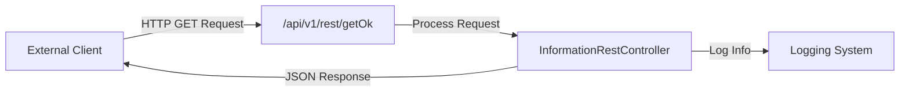

## Module: InformationRestController.java

# Documentación Técnica: InformationRestController.java

## 1. **Nombre del módulo o componente SQL:**
InformationRestController.java

## 2. **Objetivos principales:**
Este controlador REST proporciona un endpoint básico de verificación de estado (health check) para comprobar que el servicio está funcionando correctamente. Sirve como un punto de diagnóstico simple para verificar la disponibilidad del servicio web.

## 3. **Funciones, métodos o consultas críticas:**
- `getOk()`: Método GET que devuelve un mensaje simple de confirmación en formato JSON para verificar que el servicio está operativo.

## 4. **Variables y elementos clave (columnas, tablas, parámetros):**
- No contiene variables de estado ni parámetros de entrada.
- Utiliza un logger (`log`) para registrar la actividad del endpoint.

## 5. **Interdependencias y relaciones:**
- Depende de Spring Framework para la funcionalidad de controlador REST.
- Utiliza Lombok para la generación automática del logger (anotación `@Log4j2`).
- No presenta dependencias directas con otros componentes del sistema ni con bases de datos.

## 6. **Operaciones centrales vs. auxiliares:**
- **Central**: Proporcionar una respuesta simple de estado mediante el método `getOk()`.
- **Auxiliar**: Registro de la actividad mediante el logger.

## 7. **Secuencia operativa o flujo de ejecución:**
1. Se recibe una solicitud GET al endpoint `/api/v1/rest/getOk`.
2. Se registra la entrada al método mediante el logger.
3. Se devuelve una respuesta JSON simple con el mensaje "ok".

## 8. **Aspectos de rendimiento y optimización:**
- El controlador es extremadamente ligero y no realiza operaciones costosas.
- No hay consultas a bases de datos ni procesamiento complejo que pudiera afectar el rendimiento.
- La respuesta es estática y mínima, lo que garantiza tiempos de respuesta rápidos.

## 9. **Reusabilidad y adaptabilidad:**
- El controlador es simple y podría extenderse fácilmente para incluir más endpoints de diagnóstico.
- La estructura básica puede servir como plantilla para otros controladores REST.
- No es particularmente reutilizable en su forma actual debido a su propósito específico y limitado.

## 10. **Uso y contexto:**
- Se utiliza como un endpoint de verificación de estado (health check) para monitoreo del servicio.
- Puede ser consumido por herramientas de monitorización, balanceadores de carga o pruebas de disponibilidad.
- La anotación `@CrossOrigin(origins = "*")` permite que sea accesible desde cualquier origen, lo que facilita su uso en entornos de prueba o monitoreo.

## 11. **Supuestos y limitaciones:**
- **Supuestos**: Se asume que el servicio está operativo si este endpoint responde correctamente.
- **Limitaciones**: 
  - No proporciona información detallada sobre el estado del sistema.
  - No verifica la conectividad con otros componentes o servicios dependientes.
  - La permisividad del CORS (Cross-Origin Resource Sharing) podría representar un riesgo de seguridad en entornos de producción.
## Flow Diagram [via mermaid]

