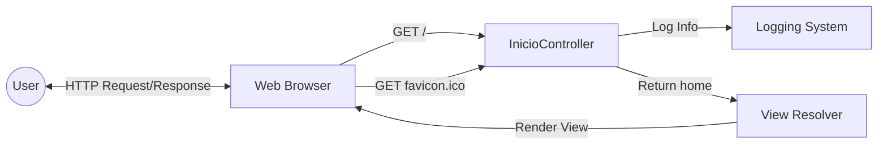

## Module: InicioController.java

# Documentación Técnica: InicioController.java

## 1. **Nombre del módulo o componente SQL:**
InicioController.java

## 2. **Objetivos principales:**
Este controlador gestiona las peticiones HTTP dirigidas a la página de inicio de la aplicación web de e-commerce de Coppel. Su propósito principal es manejar las solicitudes a la ruta raíz y evitar errores relacionados con el favicon.

## 3. **Funciones, métodos o consultas críticas:**
- `index()`: Método que maneja las solicitudes GET a la ruta raíz ("/") y devuelve la vista "home".
- `disableFavicon()`: Método que intercepta las solicitudes al favicon.ico para evitar errores 404.

## 4. **Variables y elementos clave (columnas, tablas, parámetros):**
No hay variables de estado en este controlador. Los elementos clave son:
- Anotaciones de Spring como `@Controller`, `@GetMapping` y `@ResponseBody`
- Logger de Log4j2 implementado mediante la anotación `@Log4j2` de Lombok

## 5. **Interdependencias y relaciones:**
- Depende de Spring Framework para el manejo de solicitudes HTTP
- Utiliza Lombok para la generación automática del logger
- Se relaciona con una vista llamada "home" que debe existir en el sistema de plantillas

## 6. **Operaciones centrales vs. auxiliares:**
- **Central**: El método `index()` que dirige a la página principal
- **Auxiliar**: El método `disableFavicon()` que evita errores 404 relacionados con el favicon

## 7. **Secuencia operativa o flujo de ejecución:**
1. El servidor recibe una solicitud HTTP
2. Spring la dirige al controlador correspondiente según la ruta
3. Si es la ruta raíz, se ejecuta `index()` y registra un mensaje en el log
4. Si es una solicitud de favicon.ico, se ejecuta `disableFavicon()` que no devuelve contenido

## 8. **Aspectos de rendimiento y optimización:**
- El controlador es muy ligero y no realiza operaciones costosas
- No hay consultas a bases de datos ni procesamiento complejo
- El método `disableFavicon()` optimiza la experiencia del usuario al evitar errores 404 innecesarios

## 9. **Reusabilidad y adaptabilidad:**
- El controlador es específico para la aplicación de e-commerce de Coppel
- La técnica de manejo del favicon podría reutilizarse en otros controladores
- Su simplicidad facilita la adaptación para otros proyectos similares

## 10. **Uso y contexto:**
- Se utiliza como punto de entrada principal para la aplicación web
- Forma parte del módulo de administración del e-commerce de Coppel
- Se integra dentro de una arquitectura Spring MVC

## 11. **Supuestos y limitaciones:**
- Supone la existencia de una vista llamada "home" en el sistema de plantillas
- No maneja autenticación ni autorización en este nivel
- No proporciona funcionalidad para API REST completa, solo manejo básico de rutas
- Asume que el sistema de logging está correctamente configurado para Log4j2
## Flow Diagram [via mermaid]

