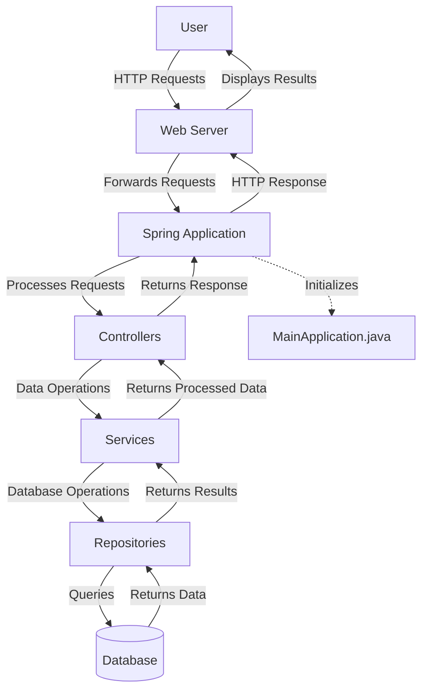

## Module: MainApplication.java

# Documentación Técnica: MainApplication.java

## 1. **Nombre del módulo o componente SQL:**
MainApplication.java

## 2. **Objetivos principales:**
Este módulo es la clase principal de una aplicación Spring Boot para un administrador de comercio electrónico (ecommerce). Su propósito es iniciar y ejecutar la aplicación Spring Boot, sirviendo como punto de entrada principal del sistema.

## 3. **Funciones, métodos o consultas críticas:**
- `main(String[] args)`: Método principal que inicia la aplicación Spring Boot utilizando `SpringApplication.run()`.

## 4. **Variables y elementos clave (columnas, tablas, parámetros):**
- `MainApplication.class`: Referencia a la propia clase que se pasa como parámetro al método `run()`.
- `args`: Argumentos de línea de comandos que se pasan a la aplicación.

## 5. **Interdependencias y relaciones:**
- Depende del framework Spring Boot (`org.springframework.boot.SpringApplication`).
- Depende de la anotación `SpringBootApplication` para la configuración automática.
- Utiliza `EnableWebMvc` para habilitar la configuración MVC de Spring.

## 6. **Operaciones centrales vs. auxiliares:**
- **Central**: Inicialización de la aplicación Spring Boot mediante `SpringApplication.run()`.
- No contiene operaciones auxiliares, ya que es una clase de arranque minimalista.

## 7. **Secuencia operativa o flujo de ejecución:**
1. La JVM invoca el método `main()`.
2. Se ejecuta `SpringApplication.run()` que inicia el contenedor de Spring.
3. Spring Boot realiza el escaneo de componentes, configuración automática y levanta el servidor web embebido.

## 8. **Aspectos de rendimiento y optimización:**
No hay consideraciones específicas de rendimiento en este módulo, ya que solo sirve como punto de entrada. El rendimiento dependerá de la configuración general de Spring Boot y los componentes que se registren en la aplicación.

## 9. **Reusabilidad y adaptabilidad:**
La clase es específica para iniciar esta aplicación particular y no está diseñada para ser reutilizada. Sin embargo, sigue el patrón estándar de inicialización de Spring Boot, lo que facilita su comprensión para desarrolladores familiarizados con el framework.

## 10. **Uso y contexto:**
Este módulo se utiliza como punto de entrada principal para iniciar la aplicación de administración de comercio electrónico. Es ejecutado directamente por la JVM cuando se inicia la aplicación, ya sea desde un IDE, como un JAR ejecutable, o en un entorno de contenedores.

## 11. **Supuestos y limitaciones:**
- Supone que todas las dependencias de Spring Boot están correctamente configuradas en el proyecto.
- Asume que las configuraciones adicionales están definidas en archivos de propiedades o en otras clases de configuración.
- Al usar `@EnableWebMvc`, se asume que la aplicación requiere capacidades web MVC completas de Spring.
- No incluye configuraciones específicas de seguridad, bases de datos o servicios externos, que deberían estar en clases separadas.
## Flow Diagram [via mermaid]

