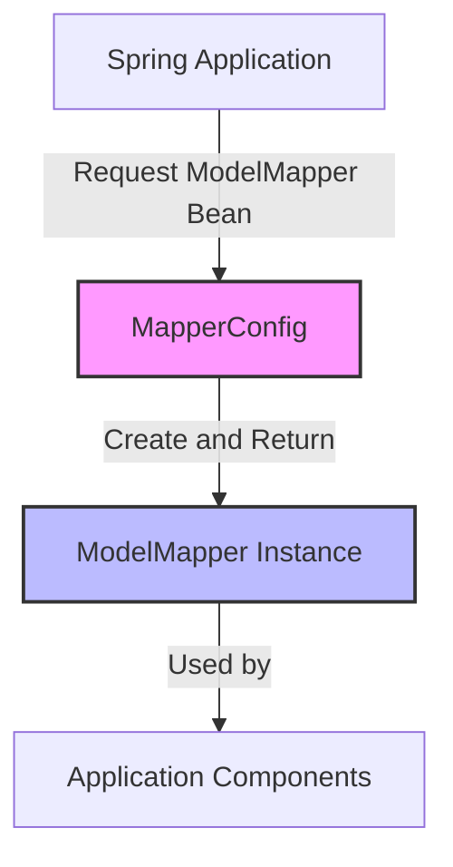

## Module: MapperConfig.java

# Documentación Técnica: MapperConfig.java

## 1. **Nombre del módulo o componente SQL:**
MapperConfig.java

## 2. **Objetivos principales:**
Este componente configura y proporciona una instancia de ModelMapper como un bean de Spring, facilitando la conversión y mapeo entre diferentes objetos de dominio y DTOs (Data Transfer Objects) en la aplicación de e-commerce de Coppel.

## 3. **Funciones, métodos o consultas críticas:**
- `mapper()`: Método anotado con @Bean que crea y devuelve una instancia de ModelMapper para ser utilizada en toda la aplicación.

## 4. **Variables y elementos clave (columnas, tablas, parámetros):**
- No contiene variables de instancia o parámetros específicos.
- El elemento clave es la instancia de ModelMapper que se configura como bean.

## 5. **Interdependencias y relaciones:**
- Depende de la biblioteca ModelMapper (`org.modelmapper.ModelMapper`).
- Depende del framework Spring para la configuración de beans (`org.springframework.context.annotation`).
- Otros componentes de la aplicación pueden inyectar y utilizar este bean para realizar operaciones de mapeo.

## 6. **Operaciones centrales vs. auxiliares:**
- **Central**: Provisión del bean ModelMapper para el mapeo de objetos.
- No contiene operaciones auxiliares.

## 7. **Secuencia operativa o flujo de ejecución:**
1. Durante el inicio de la aplicación, Spring detecta la clase anotada con @Configuration.
2. Spring invoca el método mapper() anotado con @Bean.
3. Se crea una nueva instancia de ModelMapper.
4. Spring registra esta instancia como un bean disponible para inyección de dependencias.

## 8. **Aspectos de rendimiento y optimización:**
- La configuración es simple y eficiente, creando una única instancia de ModelMapper compartida.
- No se aplican configuraciones personalizadas al ModelMapper que podrían mejorar el rendimiento en casos específicos.

## 9. **Reusabilidad y adaptabilidad:**
- Altamente reusable, ya que proporciona una funcionalidad genérica de mapeo.
- Podría extenderse fácilmente para incluir configuraciones personalizadas del ModelMapper según necesidades específicas.
- El código es conciso y sigue el patrón estándar de configuración de Spring.

## 10. **Uso y contexto:**
- Se utiliza en el contexto de una aplicación de e-commerce de Coppel (ecommercempadministrador).
- El ModelMapper configurado será inyectado en servicios y controladores que necesiten convertir entre diferentes modelos de datos.
- Es parte de la capa de configuración de la aplicación.

## 11. **Supuestos y limitaciones:**
- Supone que la configuración predeterminada de ModelMapper es suficiente para las necesidades de la aplicación.
- No incluye configuraciones personalizadas para casos de mapeo complejos.
- Limitación: si se requieren reglas de mapeo específicas, será necesario extender esta configuración o crear configuraciones adicionales.
## Flow Diagram [via mermaid]

