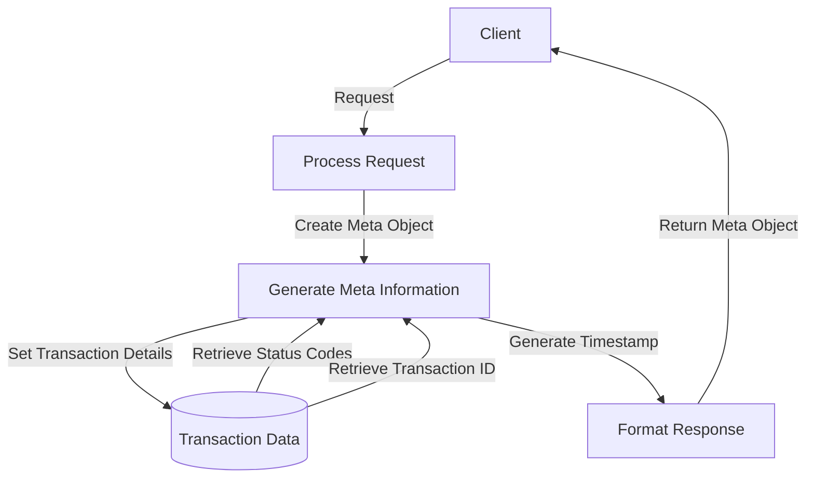

## Module: Meta.java

# Documentación Técnica: Meta.java

## 1. **Nombre del módulo o componente SQL:**
Meta.java

## 2. **Objetivos principales:**
Este componente define una clase de utilidad que encapsula metadatos de respuesta para peticiones en un sistema de comercio electrónico. Su propósito es proporcionar información estandarizada sobre el resultado de las operaciones realizadas, incluyendo identificadores de transacción, códigos de estado y mensajes informativos.

## 3. **Funciones, métodos o consultas críticas:**
- Constructor `Meta(String transactionId, String status, int statusCode)`: Inicializa un objeto Meta con información básica de la transacción.
- Constructor `Meta(String transactionId, String status, int statusCode, String message)`: Inicializa un objeto Meta con información básica y un mensaje para el cliente.
- Métodos getter y setter generados por Lombok para acceder y modificar los atributos de la clase.

## 4. **Variables y elementos clave (columnas, tablas, parámetros):**
- `transactionID`: Identificador único de la transacción.
- `status`: Estado de la petición (éxito, error, etc.).
- `statusCode`: Código numérico que representa el estado de la petición.
- `timestamp`: Marca de tiempo de la transacción.
- `devMessage`: Mensaje para desarrolladores (opcional).
- `message`: Mensaje para el cliente (opcional).

## 5. **Interdependencias y relaciones:**
- Pertenece al paquete `com.coppel.omnicanal.ecommercempadministrador.util`.
- Utiliza anotaciones de Lombok (`@Getter`, `@Setter`, `@NoArgsConstructor`, `@ToString`).
- Utiliza anotaciones de Jackson (`@JsonInclude`) para controlar la serialización JSON.
- Depende de `java.time.LocalDateTime` para generar marcas de tiempo.

## 6. **Operaciones centrales vs. auxiliares:**
- **Centrales**: Almacenamiento y provisión de metadatos de transacción.
- **Auxiliares**: Generación automática de marcas de tiempo y formateo condicional de campos opcionales en la serialización JSON.

## 7. **Secuencia operativa o flujo de ejecución:**
1. Se instancia un objeto Meta mediante uno de sus constructores.
2. Se establece automáticamente la marca de tiempo actual.
3. Opcionalmente, se pueden modificar los atributos mediante los setters.
4. El objeto se utiliza como parte de una respuesta HTTP o estructura de datos de respuesta.

## 8. **Aspectos de rendimiento y optimización:**
- La clase es ligera y eficiente, sin operaciones costosas.
- El uso de `@JsonInclude(value = Include.NON_NULL)` optimiza la serialización JSON al omitir campos nulos.
- La generación de timestamp se realiza una sola vez durante la construcción del objeto.

## 9. **Reusabilidad y adaptabilidad:**
- Alta reusabilidad como componente estándar para respuestas en toda la aplicación.
- Diseño simple y flexible que permite su uso en diferentes contextos de respuesta.
- Parametrizable a través de sus constructores y métodos setter.

## 10. **Uso y contexto:**
- Se utiliza como parte de las respuestas HTTP en APIs REST del sistema de comercio electrónico.
- Proporciona una estructura estandarizada para metadatos de respuesta.
- Probablemente se incluye como parte de un objeto de respuesta más amplio que contiene también los datos específicos de cada endpoint.

## 11. **Supuestos y limitaciones:**
- Supone que el formato de timestamp como cadena de texto es suficiente para las necesidades del sistema.
- No incluye validaciones para los valores de entrada.
- No proporciona métodos para comparar o analizar los códigos de estado.
- La serialización depende de la biblioteca Jackson para el manejo adecuado de las anotaciones.
## Flow Diagram [via mermaid]

