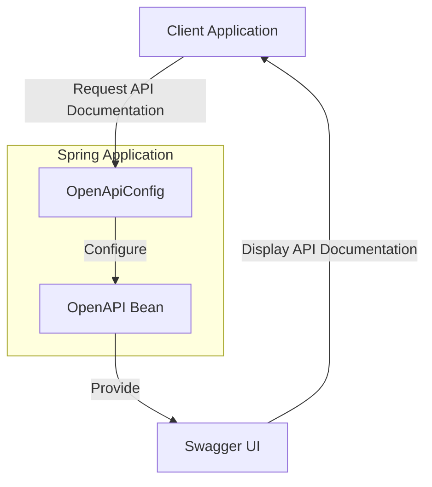

## Module: OpenApiConfig.java

# Documentación Técnica: OpenApiConfig.java

## 1. **Nombre del módulo o componente SQL:**
OpenApiConfig.java

## 2. **Objetivos principales:**
Este módulo configura la implementación de Swagger (OpenAPI) para el proyecto ecommercempadministrador. Su propósito es proporcionar documentación interactiva de la API REST del sistema, facilitando a los desarrolladores entender y probar los endpoints disponibles.

## 3. **Funciones, métodos o consultas críticas:**
- `springShopOpenAPI()`: Método anotado con @Bean que configura y devuelve un objeto OpenAPI con la información básica de la documentación.

## 4. **Variables y elementos clave (columnas, tablas, parámetros):**
- `OpenAPI`: Objeto principal que contiene la configuración de Swagger.
- `Info`: Objeto que almacena la información básica de la API (título y descripción).

## 5. **Interdependencias y relaciones:**
- Depende de las bibliotecas de SpringDoc OpenAPI (`io.swagger.v3.oas.models`).
- Se integra con el framework Spring a través de las anotaciones de configuración.
- Interactúa indirectamente con los controladores REST del sistema para generar la documentación.

## 6. **Operaciones centrales vs. auxiliares:**
- **Central**: Configuración y exposición del bean OpenAPI.
- **Auxiliar**: No contiene operaciones auxiliares significativas.

## 7. **Secuencia operativa o flujo de ejecución:**
1. Spring carga la configuración al iniciar la aplicación.
2. El método `springShopOpenAPI()` se ejecuta y crea el bean OpenAPI.
3. SpringDoc utiliza este bean para generar la documentación interactiva de la API.

## 8. **Aspectos de rendimiento y optimización:**
- La configuración es ligera y se ejecuta solo durante el inicio de la aplicación.
- No tiene impacto significativo en el rendimiento del sistema en tiempo de ejecución.

## 9. **Reusabilidad y adaptabilidad:**
- El código es reutilizable en otros proyectos Spring que requieran documentación OpenAPI.
- Es fácilmente adaptable modificando el título, descripción o añadiendo más configuraciones como información de contacto, licencia, o configuraciones de seguridad.

## 10. **Uso y contexto:**
- Se utiliza en los perfiles "default" y "dev" según la anotación `@Profile("default|dev")`.
- La documentación generada estará disponible típicamente en la ruta `/swagger-ui.html` de la aplicación.
- Es parte del módulo de configuración del proyecto ecommercempadministrador.

## 11. **Supuestos y limitaciones:**
- Supone que el proyecto utiliza Spring Boot y tiene las dependencias de SpringDoc OpenAPI correctamente configuradas.
- Solo está habilitado en los perfiles "default" y "dev", no en producción.
- La configuración es básica y no incluye aspectos avanzados como agrupación de APIs, configuración de seguridad o personalización detallada.
- Está diseñado para una aplicación Java 17 según la descripción incluida.
## Flow Diagram [via mermaid]

