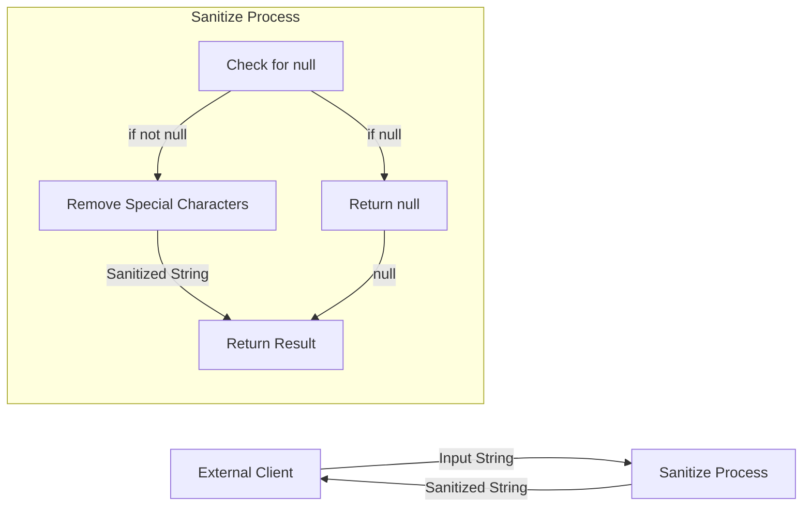

## Module: Sanitizie.java

# Documentación Técnica: Sanitizie.java

## 1. **Nombre del módulo o componente SQL:**
Sanitizie.java (clase de utilidad)

## 2. **Objetivos principales:**
Esta clase proporciona funcionalidad para sanitizar cadenas de texto, eliminando caracteres específicos que podrían causar problemas en el procesamiento de datos. Su propósito es limpiar las entradas de texto para garantizar la integridad y consistencia de los datos en el sistema de e-commerce.

## 3. **Funciones, métodos o consultas críticas:**
- `sanitize(String input)`: Método estático que recibe una cadena de texto y elimina caracteres específicos, devolviendo la cadena limpia.

## 4. **Variables y elementos clave (columnas, tablas, parámetros):**
- `input`: Parámetro de entrada que representa la cadena de texto a sanitizar.
- Caracteres a eliminar: tabulaciones y dos caracteres aparentemente vacíos (posiblemente caracteres especiales o de control).

## 5. **Interdependencias y relaciones:**
La clase pertenece al paquete `com.coppel.omnicanal.ecommercempadministrador.util`, lo que sugiere que forma parte de un módulo de utilidades para un sistema de administración de e-commerce de Coppel.

## 6. **Operaciones centrales vs. auxiliares:**
- **Central**: El método `sanitize()` que realiza la limpieza de la cadena.
- **Auxiliar**: El constructor privado que evita la instanciación de la clase.

## 7. **Secuencia operativa o flujo de ejecución:**
1. Se verifica si la entrada es nula; si lo es, se devuelve null.
2. Se aplican reemplazos secuenciales para eliminar caracteres específicos.
3. Se devuelve la cadena sanitizada.

## 8. **Aspectos de rendimiento y optimización:**
- La implementación es simple y eficiente para cadenas cortas.
- Para volúmenes grandes de datos, el encadenamiento de múltiples reemplazos podría optimizarse usando un único paso de procesamiento o expresiones regulares.

## 9. **Reusabilidad y adaptabilidad:**
- Alta reusabilidad: Al ser un método estático en una clase de utilidad, puede ser invocado desde cualquier parte del sistema.
- Adaptabilidad limitada: Los caracteres a eliminar están codificados directamente en el método. Para mayor flexibilidad, se podría parametrizar la lista de caracteres a eliminar.

## 10. **Uso y contexto:**
Se utiliza probablemente en procesos de validación y limpieza de datos ingresados por usuarios o importados de sistemas externos, antes de su almacenamiento o procesamiento en el sistema de administración de e-commerce.

## 11. **Supuestos y limitaciones:**
- **Supuestos**: Se asume que solo ciertos caracteres específicos necesitan ser eliminados.
- **Limitaciones**: 
  - No maneja otros tipos de sanitización como escape de caracteres especiales para SQL o HTML.
  - No es configurable en tiempo de ejecución para eliminar caracteres adicionales.
  - El nombre de la clase contiene un error ortográfico ("Sanitizie" en lugar de "Sanitize").
## Flow Diagram [via mermaid]

