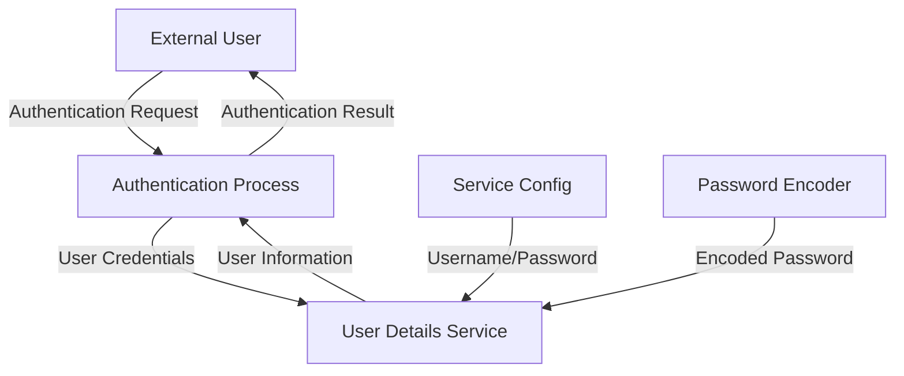

## Module: SecurityConfiguration.java

# Documentación Técnica: SecurityConfiguration.java

## 1. **Nombre del módulo o componente SQL:**
SecurityConfiguration.java

## 2. **Objetivos principales:**
Este componente configura la seguridad de la aplicación Spring Boot, estableciendo la autenticación básica mediante un usuario en memoria. Su propósito principal es proteger los endpoints de la aplicación, requiriendo credenciales válidas para acceder a los recursos.

## 3. **Funciones, métodos o consultas críticas:**
- `userDetailsService()`: Define y configura el usuario en memoria para autenticación.
- `encoder()`: Proporciona un codificador de contraseñas BCrypt para el manejo seguro de credenciales.

## 4. **Variables y elementos clave (columnas, tablas, parámetros):**
- `serviceConfig`: Recurso inyectado que contiene la configuración del servicio, incluyendo credenciales.
- `User`: Objeto que representa al usuario con nombre de usuario, contraseña y roles.
- `BCryptPasswordEncoder`: Componente para el cifrado seguro de contraseñas.

## 5. **Interdependencias y relaciones:**
- Depende de `ServiceConfig` para obtener las credenciales de usuario.
- Se integra con el framework de seguridad de Spring Security.
- Utiliza anotaciones de Spring como `@Configuration` y `@EnableWebSecurity`.

## 6. **Operaciones centrales vs. auxiliares:**
- **Central**: Configuración del servicio de autenticación mediante `userDetailsService()`.
- **Auxiliar**: Provisión del codificador de contraseñas mediante `encoder()`.

## 7. **Secuencia operativa o flujo de ejecución:**
1. Spring carga la configuración de seguridad al iniciar la aplicación.
2. Se crea el bean `PasswordEncoder` para el cifrado de contraseñas.
3. Se configura el `InMemoryUserDetailsManager` con un usuario obtenido de `ServiceConfig`.
4. El framework de seguridad utiliza estos beans para autenticar las solicitudes entrantes.

## 8. **Aspectos de rendimiento y optimización:**
- La autenticación en memoria es eficiente para conjuntos pequeños de usuarios.
- BCrypt proporciona un equilibrio entre seguridad y rendimiento para el hash de contraseñas.
- No es escalable para grandes conjuntos de usuarios, ya que almacena usuarios en memoria.

## 9. **Reusabilidad y adaptabilidad:**
- El código es modular y sigue el patrón de configuración de Spring Security.
- Puede adaptarse fácilmente para usar otras fuentes de autenticación (base de datos, LDAP, OAuth).
- La separación de la configuración de credenciales en `ServiceConfig` mejora la adaptabilidad.

## 10. **Uso y contexto:**
- Se utiliza como parte del sistema de seguridad de una aplicación de e-commerce (según el paquete `com.coppel.omnicanal.ecommercempadministrador`).
- Proporciona autenticación básica para proteger los endpoints de la API o interfaces web.
- Es cargado automáticamente por Spring durante el inicio de la aplicación.

## 11. **Supuestos y limitaciones:**
- Supone que solo se necesita un único usuario para la autenticación.
- Limitado a autenticación en memoria, no adecuado para sistemas con muchos usuarios.
- Depende de `ServiceConfig` para obtener credenciales, lo que podría ser un punto único de fallo.
- No implementa características avanzadas como autenticación de dos factores o gestión de sesiones.
## Flow Diagram [via mermaid]

