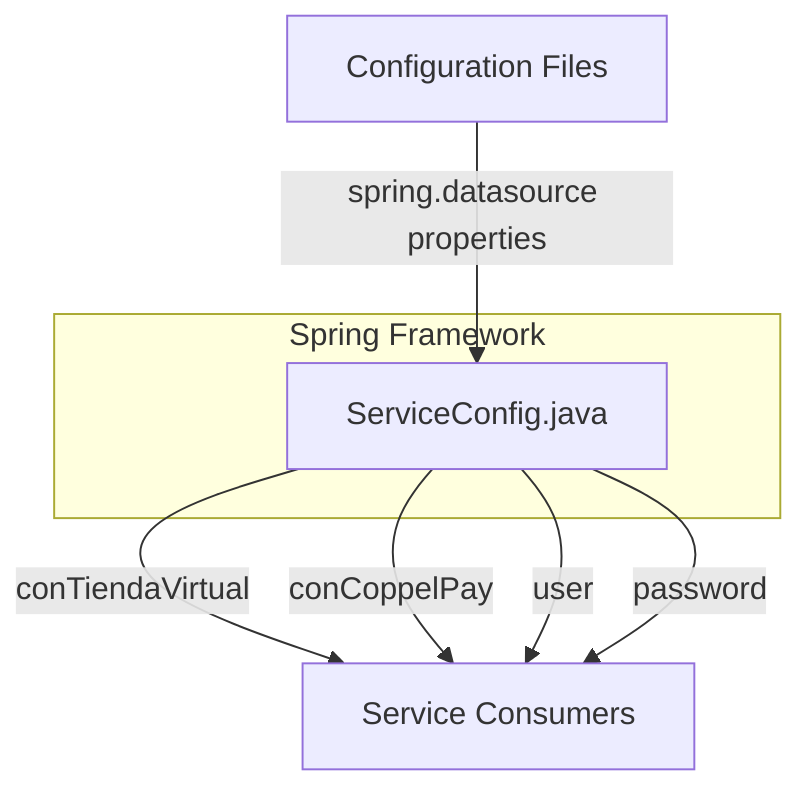

## Module: ServiceConfig.java

# Documentación Técnica: ServiceConfig.java

## 1. **Nombre del módulo o componente SQL:**
ServiceConfig.java

## 2. **Objetivos principales:**
Este componente es una clase de configuración de Spring que centraliza la gestión de parámetros de conexión a bases de datos para el sistema de e-commerce de Coppel. Su propósito principal es proporcionar acceso a las credenciales y URLs de conexión a diferentes bases de datos utilizadas por la aplicación.

## 3. **Funciones, métodos o consultas críticas:**
No contiene métodos explícitos ni consultas SQL, ya que es una clase de configuración. Su funcionalidad principal es exponer las propiedades de conexión como beans de Spring mediante la anotación `@Configuration`.

## 4. **Variables y elementos clave (columnas, tablas, parámetros):**
- `conTiendaVirtual`: URL de conexión a la base de datos de tienda virtual
- `conCoppelPay`: URL de conexión a la base de datos de CoppelPay
- `user`: Nombre de usuario para las conexiones a bases de datos
- `passw0rd`: Contraseña para las conexiones a bases de datos

## 5. **Interdependencias y relaciones:**
Esta clase depende del sistema de propiedades de Spring Boot, específicamente de las propiedades definidas en algún archivo de configuración (como application.properties o application.yml) que debe contener las claves:
- spring.datasource.tiendavirtual.url
- spring.datasource.coppelpay.url
- spring.datasource.user
- spring.datasource.passw0rd

## 6. **Operaciones centrales vs. auxiliares:**
- **Central**: Proporcionar acceso a los parámetros de conexión a bases de datos
- **Auxiliar**: No contiene operaciones auxiliares explícitas

## 7. **Secuencia operativa o flujo de ejecución:**
1. Spring carga la configuración al iniciar la aplicación
2. Las propiedades se inyectan desde el archivo de configuración mediante `@Value`
3. Los getters (generados por Lombok) permiten acceder a estas propiedades desde otros componentes

## 8. **Aspectos de rendimiento y optimización:**
Al ser una clase de configuración simple, no presenta problemas de rendimiento significativos. Las propiedades se cargan una sola vez al inicio de la aplicación, lo que es eficiente.

## 9. **Reusabilidad y adaptabilidad:**
La clase es altamente reutilizable para gestionar conexiones a bases de datos en diferentes partes de la aplicación. Para adaptarla a nuevas bases de datos, solo se necesitaría agregar nuevas propiedades y sus correspondientes getters.

## 10. **Uso y contexto:**
Este componente es utilizado por servicios y repositorios de la aplicación que necesitan conectarse a las bases de datos de tienda virtual y CoppelPay. Otros componentes pueden inyectar esta configuración para obtener los parámetros de conexión necesarios.

## 11. **Supuestos y limitaciones:**
- **Supuestos**: Se asume que las propiedades de configuración están correctamente definidas en los archivos de configuración de Spring.
- **Limitaciones**: 
  - Utiliza un único usuario y contraseña para ambas bases de datos, lo que podría ser una limitación si se requieren credenciales diferentes.
  - Almacena contraseñas como texto plano en la memoria, lo que podría representar un riesgo de seguridad.
  - No implementa mecanismos de cifrado para las credenciales.
## Flow Diagram [via mermaid]

