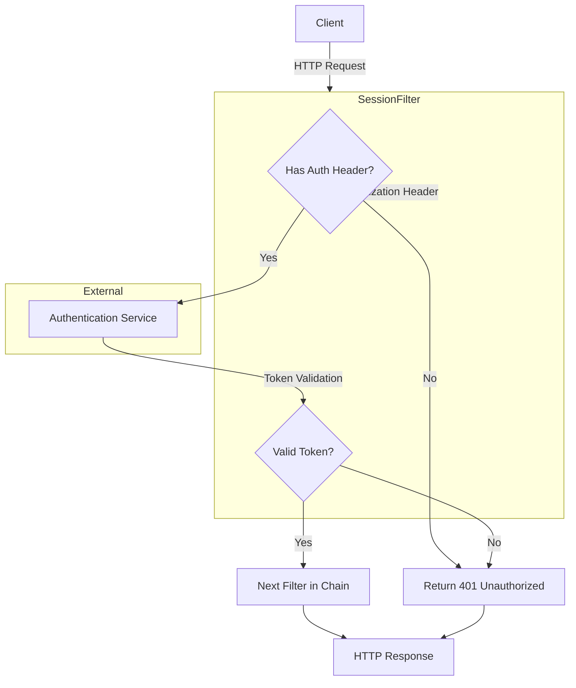

## Module: SessionFilter.java

# Documentación Técnica: SessionFilter.java

## 1. **Nombre del módulo o componente SQL:**
SessionFilter.java

## 2. **Objetivos principales:**
Este componente es un filtro de seguridad que valida la autenticación de las solicitudes HTTP mediante tokens. Su propósito principal es interceptar todas las peticiones entrantes, verificar la presencia y validez del token de autorización antes de permitir que continúen hacia los controladores de la aplicación, garantizando así que solo usuarios autenticados puedan acceder a los recursos protegidos.

## 3. **Funciones, métodos o consultas críticas:**
- `doFilter()`: Método principal que intercepta las solicitudes HTTP, verifica la presencia del token de autorización y valida su autenticidad.
- `handleUnauthorizedResponse()`: Método auxiliar que gestiona las respuestas de error cuando la autenticación falla.

## 4. **Variables y elementos clave (columnas, tablas, parámetros):**
- `config`: Configuración de la aplicación inyectada mediante Spring.
- `HttpHeaders.AUTHORIZATION`: Cabecera HTTP utilizada para transmitir el token de autenticación.
- `ApiResponseDto`: Objeto de transferencia de datos para estructurar las respuestas de la API.
- `RestTemplate`: Cliente HTTP utilizado para validar el token contra un servicio de autenticación externo.

## 5. **Interdependencias y relaciones:**
- Depende de `AppConfig` para obtener configuraciones como URLs de autenticación y opciones de CORS.
- Interactúa con un servicio de autenticación externo definido en `config.getAuthUri()`.
- Utiliza `ApiResponseDto` y `Meta` para estructurar las respuestas de error.
- Se integra con el sistema de filtros de Servlet de Jakarta EE.

## 6. **Operaciones centrales vs. auxiliares:**
- **Centrales**: 
  - Verificación de la presencia del token de autorización.
  - Validación del token mediante llamada a un servicio externo.
  - Decisión de permitir o rechazar la solicitud.
- **Auxiliares**:
  - Configuración de cabeceras CORS en las respuestas.
  - Generación de mensajes de error estructurados.
  - Registro de eventos de error mediante Log4j2.

## 7. **Secuencia operativa o flujo de ejecución:**
1. Recibe una solicitud HTTP.
2. Verifica si la validación de sesión está desactivada (`isIgnoreSession`).
3. Si está desactivada, permite que la solicitud continúe.
4. Si está activada, verifica la presencia del encabezado de autorización.
5. Si no existe el encabezado, rechaza la solicitud con estado 401.
6. Si existe, envía el token a un servicio externo para validación.
7. Si la validación es exitosa (código 200), permite que la solicitud continúe.
8. Si la validación falla, rechaza la solicitud con estado 401.

## 8. **Aspectos de rendimiento y optimización:**
- La validación del token implica una llamada HTTP externa, lo que puede afectar la latencia.
- El filtro está configurado con `@Order(value = 1)`, lo que indica que se ejecuta temprano en la cadena de filtros, evitando procesamiento innecesario para solicitudes no autenticadas.
- No hay mecanismo de caché para tokens válidos, lo que podría mejorar el rendimiento.

## 9. **Reusabilidad y adaptabilidad:**
- El filtro es altamente reutilizable en aplicaciones Spring que requieran autenticación basada en tokens.
- La configuración externa mediante `AppConfig` permite adaptarlo a diferentes entornos sin modificar el código.
- El mecanismo de validación podría extenderse para soportar diferentes tipos de tokens o estrategias de autenticación.

## 10. **Uso y contexto:**
- Se utiliza como parte del sistema de seguridad de una aplicación de comercio electrónico (ecommerce).
- Se aplica a todas las rutas de la aplicación que requieren autenticación.
- Depende de un servicio externo de autenticación para validar los tokens.

## 11. **Supuestos y limitaciones:**
- Supone que el token de autorización se transmite en el encabezado HTTP estándar `Authorization`.
- Requiere que el servicio de autenticación externo responda con código 200 para tokens válidos.
- No implementa manejo de tokens expirados o revocados más allá de la validación externa.
- No proporciona mecanismos para refrescar tokens automáticamente.
- La configuración `isIgnoreSession` permite desactivar completamente la validación, lo que podría representar un riesgo de seguridad si se usa incorrectamente.
## Flow Diagram [via mermaid]

