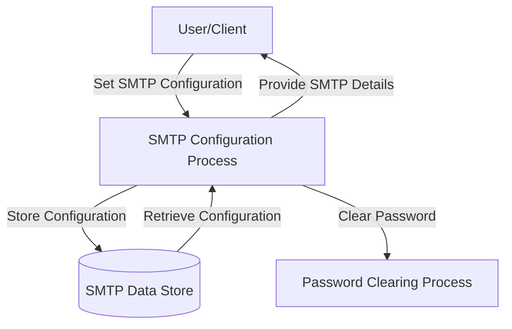

## Module: Smtp.java

# Documentación Técnica: Smtp.java

## 1. **Nombre del módulo o componente SQL:**
Smtp.java - Clase de utilidad para configuración SMTP

## 2. **Objetivos principales:**
Esta clase proporciona una estructura para almacenar y gestionar la configuración de conexión a un servidor SMTP (Simple Mail Transfer Protocol). Su propósito es encapsular los parámetros necesarios para establecer una conexión segura con un servidor de correo electrónico dentro del sistema de administración de comercio electrónico de Coppel.

## 3. **Funciones, métodos o consultas críticas:**
- Métodos getter y setter para cada propiedad de configuración SMTP
- `clearPassw0rd()`: Método específico para limpiar la contraseña de la memoria por razones de seguridad

## 4. **Variables y elementos clave (columnas, tablas, parámetros):**
- `servidor`: Dirección del servidor SMTP
- `puerto`: Puerto de conexión al servidor SMTP
- `isAutenticacion`: Bandera que indica si se requiere autenticación
- `usuario`: Nombre de usuario para la autenticación
- `passw0rd`: Contraseña para la autenticación, almacenada como array de caracteres por seguridad

## 5. **Interdependencias y relaciones:**
- Pertenece al paquete `com.coppel.omnicanal.ecommercempadministrador.util`
- Utiliza la clase `java.util.Arrays` para operaciones de seguridad en la contraseña
- No presenta dependencias directas con otras clases del sistema

## 6. **Operaciones centrales vs. auxiliares:**
- **Centrales**: Almacenamiento seguro de credenciales SMTP y parámetros de conexión
- **Auxiliares**: Limpieza segura de la contraseña en memoria mediante el método `clearPassw0rd()`

## 7. **Secuencia operativa o flujo de ejecución:**
1. Instanciación del objeto Smtp
2. Configuración de parámetros mediante setters
3. Uso de los parámetros para establecer conexión SMTP (en otras clases)
4. Limpieza de la contraseña cuando ya no se necesita mediante `clearPassw0rd()`

## 8. **Aspectos de rendimiento y optimización:**
- Implementa manejo seguro de contraseñas usando arrays de caracteres en lugar de String
- Realiza clonación defensiva de la contraseña para evitar modificaciones externas no deseadas
- Proporciona método específico para limpiar la contraseña de la memoria

## 9. **Reusabilidad y adaptabilidad:**
- Alta reusabilidad como componente de configuración SMTP
- Puede ser utilizado en cualquier parte del sistema que requiera envío de correos
- Diseño simple y enfocado que facilita su adaptación a diferentes contextos

## 10. **Uso y contexto:**
- Se utiliza como contenedor de configuración para servicios de envío de correo electrónico dentro del sistema de administración de comercio electrónico
- Probablemente es consumido por clases que implementan la funcionalidad de envío de correos

## 11. **Supuestos y limitaciones:**
- Supone que la contraseña se maneja como array de caracteres por razones de seguridad
- No implementa validación de los datos ingresados (formato de servidor, puerto válido, etc.)
- No incluye funcionalidad para cifrado o protección adicional de las credenciales más allá de la limpieza de memoria
- No maneja configuraciones avanzadas de SMTP como SSL/TLS, timeout, etc.
## Flow Diagram [via mermaid]

