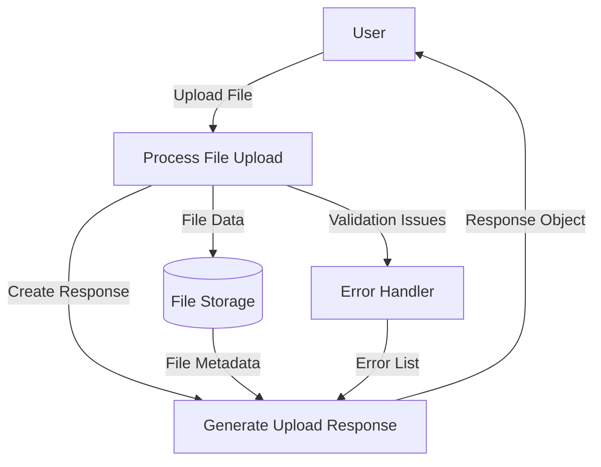

## Module: UploadFileResponse.java

# Documentación Técnica: UploadFileResponse.java

## 1. **Nombre del módulo o componente SQL:**
UploadFileResponse.java

## 2. **Objetivos principales:**
Este componente es una clase DTO (Data Transfer Object) diseñada para encapsular la información de respuesta después de una operación de carga de archivos en el sistema. Su propósito es proporcionar una estructura estandarizada para devolver datos relacionados con archivos cargados, incluyendo metadatos del archivo y posibles errores ocurridos durante el proceso.

## 3. **Funciones, métodos o consultas críticas:**
- Constructores sobrecargados para diferentes escenarios de respuesta:
  - Constructor con mensaje y lista de errores
  - Constructor con solo mensaje
  - Constructor con metadatos del archivo
  - Constructor con metadatos del archivo y lista de errores
- Métodos getter y setter para acceder y modificar los atributos de la clase

## 4. **Variables y elementos clave (columnas, tablas, parámetros):**
- `fileName`: Nombre del archivo cargado
- `fileDownloadUri`: URI para descargar el archivo
- `fileType`: Tipo MIME del archivo
- `size`: Tamaño del archivo en bytes
- `errores`: Lista de strings que contiene los errores ocurridos durante la carga
- `message`: Mensaje informativo sobre el resultado de la operación

## 5. **Interdependencias y relaciones:**
- Pertenece al paquete `com.coppel.omnicanal.ecommercempadministrador.dto`
- Depende de la clase `List` de Java para manejar la colección de errores
- Es utilizada probablemente por controladores REST o servicios que manejan la carga de archivos

## 6. **Operaciones centrales vs. auxiliares:**
- **Operaciones centrales**: Almacenamiento y recuperación de información sobre archivos cargados
- **Operaciones auxiliares**: Manejo de errores y mensajes informativos

## 7. **Secuencia operativa o flujo de ejecución:**
1. Se instancia la clase con uno de los constructores disponibles según el escenario
2. Se accede a los datos mediante los métodos getter o se modifican mediante los métodos setter
3. El objeto se utiliza como respuesta en operaciones de carga de archivos

## 8. **Aspectos de rendimiento y optimización:**
- La clase es ligera y eficiente al ser un simple contenedor de datos
- No realiza operaciones complejas que puedan afectar el rendimiento
- El uso de tipos primitivos como `long` para el tamaño optimiza el uso de memoria

## 9. **Reusabilidad y adaptabilidad:**
- Alta reusabilidad: puede utilizarse en cualquier parte del sistema que requiera devolver información sobre archivos cargados
- Adaptable mediante sus diferentes constructores para diversos escenarios de respuesta
- Podría extenderse fácilmente para incluir más metadatos o información adicional

## 10. **Uso y contexto:**
- Se utiliza como objeto de respuesta en endpoints REST que manejan operaciones de carga de archivos
- Probablemente es serializado a JSON para ser enviado como respuesta HTTP
- Forma parte del módulo de administración de e-commerce según se infiere del paquete

## 11. **Supuestos y limitaciones:**
- Supone que los errores pueden representarse como cadenas de texto simples
- No incluye validaciones de datos ni lógica de negocio
- No maneja directamente el archivo, solo almacena información sobre él
- No proporciona métodos para serialización/deserialización personalizada
## Flow Diagram [via mermaid]

