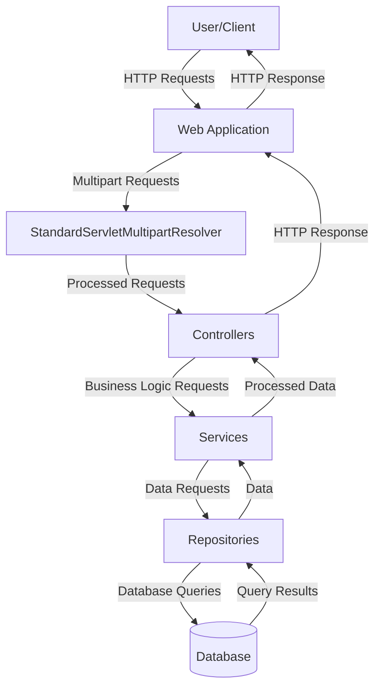

## Module: WebConfig.java

# Documentación Técnica: WebConfig.java

## 1. **Nombre del módulo o componente SQL:**
WebConfig.java

## 2. **Objetivos principales:**
Este módulo configura el entorno web de una aplicación Spring MVC para el administrador de e-commerce de Coppel. Su propósito principal es establecer la configuración básica para el manejo de solicitudes web y habilitar la funcionalidad para cargar archivos multipart (como imágenes o documentos).

## 3. **Funciones, métodos o consultas críticas:**
- `multipartResolver()`: Método que define y configura el resolvedor de contenido multipart para permitir la carga de archivos en la aplicación.

## 4. **Variables y elementos clave (columnas, tablas, parámetros):**
- No contiene variables de instancia.
- El componente principal es el bean `StandardServletMultipartResolver` que se configura para manejar solicitudes multipart.

## 5. **Interdependencias y relaciones:**
- Depende de los paquetes de Spring Framework, específicamente:
  - `org.springframework.context.annotation`
  - `org.springframework.web.servlet.config.annotation`
  - `org.springframework.web.multipart.support`
- Se relaciona con todos los componentes del paquete base "com.coppel.omnicanal.ecommercempadministrador" mediante el escaneo de componentes.

## 6. **Operaciones centrales vs. auxiliares:**
- **Central**: Configuración del resolvedor multipart para permitir la carga de archivos.
- **Auxiliar**: Habilitación de Spring MVC y configuración del escaneo de componentes.

## 7. **Secuencia operativa o flujo de ejecución:**
1. La clase es cargada por el contenedor de Spring durante el inicio de la aplicación.
2. Se registra como una configuración web mediante la anotación `@Configuration`.
3. Se habilita Spring MVC con `@EnableWebMvc`.
4. Se configura el escaneo de componentes en el paquete base.
5. Se crea y registra el bean `StandardServletMultipartResolver`.

## 8. **Aspectos de rendimiento y optimización:**
- La configuración es minimalista y eficiente, sin elementos que puedan afectar negativamente al rendimiento.
- No se establecen límites específicos para el tamaño de archivos multipart, lo que podría ser un punto a considerar para evitar problemas de memoria con archivos grandes.

## 9. **Reusabilidad y adaptabilidad:**
- La clase es altamente reutilizable como base para configuraciones web en otras aplicaciones Spring MVC.
- Es fácilmente adaptable mediante la extensión de la clase o la modificación de los métodos de configuración.
- Se podría mejorar la adaptabilidad parametrizando aspectos como el tamaño máximo de archivos.

## 10. **Uso y contexto:**
- Se utiliza como parte de la configuración inicial de la aplicación web del administrador de e-commerce.
- Es cargada automáticamente por Spring durante el arranque de la aplicación.
- Proporciona la infraestructura necesaria para que los controladores web puedan recibir y procesar archivos cargados por los usuarios.

## 11. **Supuestos y limitaciones:**
- Supone que la aplicación utilizará el estándar de Servlet 3.0+ para el manejo de multipart.
- No establece configuraciones específicas para el tamaño máximo de archivos o directorio temporal.
- Limitado a la configuración básica de multipart, sin incluir otras configuraciones web como interceptores, formateadores o manejadores de recursos estáticos.
## Flow Diagram [via mermaid]

