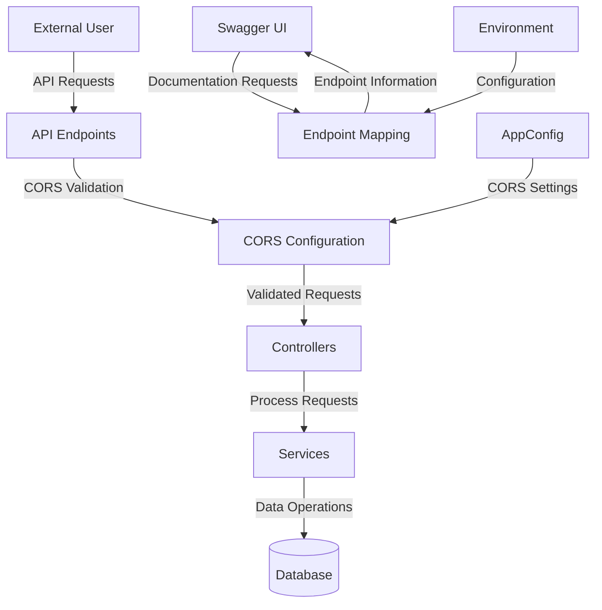

## Module: WebMvcConfigure.java

# Documentación Técnica: WebMvcConfigure.java

## 1. **Nombre del módulo o componente SQL:**
WebMvcConfigure.java

## 2. **Objetivos principales:**
Este componente configura aspectos de la capa web MVC de Spring en una aplicación de e-commerce. Su propósito principal es establecer la configuración CORS (Cross-Origin Resource Sharing) para permitir el acceso a la API desde orígenes específicos, y configurar el mapeo de endpoints para Swagger en versiones de Spring Boot 2.7 o superiores.

## 3. **Funciones, métodos o consultas críticas:**
- `corsConfigurer()`: Define y configura las políticas CORS para la aplicación.
- `webEndpointServletHandlerMapping()`: Configura el mapeo de endpoints para Swagger.
- `shouldRegisterLinksMapping()`: Método auxiliar que determina si se debe registrar el mapeo de enlaces.

## 4. **Variables y elementos clave:**
- `AppConfig config`: Inyección de dependencia que contiene la configuración de la aplicación.
- Parámetros de CORS: `allowedOrigins`, `allowedMethods`, `allowedHeaders`.
- Componentes de endpoints: `WebEndpointsSupplier`, `ServletEndpointsSupplier`, `ControllerEndpointsSupplier`.
- `Environment`: Proporciona acceso al entorno de ejecución.

## 5. **Interdependencias y relaciones:**
- Depende de `AppConfig` para obtener la configuración de CORS.
- Interactúa con varios componentes de Spring Boot Actuator para la configuración de endpoints.
- Se relaciona con el sistema de configuración de Spring MVC a través de la implementación de `WebMvcConfigurer`.

## 6. **Operaciones centrales vs. auxiliares:**
- **Centrales**: 
  - Configuración de CORS mediante `corsConfigurer()`
  - Configuración de endpoints para Swagger mediante `webEndpointServletHandlerMapping()`
- **Auxiliares**:
  - Método `shouldRegisterLinksMapping()` que determina si se debe registrar el mapeo de enlaces.

## 7. **Secuencia operativa o flujo de ejecución:**
1. Spring carga la clase como componente debido a la anotación `@Component`.
2. Se activa solo en perfiles "default" o "dev" según la anotación `@Profile`.
3. Se inyecta la configuración de la aplicación (`AppConfig`).
4. Se registran los beans `corsConfigurer()` y `webEndpointServletHandlerMapping()`.
5. Cuando se inicializa la aplicación, se aplica la configuración CORS y se configuran los endpoints.

## 8. **Aspectos de rendimiento y optimización:**
- La configuración CORS está optimizada para permitir solo orígenes, métodos y cabeceras específicos, lo que mejora la seguridad.
- No hay bucles ni operaciones intensivas que puedan afectar el rendimiento.
- La configuración se realiza una sola vez durante el inicio de la aplicación.

## 9. **Reusabilidad y adaptabilidad:**
- El código es modular y parametrizable a través de la inyección de `AppConfig`.
- La configuración CORS puede adaptarse fácilmente modificando los valores en `AppConfig`.
- El componente está limitado a perfiles específicos ("default" y "dev"), lo que permite tener configuraciones diferentes en otros entornos.

## 10. **Uso y contexto:**
- Se utiliza durante la inicialización de la aplicación Spring Boot para configurar aspectos de la capa web.
- Es parte de la infraestructura de configuración de la aplicación, no de la lógica de negocio.
- Se activa solo en entornos de desarrollo y por defecto, no en producción.

## 11. **Supuestos y limitaciones:**
- Supone que existe una clase `AppConfig` con métodos para obtener la configuración CORS.
- Está diseñado específicamente para Spring Boot 2.7 o superior, como se menciona en los comentarios.
- Solo se activa en perfiles "default" o "dev", lo que limita su uso en otros entornos.
- La configuración de Swagger está adaptada para una versión específica de Spring Boot, lo que podría requerir cambios si se actualiza la versión.
## Flow Diagram [via mermaid]

